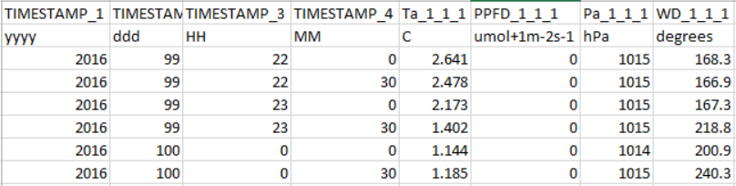
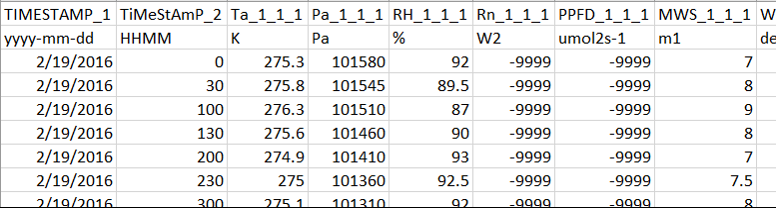
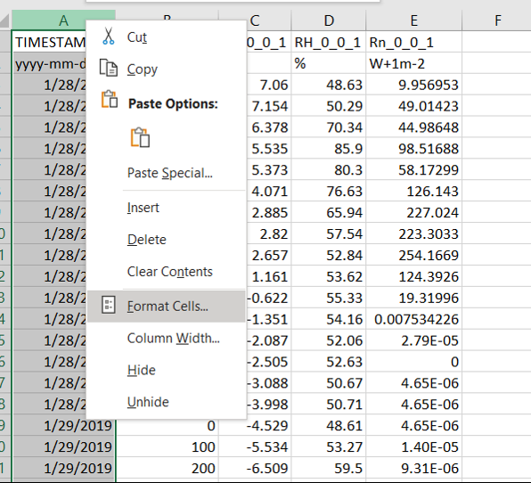
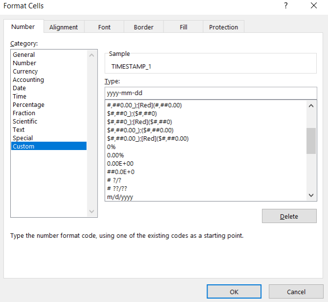
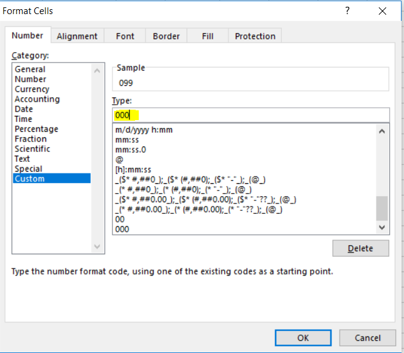
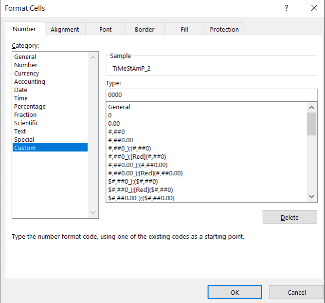

# Frequently asked questions

[Why does EddyFlow seem slow sometimes but it works fine other times on the same computer?](#)

[An EddyFlow processing run fails at a particular file, but if I take the file at which it fails and process it separately it seems to work. What is going on?](#)

.ghg

[I have a biomet data file that is not being recognized or is causing an error. How can I format it for EddyFlow?](#)

Processing data from biomet sensors along with high-speed wind and gas data is accomplished either by using a data file included in the .ghg file or by adding data contained in external text files. External text files must have properly formatted time stamp information so that EddyFlow can match it to the fast wind and gas data. Most errors in processing such files arise because of problems with the timestamp formatting.

Errors may arise from an improper number of characters or unacceptable formatting in the time stamp fields of external biomet files. Here are several examples and solutions:

** Example 1:** This file has incorrect formatting in the day-of-year, hour, and minute columns. All values in the day-of-year column should have three characters. Some have only two. The same applies to the hour and minute fields, which have one or two characters instead of the required two.

** Example 2:** This file shows automatic formatting done by Excel® for the first timestamp that contains the date. It also shows the same issue from Example 1 in the hour/minute column.

** Solutions:**

1. With the files open in Excel, configure the date formatting.
2. Select the column that needs to be corrected. Right click and select Format Cells.
3. 
4. To correct the date formatting, click Custom. Under Type, enter yyyy-mm-dd.
5. 
6. To correct day of year, select the column and open Format Cells. Select Custom and enter 000 to specify three-digit day of year.
7. 
8. To correct hour and minute, select the column and open Format Cells. Select Custom and enter 0000 to specify four-digit time.
9. 
10. Click ** OK** and save the file in its original format.

Repeat this for other files to correct run failures and time stamp issues.

[How does EddyFlow determine daytime or nighttime?](#)

EddyFlow makes the determination of daytime and nighttime based on the following inputs and/or calculations.

1. If the data file or the Biomet data contains global radiation measurements it will consider the flux averaging interval with global radiation value greater than 12 Watts m-2 to be daytime.
2. If the data doesn't contain global radiation but PPFD (PAR) then EddyFlow will consider the flux averaging interval with PPFD value greater than 100 µmol sec-1 m-2 to be daytime.
3. If both global radiation and PPFD are not available, then EddyFlow computes the potential radiation based on the latitude and longitude provided in the metadata. If this value is greater than 10 watts m-2, then that half hour is considered daytime.
4. If there is no latitude then the time stamp information is used to determine daytime.

[I'm running an older version of EddyFlow. Where can I find the documentation?](#)

Each version of the EddyFlow application includes full documentation as part of the application. To open the embedded documentation, click the ** Help ** menu and select ** Use Offline Help **. Now the instruction manual (.pdf) and help will be opened from the EddyFlow installation files.
