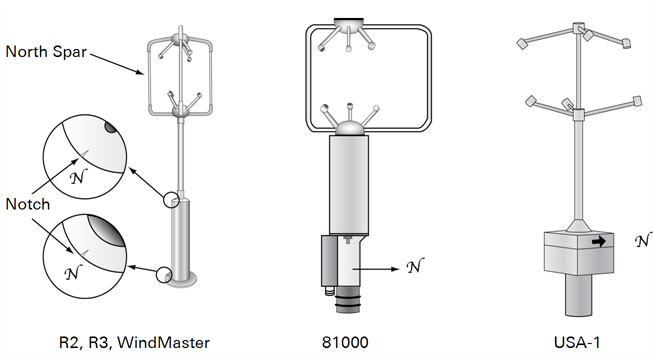
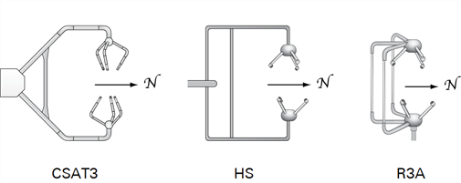
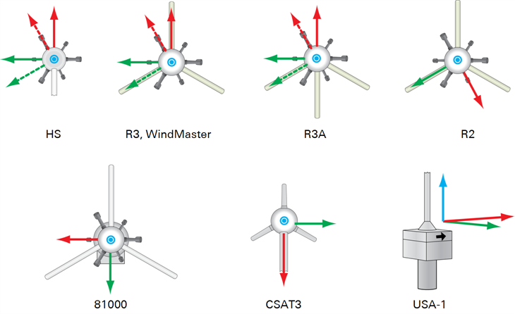

# Adjusting the anemometer coordinate system

Each anemometer model adopts a customized convention for providing wind components in an orthogonal coordinate system, so that the user is able to retrieve the actual wind direction with respect to geographic north. Anemometer north is shown by:

- On Gill post-mounted anemometers (e.g. R2, R3, WindMaster™, WindMaster™ Pro), by an "N" or a notch at the base;
- On Young 8100, by an "N", and by the junction box (facing south);
- On Metek's USA-1, by a black arrow on the electronic box or by a north bar on the sensor head;
- On Campbell® Scientific CSAT3 (yoke-styled), by the direction of the arm, opposite to the arm with respect to the transducers set;
- On Gill HS™ (yoke-styled), by the direction of the arm, opposite to the arm with respect to the transducers set;
- On Gill R3A™ by the direction of the symmetry axis, opposite to central spar.

                                                            Figure 6‑1. North for asymmetric anemometer models.

Any misalignment between anemometer north and geographic north is accounted in EddyFlow with the [North offset](north-offset.md), which is provided as part of the metadata (site information).

In addition to the definition of north, each anemometer model features a specific Cartesian coordinate system that can be right-hand (R3, HS, CSAT3, 8100) or left-hand (R2 and USA-1) and where a positive wind component can be defined as blowing *away from* or *toward* the positive axis orientation (see below).

EddyFlow handles those differences by expressing wind components in a fixed right-hand coordinate system, where wind components in x, y, and z directions are indicated with u, v, and w respectively. Such a system coincides with the one used in the SPAR configuration of the Gill HS, R3, and WindMaster (see below).

                                                            Figure 6‑2. Top view of various anemometer models (except USA-1, perspective view). Red arrows indicate the direction of positive u, green arrows indicate the direction of positive v, and blue arrows indicate the positive w, as provided by the anemometer. For Gill HS, R3, WindMaster, and R3A, solid arrows represent the coordinates in SPAR configuration, while dashed arrows are those AXIS configuration.

To adjust coordinates, EddyFlow changes the sign of one component of left-handed anemometers, and introduces a north offset (in addition to the one provided by the user) to rotate the original axis into the predefined system.

** Note:** This offset is actually added only when calculating wind direction, and does not modify wind components. Thus, what one should expect is that EddyFlow does not modify wind components of right-handed anemometers (at least until wind components are rotated for correcting anemometer tilting), while it inverts the sign of one horizontal component of left-handed anemometers, either u or v.

For example, the coordinate system of an R2 (left-handed) is adjusted by inverting the sign of the u components and by adding a North offset of -30°, while coordinate system of a CSAT3 (right-handed) is adjusted solely by adding a North offset of 180°.
