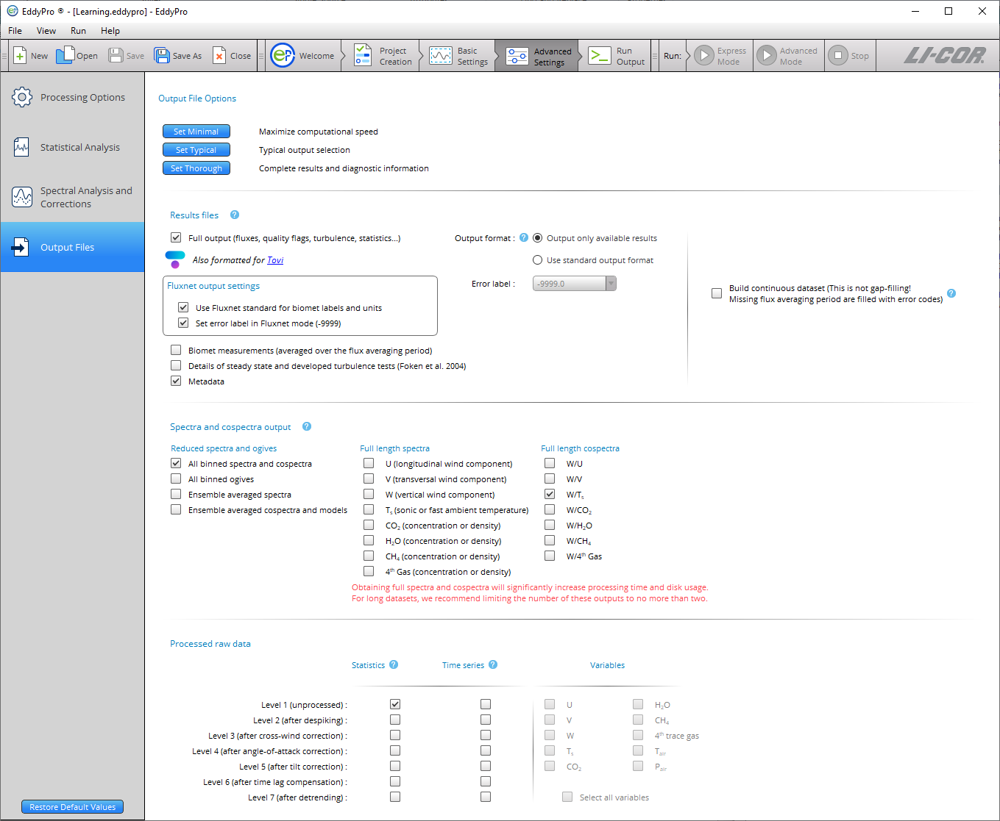

# Output files

** Note:** To keep processing time to a minimum, select only the output files that are needed. Selecting *full spectra* and *cospectra* will increase processing time significantly. Therefore, we recommend that you limit the number of these outputs to less than two.

The ** Output Files ** tab is used to tell EddyFlow which files to write upon completing the project. Here, there is a great deal of flexibility, depending on your research needs. Settings include:

- See [Results files and options](output-files.md#Results)
- See [Spectral outputs](output-files.md#Spectra)
- See [Processed raw data](output-files.md#Statistics)
