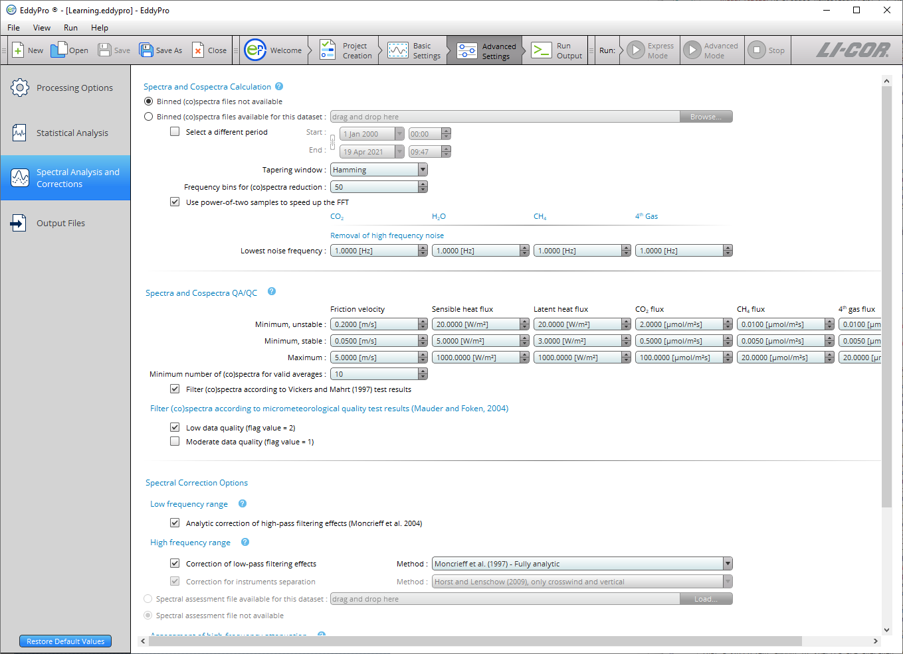

# Spectral corrections

Spectral corrections are needed to correct flux estimates for low and high frequency losses due to the instrument setup, intrinsic sampling limits of the instruments, and some data processing choices. An overview and some details about the spectral correction methods available in EddyFlow are provided here. This tutorial focuses on the items available to you, to select and tune the correction procedure.

** Note:** The default settings in this section correspond with the settings used by Express Mode, meaning that you can process a dataset in Advanced Mode without altering these settings, and still compute reasonable results for most datasets.

The first choice is whether to correct for the high-pass filtering losses implied by the fact that fluxes are calculated on a finite time period, and possibly by the detrending operation (e.g., linear detrending, running mean). Select ** Analytic correction for high-pass filtering effects (Moncrieff et al., 2004) ** to instruct EddyFlow to apply this correction, which affects the low frequency range of the flux cospectra.

The second choice regards the application of a correction for the low-pass filtering losses, mainly related to intrinsic instrument limits (finite path lengths and time responses) and to the actual instruments deployment, such as the separation between anemometer and gas analyzer, the height above the underlying canopy or surface, the deployment of a sampling line for closed path analyzer and the way this is conditioned (e.g., insulated or heated).

Five methods are available:

- The analytic method of [Moncrieff et al. (1997)](references.md#Moncrieff2),
- The analytic method of [Massman (2000, 2001)](references.md#Massman2000),
- The semi-analytic method of [Horst (1997)](references.md#horst1997)
- The *in situ* method of [Ibrom et al. (2007a)](references.md#Ibrom), and
- The *in situ* method of [Fratini et al. (2012)](references.md#Fratini2012).

The methods by Moncrieff et al. (1997) and by Massman (2000, 2001) model all major sources of flux attenuation by means of a mathematical formulation. When using these methods, no further information is needed, so all of the fields in this page are deactivated. These methods are suggested for open path EC systems or for closed path systems if the sampling line is short and heated. The reason is that this method may seriously underestimate the attenuation (and hence the correction)—notably for water vapor—when the sampling line is long (and the attenuation is strong) and not heated because of the dependency of attenuation of H2O on relative humidity, which has been clearly recognized in recent research.

If the methods by Horst (1997), Ibrom et al. (2007), or Fratini et al. (2012) are selected, the "Assessment of high-frequency attenuation" section activates. In fact, all three methods require the preliminary, *in situ* assessment of the attenuation of scalar spectra. Such attenuation is quantified by determining the system low-pass transfer function. The procedure makes use of the temperature spectrum as a proxy for the unattenuated gas spectra (thereby assuming similarity of turbulent spectra among all gases and the air temperature) and fits a prescribed transfer function to the ratio of the gas to the temperature spectra. The assumed transfer function is that of the so-called Infinite Impulse Response (IIR) filter (Ibrom et al., 2007a). However, this procedure cannot be applied on individual spectra, which may be affected by noise or characteristics of the local turbulence. Instead, ensemble spectra are calculated for all variables involved (temperature and gas concentrations) using all available "high-quality" spectra and a least squared minimization is then used to fit the transfer function to the ratio of ensemble gas spectra to ensemble temperature spectra. This is what we call the "spectral assessment". In this phase you need to instruct EddyFlow on how to select the spectra to be used in this procedure.

To start with, select the starting and ending dates of the period to be used for the spectral assessment. The larger the time periods, the longer the procedure will take, but the more accurate the results will be. However, pay attention to select a period in which your instrument setup did not undergo major modifications. You are going to average all spectra for this period to assess to what extent your instrument configuration attenuated them compared to atmospheric conditions, thus you need to make sure that all spectra are representative of the same configuration.

The minimum number of spectra for valid ensemble averages is set to make sure that a sufficient amount of spectra are averaged, to level out noise and local turbulence characteristics, and highlight the main spectra features. Again, a large number here will ensure a more accurate assessment, but it will also require a longer period of time, because not all spectra are going to be valid and take part in the averaging procedure.

In fact, minimum flux values must also be set, to discriminate "good spectra." A sufficient flux ensures that developed turbulent conditions are met and that spectra are well characterized in the inertial and dissipation ranges. Water vapor minimum are indirectly set by specifying a lower limit for the latent heat flux. Similarly, good quality temperature spectra will be achieved when sensible heat flux will be above a certain threshold that you can specify.

The ** Spectral Corrections ** tab includes the following options:

- [Low frequency range](spectral-corrections.md#Low)
- [High frequency range](spectral-corrections.md#High)
- [Assessment of high-frequency attenuation](spectral-corrections.md#Assessme)
