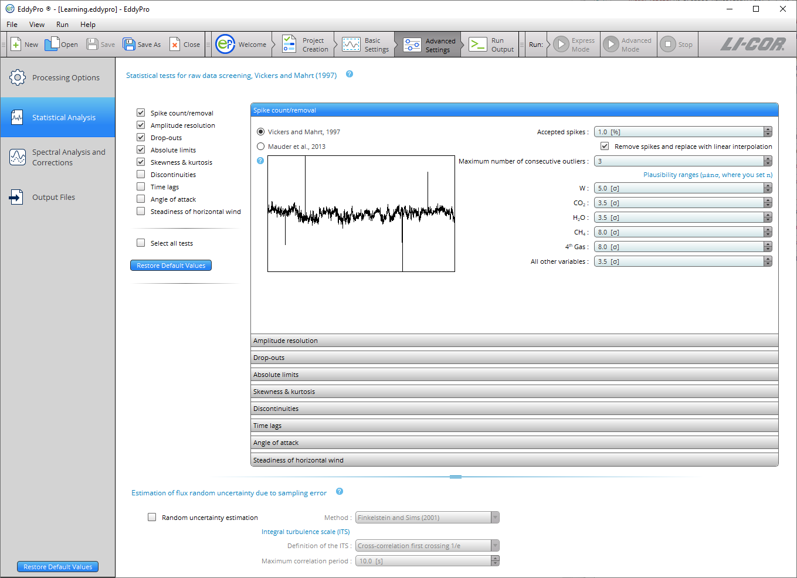

# Statistical analysis

The ** Statistical Tests ** tab includes all tests recommended by [Vickers and Mahrt (1997)](references.md#Vickers) and [Mauder (2003)](references.md#Mauder2013).

** Note:** The default settings in this section correspond with the settings used by Express Mode, meaning that you can process a dataset in Advanced Mode without altering these settings, and still compute reasonable results for most datasets.

Click the links below to learn more about each test:

- See [Despiking](despiking-raw-statistical-screening.md#Spike)
- See [Amplitude resolution](despiking-raw-statistical-screening.md#Amplitude)
- See [Drop-outs](despiking-raw-statistical-screening.md#Drop)
- See [Absolute limits](despiking-raw-statistical-screening.md#Absolute)
- See [Skewness and kurtosis](despiking-raw-statistical-screening.md#Skewness)
- See [Discontinuities](despiking-raw-statistical-screening.md#Discontinuities)
- See [Time lags](despiking-raw-statistical-screening.md#Time)
- See [Angle of attack](despiking-raw-statistical-screening.md#Angle)
- See [Steadiness of horizontal wind](despiking-raw-statistical-screening.md#Steadiness)
