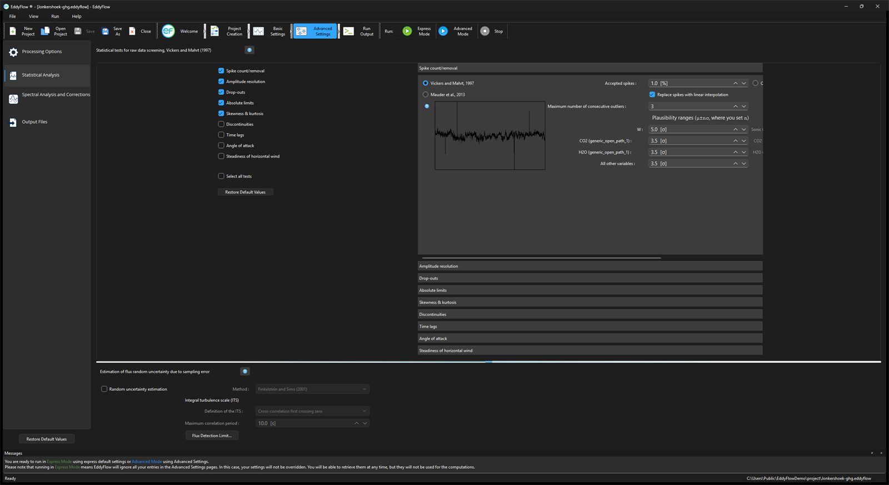

# Statistical analysis

The **Statistical Analysis** tab includes all tests recommended by [Vickers and Mahrt (1997)](references.md#Vickers) and [Mauder et al. (2013)](references.md#Mauder2013).

!!! note

    The default settings in this section correspond with the settings used by Express Mode, meaning that you can process a dataset in Advanced Mode without altering these settings, and still compute reasonable results for most datasets.

Click the links below to learn more about each test:

- See [Despiking](despiking-raw-statistical-screening.md#Spike)
- See [Amplitude resolution](despiking-raw-statistical-screening.md#Amplitude)
- See [Drop-outs](despiking-raw-statistical-screening.md#Drop)
- See [Absolute limits](despiking-raw-statistical-screening.md#Absolute)
- See [Skewness and kurtosis](despiking-raw-statistical-screening.md#Skewness)
- See [Discontinuities](despiking-raw-statistical-screening.md#Discontinuities)
- See [Time lags](despiking-raw-statistical-screening.md#Time)
- See [Angle of attack](despiking-raw-statistical-screening.md#Angle)
- See [Steadiness of horizontal wind](despiking-raw-statistical-screening.md#Steadiness)
- See [Consecutive-difference despiking](despiking-raw-statistical-screening.md#consecutive-difference-despiking)
- See [Extra raw-signal diagnostics (RFlux)](despiking-raw-statistical-screening.md#extra-raw-signal-diagnostics-rflux), [Post-flux despiking (STL)](despiking-raw-statistical-screening.md#post-flux-despiking-stl) and [Storage-flux cleaning](despiking-raw-statistical-screening.md#storage-flux-cleaning) (all off by default)
- See [Kurtosis index of differences (KID)](despiking-raw-statistical-screening.md#kurtosis-index-of-differences-kid)
- See [Random uncertainty estimation](random-uncertainty-estimation.md#top) and the [Flux Detection Limit Settings dialog](flux-detection-limit-settings.md#top)
