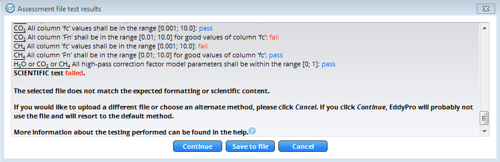
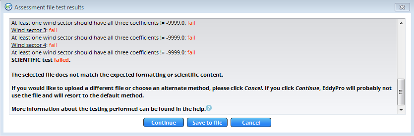
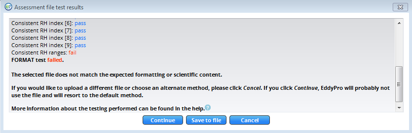

# Assessment tests

Assessment tests evaluate ancillary files to ensure that they meet certain requirements before processing. The purpose of assessment tests is to reduce processing errors when using EddyFlow for desktop processing, and to ensure the validity of ancillary files prior to uploading them to the SmartFlux System. The ** Format Test ** evaluates the file format by comparing it to a standard, and the ** Scientific Test ** evaluates data by comparing values in the file with known acceptable values.

If the test fails for any reason, you will be notified and provided with information that will help you solve the problem, either by choosing another file or correcting the file that you selected. If you click ** Continue ** after a test fails, EddyFlow will use the default method and will probably not use the file that failed. The default methods are as follows:

- Spectral Correction defaults to ** Moncrieff **
- Planar Fit (Rotation method) defaults to ** Double Rotation **
- Automatic time lag optimization (Time lag detection method) defaults to ** Covariance maximization with default **

## Spectral assessment file

### Format test

This file has a strictly fixed format: the number of lines and all textual (i.e., not numeric) content is strictly fixed, with the only exception of the first word at line 46 ('none' in the sample file), which can change if EddyFlow processed a 4th gas. Thus, any textual information can be used to make sure the file is 'well formatted'. Note, too, that the RH classes (lines 8-16) are predefined, including their percentage indications ('5 – 15%', etc.).

### Scientific test

#### Water vapor

1. Column 'fc' shall have at least 1 value in the range 0.001 – 10.
2. Column 'fc' shall not have all values set to -9999.
3. Column 'numerosity' shall have at least 1 value > 0.
4. Column 'Fc' shall be in the range 0.01 – 10 for good values of column 'fc'
5. The three values shall be ≠ -9999.

#### CO2

1. In the normal case, column 'fc' must contain always the same value, which shall be within the range 0.001 – 10.
2. The user may edit the file manually. In this case, all values shall be in the range 0.001 – 10.
3. Column 'Fc' shall be in the range 0.01 – 10 for good values of column 'fc.'

#### CH4

1. In the normal case, column 'fc' must contain always the same value, which shall be within the range 0.001 – 10.
2. The user may edit the file manually. In this case, all values shall be in the range 0.001 – 10.
3. Column 'Fc' shall be in the range 0.01 – 10 for good values of column 'fc.'

                                                            Figure 2‑1. If the Spectral Assessment file fails a test, you can correct the file, choose a different file, or choose an alternate method. If you click ** Continue **, the default method will be used, and EddyFlow will probably not use the file.

## Planar fit file

### Format test

This file does not have a strictly predefined structure. However, the number of lines can be calculated based on the value at line 2, 'Number of wind sectors.' Let this number be N in the following example:

1. Lines 1 thru 10 shall always contain the same textual information.
2. There shall be N lines formally identical to lines 11-14 in the sample file.
3. Line 10 + N + 2 shall always be "Rotation matrices."
4. There shall be N groups of 4 lines starting at line 10 + N + 3, composed as in the sample file:
5. 1 textual line starting with "Sector number."
                                                                    3 numbers composed of 3 numbers each.
                                                                    The first number of the second line of each group (lines 19, 23, 27, 31 in the sample file) shall always be identically zero.
6. The total number of lines of the file shall be 10 + N + 2 + 4*N = 5*N + 12 (N = 4 and total number of lines = 32 in the sample file).

### Scientific test

1. At least one wind sector (lines 10 + 1 thru 10+N) should have all three coefficients (B0, B1, B2) ≠ -9999.
2. For each wind sector having valid coefficients, the corresponding 4-lines group shall contain only numbers ≠ -9999 and at least one number ≠ 0.

                                                            Figure 2‑2. If the planar fit file fails the test, you can correct the file, choose a different file, or choose an alternate method. If you click ** Continue **, the default method will be used, and EddyFlow will probably not use the file.

## Timelag optimization file

### Format test

This file does not have a strictly predefined structure and the number of lines to be expected cannot be unequivocal calculated. Some criteria that can be tested are:

1. The first 4 lines shall always have the same textual content.
2. Starting at line 6, there could be 0, 1, 2, 3 or 4 groups of 5 lines (4 with text and 1 empty).
3. If present, each group shall have fixed textual content, except for the label of the gas (either "co2", "h2o", "ch4" or "4th_gas").
4. If H2O was processed in RH classes, a group shall exist similar to the one at lines 16-28 in the sample file.
5. The group starts with 3 lines of fixed textual content.
                                                                    	The number of following numeric lines may change. Look at the column "RH-range": The first of these lines shall start with "0 – ", while the last one shall end with " – 100%."

### Scientific test

1. In the "small" groups, the "median" timelag shall always be > maximum and < minimum timelags.
2. All timelags in the small groups shall not be larger than 60 seconds.
3. In the RH-sorted h2o classes:
4. The "class" index shall be continuous, starting from 1 and up to a maximum of 20 (but they could be less than 20).
                                                                    In each line it shall be true that; "min _h2o" < "med_h2o" < "max_h2o" (note the header: the "med" is the left one, not the central one!).
                                                                    There shall be at least 3 classes with "class_num" > 30.

                                                            Figure 2‑3. If the Timelag Optimization file fails the test, you can correct the file, choose a different file, or choose an alternate method. If you click ** Continue **, the default method will be used, and EddyFlow will probably not use the file.
