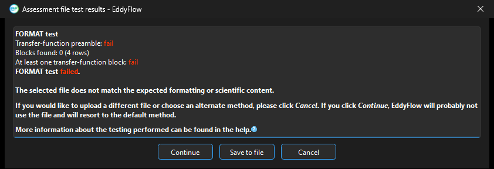
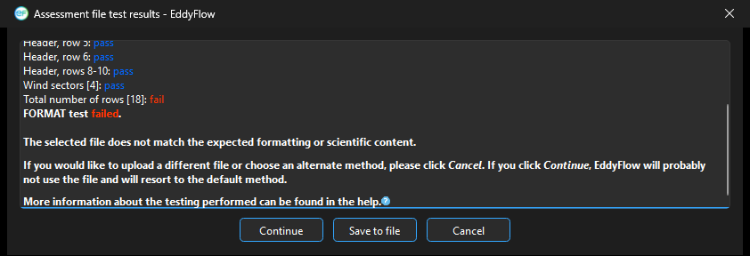
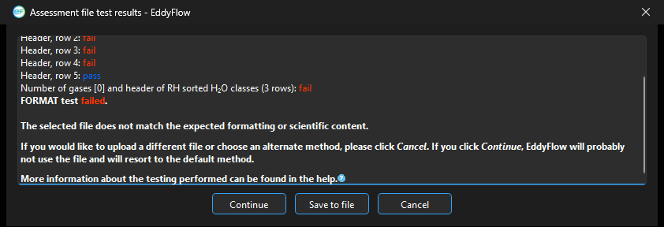

# Assessment tests

Assessment tests evaluate ancillary files to ensure that they meet certain requirements before processing. The purpose of assessment tests is to reduce processing errors when using EddyFlow for desktop processing, and to ensure the validity of ancillary files prior to uploading them to the SmartFlux System. The **Format Test** evaluates the file format by comparing it to a standard, and the **Scientific Test** evaluates data by comparing values in the file with known acceptable values.

The results appear in a window titled **Assessment file test results**, one line per check ending in *pass* or *fail*. If the format test fails, the scientific test is not run. If the test fails for any reason, you will be notified and provided with information that will help you solve the problem, either by choosing another file or correcting the file that you selected. The window offers three buttons: **Continue**, **Cancel** and **Save to file** (saves the report). If you click **Continue** after a test fails, EddyFlow will use the default method and will probably not use the file that failed. The default methods are as follows:

- Spectral Correction defaults to **Moncrieff**
- Planar Fit (Rotation method) defaults to **Double Rotation**
- Automatic time lag optimization (Time lag detection method) defaults to **Covariance maximization with default**

A failed test ends with the message "The selected file does not match the expected formatting or scientific content." followed by the choice described above. A file that cannot be opened, or is empty, gives "Unable to open the selected file or the file is empty. Please, select another file." If the template files the tests compare against are missing, the message is "The formatting and content of the selected file could not be assessed due to missing template files. Please, re-install the software."

The files can also be read from a shared Google Drive or Dropbox folder; see [Remote folders](remote-folders.md#top). The interface downloads such a file into a temporary cache to test it.

## How the spectral assessment and time lag files are checked

The spectral assessment file and the time lag optimization file contain one block of results **per gas** that the project names. The validators therefore do not compare the whole file with a fixed sample. The sample files shipped with the interface (`eddyflow_sample_spectral_assessment.txt` and `eddyflow_sample_timelag_opt.txt`) contain one **prototype block** of each kind, headed `<GAS>` (`<gas>` in the time lag file), and every block found in the file under test is held against the prototype of its kind, wherever the block sits in the file. All label text is taken from the sample file, not from the program.

### Block names and the project's gas records

A block is matched to a gas record of the project by name, following the names the engine writes in both files:

- the species name, upper case in the spectral file (lower case in the time lag file), for example `CO2`, `CH4`, `N2O`, `COS`;
- when the project names a species more than once (two CO2 analysers), each occurrence is numbered in record order: `CO2_1`, `CO2_2`;
- a **bare name** is read as the **first** record of that species. This keeps files written by older versions, which wrote `co2` beside `co2_2`, readable;
- a numbered name is accepted even if the project now names the species only once, because a file fitted while a second analyser was configured still says `CO2_1`.

Names are not split at underscores, so names such as `co2_2` or `alpha_pinene` are read whole.

### Measured and unmeasured gases

A gas record counts as **measured** if it is assigned a column in the raw data (Raw File Description). The engine writes a block for every gas record, measured or not (an unmeasured one filled with -9999), and discards such blocks when reading a file. The validators follow the same logic:

- A **measured gas** that has no block in the file **fails** the test. The check reads "<name> is measured and has a TFP block" in the spectral file and "<name> is measured and has a time lag" in the time lag file. The engine would read such a file, give that gas no transfer function (or only its default time lag) and raise Alert 65 during the run, so the test says so first.
- A **measured gas** with a block but without a fit (values outside the accepted ranges, or -9999) **fails** the scientific test.
- A gas that is **not measured** is reported as "not in this project's raw data — skipped" and cannot make the file fail. This also applies to blocks of a gas the project does not name at all (for example a file made for another project).

If the test is run without a project open, every gas is taken as measured, because checking too much is the safe way to be wrong.

The **primary hygrometer** is the first water-vapour record that has a column in the raw data. Its transfer-function table is the one block that is not named in the file, and its time lags are the RH-sorted table of the time lag file. A second hygrometer gets a named block of its own (for example `H2O_2`).

## Spectral assessment file

### Format test

The format test compares labels, not numbers. In order:

1. **Header, rows 1-N:** the introductory rows (title, explanation of `fc` and `Fn`, the two notes, and the dashed rule) match the sample's. A run of dashes matches any run of dashes, because the length of the rule has changed between versions.
2. **H2O TFP labels:** the header and the nine RH-class rows (`RH class 5 - 15% =` to `RH class 85 - 95% =`) of the primary hygrometer table match the sample. The RH classes are predefined, including their percentage indications.
3. **One check per further block** (`<NAME> TFP labels, rows a-b`), found by the word `TFP` in its header. A block whose header also says `numerosity` is an RH-class block of nine rows (an additional hygrometer); any other block is a monthly block of twelve rows (`January =` to `December =`). Each is compared with the prototype of its kind, with `<GAS>` read as the block's own name. Anything the engine appends to a block header after the columns (`groups=`, `var=`, `instr=`, `exp=`, `rates=`) is ignored, as are the `key=value` words on label rows.
4. **One check per measured gas** (`<NAME> is measured and has a TFP block`), see above.
5. **The tail:** the title `RH/fc_exponential_fit_parameters_for_water_vapour_spectral_corrections` must come after the last block, and its labels and those of the `High-pass_correction_factor_model_parameters` section (including the rows `unstable =` and `stable   =`) must match the sample.

If the sample file is incomplete, the message is "The spectral assessment template is incomplete. Please, re-install the software."

### Scientific test

Each gas is judged by its block name, not by its position in the file. Before, the first monthly block was always read as CO2 and the second as CH4, whatever their headers said, and nothing past the second block was examined.

#### Water vapor (primary hygrometer and any additional hygrometer block)

If the primary hygrometer is measured, its nine-class table is checked; for an additional hygrometer the same four checks run on its named block. If the primary hygrometer is not measured the line reads "H2O: not in this project's raw data — skipped".

1. Column 'fc' shall have at least 1 value in the range [0.001; 10.0].
2. Column 'fc' shall not have all values set to -9999.
3. Column 'numerosity' shall have at least 1 value > 0.
4. Column 'Fn' shall be in the range [0.01; 10.0] for good values of column 'fc'.
5. (Primary hygrometer only) All spectral corrections RH/fc exponential fit parameters shall be != -9999.0.

A class may be empty; the table may not.

#### Gases in monthly blocks (CO2, CH4, N2O, COS, ...)

For every measured gas with a monthly block:

1. All column 'fc' values shall be in the range [0.001; 10.0]. Every month must carry a fit, so a gas that is measured but could not be fitted fails here (the engine writes -9999 for it).
2. All column 'Fn' values shall be in the range [0.01; 10.0] for good values of column 'fc'.

#### High-pass correction factor model

All high-pass correction factor model parameters (the two values on each of the `unstable` and `stable` rows) shall be within the range [0; 1].

### How a multi-rate file is accepted

A file written for a project with [more than one acquisition rate](mixed-acquisition-rates.md#the-rates-token-in-the-spectral-assessment-file) carries a `rates=` token on the header of a gas that has several rates, and several value sets on each row. The format test ignores the token and compares the labels up to the `=`. The scientific test reads the **first** value set of each row, that is, the fastest rate's. The file is therefore accepted without any change in how it is validated.

                                                            Figure 2‑1. If the Spectral Assessment file fails a test, you can correct the file, choose a different file, or choose an alternate method. If you click **Continue**, the default method will be used, and EddyFlow will probably not use the file.

## Planar fit file

### Format test

This file does not have a strictly predefined structure. However, the number of lines can be calculated based on the value at line 2, 'Number of wind sectors.' Let this number be N in the following example:

1. Lines 1 thru 10 shall always contain the same textual information.
2. There shall be N lines formally identical to lines 11-14 in the sample file.
3. Line 10 + N + 2 shall always be "Rotation matrices."
4. There shall be N groups of 4 lines starting at line 10 + N + 3, composed as in the sample file:
5. 1 textual line starting with "Sector number."
                                                                    3 numbers composed of 3 numbers each.
                                                                    The first number of the second line of each group (lines 19, 23, 27, 31 in the sample file) shall always be identically zero.
6. The total number of lines of the file shall be 10 + N + 2 + 4*N = 5*N + 12 (N = 4 and total number of lines = 32 in the sample file).

### Scientific test

1. At least one wind sector (lines 10 + 1 thru 10+N) should have all three coefficients (B0, B1, B2) ≠ -9999.
2. For each wind sector having valid coefficients, the corresponding 4-lines group shall contain only numbers ≠ -9999 and at least one number ≠ 0.

                                                            Figure 2‑2. If the planar fit file fails the test, you can correct the file, choose a different file, or choose an alternate method. If you click **Continue**, the default method will be used, and EddyFlow will probably not use the file.

## Timelag optimization file

The time lag file is checked in the same way, block by block against the prototype in `eddyflow_sample_timelag_opt.txt`. This applies to the file written by automatic time lag optimization and to the file written by the pre-whitening block-bootstrap method. Rows that the engine adds in the aggregate mode of that method (rows starting with `PWB_`, such as `PWB_aggregate_summary:` and `PWB_summary_source_for_<gas>:`) say where a summary came from and are removed before rows are counted; previously they shifted the five-row stride of the blocks and made the file fail at the first gas.

### Format test

The first check is "Number of rows [N]", which needs more than two rows. Then, in order:

1. **Header, row 1 to 5:** the title row (`Time-lag_optimisation_results`), the plausibility range, the beginning and end of the optimization period, and the blank row. Only the label at the start of each row is compared (case, hyphens versus underscores, the spellings optimisation and optimization, and the sample's misspelling "Mimimum" are not significant); the numbers and dates are free. A row that is blank in the sample must be blank.
2. **Gas blocks:** starting after the header, any number of blocks of five rows (`Number_of_timelags_used_for_<gas>`, `Median_<gas>_timelag_[s]`, `Mimimum_<gas>_timelag_[s]`, `Maximum_<gas>_timelag_[s]` and a blank row). The gas name is taken from the first row and must be the same in the other rows. The line "Gas blocks found: n (names)" lists what was found. Blocks stop at the first row that is not a block.
3. **RH-sorted water-vapour table:** if the row `H2O_timelag_determinations_as_a_function_of_relative_humidity` follows, its three header rows must match the sample: the title, the note, and the column header (`class RH-range med_h2o min_h2o max_h2o class_num`). The note says how many determinations a class needs (`Classes with numerosity < 15 are inferred`). The number in the note is **not** compared, because it is a setting that has changed (30 in earlier versions, 15 now); previously the note had to say 30, so every file written by the current engine failed. The number the file states is the one the scientific test uses. Each class row is then checked ("Consistent RH index [k]": classes numbered continuously from 1), as are the ranges ("Consistent RH ranges": the first row starts with `0` and the last ends with `100%`) and the number of classes ("RH classes <= 20").
4. **RH tables of further hygrometers:** every closed-path hygrometer has its own RH table, binned by its own humidity (or by the site's biomet relative humidity, where there is a valid one). The primary hygrometer's table keeps the title above; each other hygrometer's follows it after a blank row, titled with `_for_<gas>` appended, for example `H2O_timelag_determinations_as_a_function_of_relative_humidity_for_h2o_2`, with the same note and column header. Each table gets the same checks as the first ("Header of RH sorted <gas> classes (3 rows)", index, ranges, number of classes). A table for a hygrometer the project does not have fails ("<gas> is a hygrometer of this project"), and so does a second table for the same hygrometer. These hygrometers keep their ordinary gas block as well, which is what earlier versions of EddyFlow read.
5. **Nothing after the last table:** the gas blocks and the RH tables must be the whole file: any other row after them fails ("Unrecognised row after the gas blocks [...]"), and a file without RH tables must have at least one gas block ("At least one gas block, or the RH sorted H2O classes").
6. **One check per measured gas** (`<name> is measured and has a time lag`). A hygrometer's lag may be given by its RH table instead of a block: the primary hygrometer's by the first table, any other's by the table named for it.

If the sample file is incomplete the message is "The time-lag template is incomplete. Please, re-install the software."

### Scientific test

Only blocks of gases measured in the project are examined; the others are reported as skipped. When a check fails, the names of the gases that fail it are appended in brackets.

1. Every measured gas has a time-lag determination (the median is not -9999).
2. Gas time-lag median values inside the [minimum; maximum] range, that is, minimum <= median <= maximum.
3. Time-lag values not larger than 60 seconds (median, minimum and maximum).
4. For every RH-sorted table whose hygrometer is measured: RH-sorted median values inside the [minimum; maximum] range (for every class), and "At least 3 <gas> classes with numerosity >= 15", where 15 stands for the value the file's note states (the primary hygrometer's table is named H2O in these messages). A table whose hygrometer is not measured is reported as skipped.

                                                            Figure 2‑3. If the Timelag Optimization file fails the test, you can correct the file, choose a different file, or choose an alternate method. If you click **Continue**, the default method will be used, and EddyFlow will probably not use the file.
