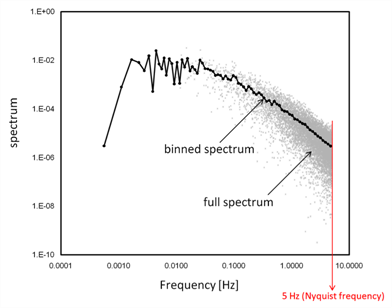
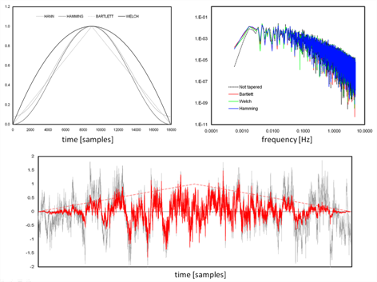

# Calculating spectra, cospectra, and ogives

EddyFlow Software allows calculation and output of most relevant spectra and cospectra. Namely spectra are available for the three wind components, the sonic temperature (or the alternative fast temperature reading used in place of sonic temperature, as applicable) and the gas concentrations or densities. Similarly, cospectra are available for covariances of *w* (vertical wind component) and all such variables. In the remainder of this paragraph we use the wording "(co)spectra" to refer to both spectra and cospectra.

(Co)spectra are calculated after raw data have been fully processed, including the compensation of time lags, and are available in two different formats: either "full" or "binned". Full (co)spectra are calculated for each flux averaging period and contain a number of frequencies equal to half the number of raw records. As an example, a raw dataset of 18000 records (30 minutes at 10 Hz) will provide (co)spectra specified for 9000 frequencies, linearly distributed between the lower frequency of 1/(30 minutes) and the maximum frequency (the Nyquist frequency) of (10 Hz)/2. One property of full (co)spectra is that their integration over the entire frequency range provides the (co)variance of the concerned variables. For details on the derivation and interpretation of spectra and cospectra refer, for example, to [Smith (1998)](references.md#Smith).

However, the full (co)spectra dataset is difficult to handle because of the size of each individual (co)spectrum, and difficult to interpret because of the noise that typically affects the medium and high-frequency ranges. For these reasons, EddyFlow also calculates and outputs reduced, or "binned" (co)spectra. The reduction procedure consists of dividing the frequency range in a user-specified number of exponentially spaced frequency bins (e.g., 100) and averaging individual (co)spectral values that fall within each bin. The exponential nature of the size increase of the bins assures that increasingly more spectral values are averaged as it moves toward higher frequencies, thereby increasingly reducing noise. The figure below shows an example of a full spectrum and the corresponding binned version.

Calculation of the full (co)spectra involves the following sequence of operations:

1. First, if one selects this option, raw time series are limited to a number of records equal to the power-of-two closest to the available number of records for the current flux averaging period. This step guarantees that the Fourier transforms are performed at the fastest speed possible. If you do not select this option, all available samples are used, but the computation slows down.
2. If applicable, statistics (variances and covariances) are now re-evaluated on the reduced time series and used later for (co)spectra normalization.
3. Fourier transform is performed by means of an FFT (Fast Fourier Transform) algorithm.
4. Full (co)spectra can now be calculated and output as selected by the user.

This procedure ensures that (co)spectra are such that their integration provides the corresponding (co)variances, as stated above.

The calculation of binned (co)spectra involves a slightly different sequence of steps:

1. First, if you select this option, raw time series are limited to a number of records equal to power of two closest to the available number of records for the current flux averaging period. This step guarantees that the Fourier transforms are performed at the fastest speed possible.
2. If applicable, statistics (variances and covariances) are now re-evaluated on the reduced time series and used later for (co)spectra normalization.
3. The reduced time series is now "tapered" using the selected tapering window. The tapering, (or windowing) procedure consists of multiplying (in a scalar sense) the time series with a suitable symmetric function. The aim, which you can learn in detail in [Smith (1998)](references.md#Smith), is to produce a time series that can be thought of as a part of an infinite periodic time series, to which the definition of discrete (co)spectra actually applies. Not applying the tapering procedure to short time series can result in spectral power overestimation. [Kaimal and Kristensen (1991)](references.md#Kaimal2) suggested the use of the Hamming or the Hann windows. The figure below shows examples of tapering windows and the effect of their application to a time series. Also shown are the effects that different windows have on a sample spectrum.
4. The FFT is now applied to tapered time series and full (co)spectra are calculated.
5. Full (co)spectra are normalized using relevant (co)variances.
6. Full (co)spectra are finally reduced into the exponentially spaced frequency base.
7. As a further option, EddyFlow calculates and outputs ogives of all (co)spectra. At each given frequency, the ogive is simply the integration of the (co)spectrum from the current frequency to the Nyquist frequency. It can be thought of as a cumulative (co)spectrum, while its value at the lowest frequency provides the integration of the full (co)spectrum (i.e., the (co)variance). Ogives can be used to evaluate the suitability of the chosen flux averaging period.

                                                            Figure 6‑14. Top left: Shape of tapering windows available in EddyFlow. Top right: Effect of different tapering windows on a sample spectrum. Bottom: Effect (red) of the Bartlett window on a raw (gray) time series.
