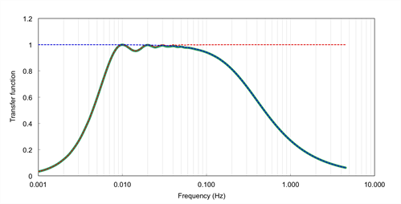

# Calculating Spectral correction factors

Spectral corrections compensate flux underestimations due to two distinct effects:

- Fluxes are calculated on a finite averaging time, implying that longer-term turbulent contributions are under-sampled to some extent, or completely. In EddyFlow, the correction for these flux losses is referred to as [high-pass filtering](high-pass-filtering.md) correction because the any detrending method acts similar to a high-pass filter, by attenuating flux contributions in the frequency range close to the (inverse of the) flux averaging interval.
- Instrument and setup limitations that do not allow sampling the full spatiotemporal turbulence fluctuations and necessarily imply some space or time averaging of smaller eddies, as well as actual dampening of the small-scale turbulent fluctuations. In EddyFlow, the correction for these flux losses is referred to as [low-pass filtering](low-pass-filtering.md) correction.

For any given flux, the spectral correction procedure requires a series of conceptual steps (for a thorough overview of spectral corrections in eddy covariance see, [Ibrom et al. (2007a)](references.md#Ibrom) and [Massman (2004)](references.md#Massman) for example):

1. Calculation or estimation of a reference flux cospectrum, representing the true spectral content of the investigated flux as it would be measured by a perfect system;
2. Estimation of the high-pass and low-pass filtering properties implied by the actual measuring system and the chosen averaging period and detrending method;
3. Estimation of flux attenuation;
4. Calculation of the spectral correction factor and application of the correction.

In the implemented method, true cospectra estimation (step 1) is performed by using analytical cospectra formulations, according to Eqs. 12-18 in [Moncrieff et al. (1997)](references.md#Moncrieff), a modification of the Kaimal formulation ([Kaimal, 1972](references.md#Kaimal)). Flux cospectra (COF) are expressed as a function of the natural frequency, COF(f), and depend primarily on the considered flux (momentum, sensible heat or gas fluxes), on atmospheric stratification and wind speed and on the measuring height above the canopy. For this reason, cospectra must be recalculated at each flux averaging period.

Step 2 is usually performed by specifying a band pass transfer function (TF(f)), describing how individual flux contributions at each natural frequency are represented in the measured fluxes, due to the EC system properties and the processing choices (see the figure below). In the implemented method, the system transfer function is specified by the superimposition of a set of transfer functions describing individual sources of high-frequency or low-frequency losses. Refer to Appendix A of the [Moncrieff et al. (1997)](references.md#Moncrieff) for the full description of the transfer functions. Such transfer functions depend on the instrument setup (through the instruments' path lengths, acquisition frequencies, separations etc.) but also on the atmospheric conditions (because some quantities are defined as a function of the average wind speed), thus they must be recalculated for each flux averaging period.

                                                            Figure 6‑15. Representation of the transfer function of a band-pass filter (green line), obtained as the superimposition of the transfer functions of a high-pass (red line) and a low-pass (blue line) filter.

Spectral correction factors are calculated for each averaging period and for each mass and energy flux. The exact moment in which the correction is applied depends mainly on the instrument(s) used (open vs. closed path configurations), due to the interaction with other corrections. This is thoroughly explained in [Calculating Level 1, 2, and 3 Fluxes](calculate-flux-level-123.md), and [Calculating Fluxes with Open Path Analyzers](calculate-flux-open-path-analyzers.md).
