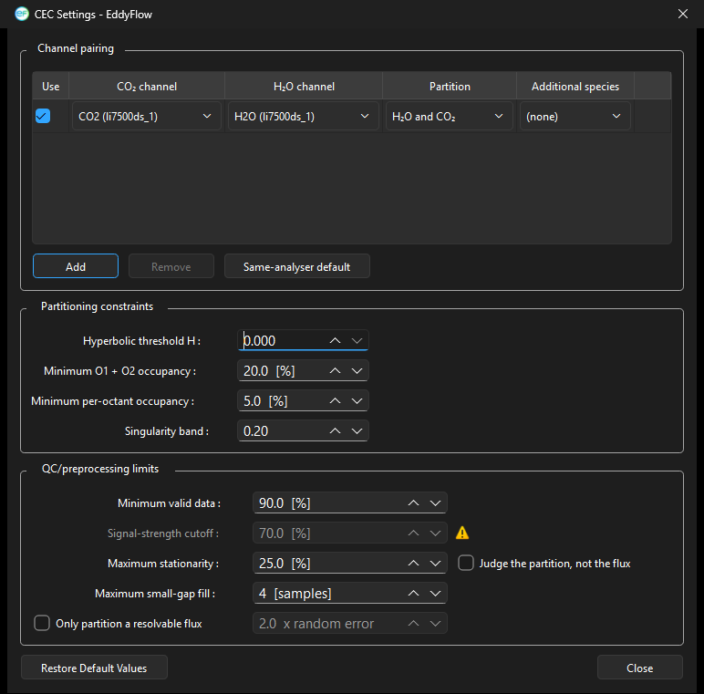

# CEC settings dialog

Under: Advanced Settings > Processing Options > Other options > Conditional Eddy Covariance

Activating **Conditional Eddy Covariance** under **Other options** will cause the **CEC Settings** button to activate. Click on it to open the CEC configuration dialog, where you define which channels are partitioned and the quality conditions a flux averaging period must meet before a partitioned result is reported. For an explanation of the CEC method itself, its output variables, and its assumptions and limitations, see [Conditional Eddy Covariance](conditional-eddy-covariance.md#top). This page documents only the dialog fields.

## Channel pairing

The pairing table defines which measured channels CEC uses, instead of relying on a single fixed carbon dioxide and water vapor pair. Each row pairs one carbon dioxide channel with one water vapor channel and states what should be partitioned, so several instrument combinations can be processed in the same run. Because the channels are chosen per row, the pair may span two different analyzers, and species other than carbon dioxide and water vapor (for example carbonyl sulfide) can be partitioned as well.

- **Use:** Include this row in the run. Clearing it keeps the row but leaves it unprocessed.
- **CO2 channel:** The carbon dioxide channel for this pair, named as *species (instrument)*.
- **H2O channel:** The water vapor channel used as the partitioning reference for this pair.
- **Partition:** Which fluxes this row produces, for example *H2O and CO2*.
- **Add:** Add a pairing row.
- **Remove:** Delete the selected row.
- **Same-analyser default:** Fill the table with the pairs implied by the project's own metadata, pairing each analyzer's carbon dioxide channel with the water vapor channel from that same instrument.

## Partitioning constraints

- **Hyperbolic threshold H:** Half-width of the hyperbolic exclusion region around the origin of the joint scalar quadrant plot. Samples inside it carry little flux information and are excluded from the conditional averages. A value of zero disables the exclusion.
- **Minimum O1 + O2 occupancy:** Minimum combined share of samples, in percent, that must fall into the two ejection octants used by the partition.
- **Minimum per-octant occupancy:** Minimum share of samples, in percent, required in *each* of those octants individually, so that one octant cannot carry the partition on its own.
- **Singularity band:** Width of the band around the singular solution in which the partition becomes numerically ill-conditioned; results falling inside it are rejected.

## QC/preprocessing limits

- **Minimum valid data:** Minimum percentage of raw records in the averaging period that must survive despiking and the other statistical tests before partitioning is attempted.
- **Signal-strength cutoff:** Minimum instrument signal strength (AGC/RSSI, depending on the analyzer) required for the period to be partitioned. Available only when the project actually carries a signal-strength channel.
- **Maximum stationarity:** Maximum permitted non-stationarity, in percent, above which the period is excluded.
- **Maximum small-gap fill:** Longest run of consecutive missing samples, in samples, that may be filled before the period is rejected.
- **Only partition a resolvable flux:** Restrict partitioning to periods where the flux exceeds its own random error by the stated multiple, so that a flux which cannot be distinguished from its noise is never split. The multiplier is entered alongside as *x random error*.
- **Judge the partition, not the flux:** Apply the non-stationarity test to the partitioned result rather than to the underlying flux, which is an alternative to the criterion originally described by Zahn et al. (2022).

## Dialog buttons

- **Restore Default Values:** Return every field on this dialog to its default.
- **Close:** Close the dialog, keeping the current settings.

!!! note

    **Only partition a resolvable flux** and **Judge the partition, not the flux** were introduced in engine 8.0.0 as refinements to the original Zahn et al. (2022) quality criteria, as was the channel pairing table. Earlier versions partitioned a single fixed carbon dioxide and water vapor pair and offered only the occupancy, valid-data, signal-strength and stationarity limits.
