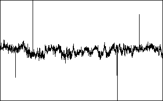
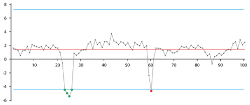
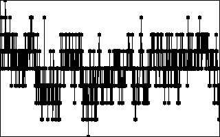
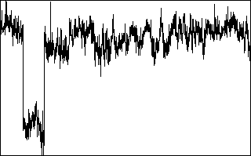
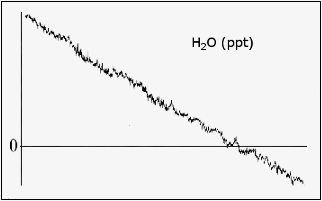
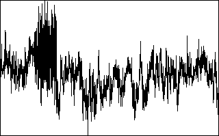
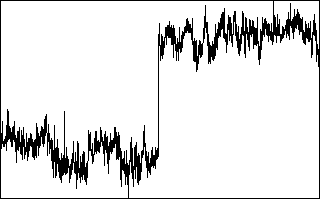
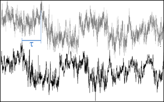
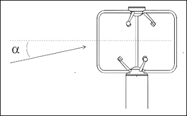
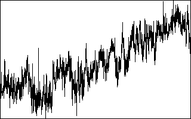

# Despiking and raw data statistical screening

EddyFlow allows you to perform up to 9 tests to assess the statistical quality of the raw time series. Tests are derived from the paper of [Vickers and Mahrt (1997)](references.md#Vickers), and an additional spike count and removal option from [Mauder (2013)](references.md#Mauder2013). Each test can be individually selected and configured to fit your dataset. EddyFlow provides defaults for all configurable parameters, as derived from the original publication.

For each test and for each concerned variable, EddyFlow outputs a flag that indicates whether the variable passed the test:

- Passed: 0
- Failed: 1
- Not selected: 9

EddyFlow does not filter results according to these flags. It is left up to the user to decide whether to investigate the flagged time series and assess them for physical plausibility.

## Despiking

The ** despiking ** procedure consists of detecting and eliminating short-term outranged values in the time series.

                                                            Figure 6‑3. Spikes in a typical data set.

Following [Vickers and Mahrt (1997)](references.md#Vickers), for each variable a spike is detected as up to 3 (settable) consecutive outliers with respect to a plausibility range defined within a certain time window, which moves throughout the time series. The rationale is that if more consecutive values are found to exceed the plausibility threshold, they might be a sign of an unusual yet physical trend. The width of the moving window is defined as one sixth of the current flux averaging period and the plausibility range is quantified differently for different variables. The table below provides EddyFlow default values, that can be changed by the user. The window moves forward half its length at a time. The procedure is repeated up to twenty times, or until no more spikes are found for all variables. Detected spikes are counted and replaced by linear interpolation of neighboring values.

| Variable | Plausibility Range |
| --- | --- |
| u, v | window mean ±3.5 st. dev. |
| w | window mean ±5.0 st. dev. |
| CO2, H2O | window mean ±3.5 st. dev. |
| CH4, N2O | window mean ±8.0 st. dev. |
| Temperatures, Pressures | window mean ±3.5 st. dev. |

As an example, consider the time series in the figure below, where a time series is shown along with its mean value (gray line) and the plausibility range (blue lines). Here, the first 4 consecutive outliers on the left are considered as a local trend and not counted as a spike. On the contrary, the single red outlier on the right is considered as a spike.

                                                            Figure 6‑4. Example of outliers not detected as a spike (green points) and as a spike (red data point) in EddyFlow. The red line is the window mean, blue lines define the plausibility range.

While despiking, EddyFlow counts the number of spikes found. If, for each variable and for the flux averaging period, the number of spikes is larger than 1% (a user-settable value) of the number of data samples, the variable is hard-flagged for too many spikes.

** Note:** 1, 2, or 3 consecutive outliers are counted as only one spike.

** Note:** At each of the 20 iterations of the procedure, a spike that was detected (and replaced) at the previous repetition can appear again as a spike, due to the changed plausibility range; it is replaced again by linear interpolation, however it is not counted again for the purpose of flagging.

Following Mauder (2013), there are no settings to configure except the percent of spikes, and whether to perform linear interpolation between the spikes.

## Amplitude resolution

For some records with weak variance (weak winds and stable conditions), the amplitude resolution of the recorded data may not be sufficient to capture the fluctuations, leading to a step ladder appearance in the data. A resolution problem also might result from a faulty instrument or data recording and processing systems ([Vickers and Mahrt, 1997](references.md#Vickers)). This test attempts to detect these situations by assessing whether the number of different values each variable takes throughout the time series covers its range of variation with sufficient homogeneity.

                                                            Figure 6‑5. Example of a time series affected by an instrument's poor resolution.

In a window moving throughout the time series, data for each variable are clustered into a user-specified number of bins and the frequency distribution is calculated. When the number of empty bins exceeds a critical threshold, the variable is flagged for a resolution problem. The range of variation for each variable is defined by the minimum among: 1) the difference between the maximum and the minimum value attained by the variable and 2) ±3.5 (a user-settable value) times the standard deviation of the variable in the current window.

## Drop-outs

The drop-outs test attempts to detect (relatively) short periods in which the time series sticks to some value that is statistically different from the average value calculated over the whole period. These values may well be within the measuring range of the instruments and within physically plausible values, but the time series stays for "too long" on a value that is far from the mean. This occurrence may be the sign of a short term instrument malfunction, for example due to rain or to the obstruction of the optical or sonic path or indicate an unresponsive instrument or electronic recording problems.

                                                            Figure 6‑6. Dropouts appear as short-lived periods in which the variable sticks to values statistically different from the overall trend.

The test attempts to detecting drop-outs as too many consecutive values falling within bins too distant from the mean value of the time series. Extreme bins (as opposed to central bins) are expected to have smaller numbers of consecutive data points. Furthermore, fluxes are more sensitive to drop-outs in the extreme bins. Thus, thresholds are defined differently for extreme and central bins.

## Absolute limits

This test simply assesses whether each variable attains, at least once in the current time series, a value that is outside a user-defined plausible range. In this case, the variable is flagged. The test is performed after the despiking procedure. Thus, each outranged value found here is not a spike, it will remain in the time series and affect calculated statistics, including fluxes. Therefore, it is mandatory to carefully set the expected plausible ranges for all variables and to consider each flux averaging period in which any variables are flagged for "absolute limits."

                                                            Figure 6‑7. Absolute limits set a boundary on plausible data values.

## Skewness and kurtosis

Third and fourth order moments are calculated on the whole time series and variables are flagged if their values exceed user-selected thresholds. Excessive skewness and kurtosis may help detect periods of instrument malfunction.

                                                            Figure 6‑8. Example of a time series flagged for excessive skewness and kurtosis.

## Discontinuities

The goal of this test is to detect discontinuities that lead to semi-permanent changes, as opposed to sharp changes associated with smaller-scale fluctuations ([Vickers and Mahrt, 1997](references.md#Vickers)). Discontinuities in the data are detected using the Haar transform, which calculates the difference in some quantity over two half-window means. Large values of the transform identify changes that are coherent on the scale of the window.

                                                            Figure 6‑9. Example of a time series featuring a "permanent" change in the mean value.

## Time lags

This test flags the scalar time series if the maximal *w*-covariances, determined via the covariance maximization procedure and evaluated over a predefined time-lag window, are too different from those calculated for the user-suggested time lags. That is, the mismatch between fluxes calculated with the expected time lags and with the "actual" time lags is too large.

                                                            Figure 6‑10. Time lags are compensated by detecting the time difference in covariances or other methods.

## Angle of attack

This test calculates sample-wise Angle of Attacks throughout the current flux averaging period, and flags it if the percentage of angles of attack exceeding a user-defined range is beyond a (user-defined) threshold.

                                                            Figure 6‑11. The Angle of Attack test.

## Steadiness of horizontal wind

This test assesses whether the along-wind and crosswind components of the wind vector undergo a systematic reduction (or increase) throughout the file. If the quadratic combination of such systematic variations is beyond the user-selected limit, the flux averaging period is hard-flagged for instationary horizontal wind ([Vickers and Mahrt, 1997](references.md#Vickers), Par. 6g).

                                                            Figure 6‑12. Steadiness of horizontal wind assesses systematic changes in wind measurements in the time series.
