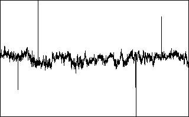
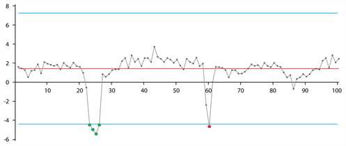
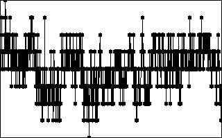
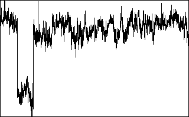
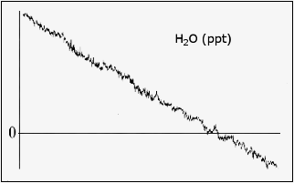
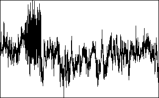
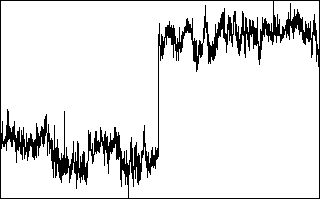
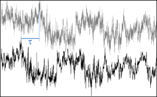
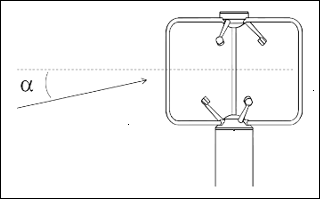
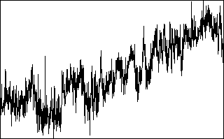

# Despiking and raw data statistical screening

EddyFlow allows you to perform up to 9 tests to assess the statistical quality of the raw time series. Tests are derived from the paper of [Vickers and Mahrt (1997)](references.md#Vickers), and an additional spike count and removal option from [Mauder (2013)](references.md#Mauder2013). Each test can be individually selected and configured to fit your dataset. EddyFlow provides defaults for all configurable parameters, as derived from the original publication.

For each test and for each concerned variable, EddyFlow outputs a flag that indicates whether the variable passed the test:

- Passed: 0
- Failed: 1
- Not selected: 9

EddyFlow does not filter results according to these flags. It is left up to the user to decide whether to investigate the flagged time series and assess them for physical plausibility.

Three further options, **Extra raw-signal diagnostics (RFlux)**, **Post-flux despiking (STL)** and **Storage-flux cleaning**, are off by default and work differently: they report numbers or write separate files instead of 0/1/9 flags (see the sections at the end of this page).

## Despiking

The **despiking** procedure consists of detecting and eliminating short-term outranged values in the time series.

                                                            Figure 6‑3. Spikes in a typical data set.

Following [Vickers and Mahrt (1997)](references.md#Vickers), for each variable a spike is detected as up to 3 (settable) consecutive outliers with respect to a plausibility range defined within a certain time window, which moves throughout the time series. The rationale is that if more consecutive values are found to exceed the plausibility threshold, they might be a sign of an unusual yet physical trend. The width of the moving window is defined as one sixth of the current flux averaging period and the plausibility range is quantified differently for different variables. The table below provides EddyFlow default values, that can be changed by the user. The window moves forward half its length at a time. The procedure is repeated up to twenty times, or until no more spikes are found for all variables. Detected spikes are counted and replaced by linear interpolation of neighboring values.

| Variable | Plausibility Range |
| --- | --- |
| u, v | window mean ±3.5 st. dev. |
| w | window mean ±5.0 st. dev. |
| CO2, H2O | window mean ±3.5 st. dev. |
| CH4, N2O | window mean ±8.0 st. dev. |
| Temperatures, Pressures | window mean ±3.5 st. dev. |

As an example, consider the time series in the figure below, where a time series is shown along with its mean value (gray line) and the plausibility range (blue lines). Here, the first 4 consecutive outliers on the left are considered as a local trend and not counted as a spike. On the contrary, the single red outlier on the right is considered as a spike.

                                                            Figure 6‑4. Example of outliers not detected as a spike (green points) and as a spike (red data point) in EddyFlow. The red line is the window mean, blue lines define the plausibility range.

While despiking, EddyFlow counts the number of spikes found. If, for each variable and for the flux averaging period, the number of spikes is larger than 1% (a user-settable value) of the number of data samples, the variable is hard-flagged for too many spikes.

!!! note

    1, 2, or 3 consecutive outliers are counted as only one spike.

!!! note

    At each of the 20 iterations of the procedure, a spike that was detected (and replaced) at the previous repetition can appear again as a spike, due to the changed plausibility range; it is replaced again by linear interpolation, however it is not counted again for the purpose of flagging.

Following Mauder (2013), there are no settings to configure except the percent of spikes, and whether to perform linear interpolation between the spikes.

EddyFlow also offers a third despiking method, **Consecutive difference (EddyUH)** (`despike_vm=2`), described in [Consecutive-difference despiking](#consecutive-difference-despiking) below.

## Consecutive-difference despiking

**Exact UI label:** Consecutive difference (EddyUH). Project-file key: `despike_vm=2` (0 = Vickers and Mahrt, 1 = Mauder; any other value is treated as Mauder et al.).

**Idea.** A rate-of-change limit rather than a statistical outlier test. Nothing is scaled by a standard deviation and nothing iterates, so the numbers it asks for are of a different kind from those of the two methods above: they are absolute steps, in the variable's own unit, that you decide are physically impossible between two consecutive samples.

**Procedure.** For every variable that has a limit above zero, the series is walked once in time order. Each valid sample is compared with the previous valid sample. If the absolute difference is larger than the limit, the sample is counted as a spike. When spikes are to be replaced (the replace option of the Spike count/removal test is selected), the sample is replaced by the previous valid sample, so the next comparison is made against the replaced value; otherwise the sample is kept and only counted. Samples carrying the error code are skipped and the comparison resumes from the next valid pair: a gap is not counted as a spike and does not create a step between the values on either side of it.

**Limits.** The fields are in the right-side panel of the Statistical Analysis page and are enabled only while this method is selected:

- **u step limit**, **v step limit**, **w step limit**: m s⁻¹; keys `sr_step_u`, `sr_step_v`, `sr_step_w`.
- **Sonic temperature step limit**: K; key `sr_step_ts`.
- One **step limit** per configured gas, in the unit of that gas's column in the raw file description; key `gas_<i>_step_lim`, where `<i>` is the gas record number. The gas fields are generated from the gas records and default to 0 because an absolute step cannot be guessed from the species (a CO₂ series in ppm and one in mol mol⁻¹ need numbers six orders of magnitude apart). The fields show six decimals, so that a step of a few hundredths of a ppb can be entered.

A limit of 0 (displayed as "not despiked") leaves that column untouched, and the run log lists every column skipped for this reason ("No step limit stated for: ... - left undespiked"). A limit far larger than a channel's own sample-to-sample noise removes nothing from it, which is worth checking for the trace-gas channels of a high-precision analyser. The default sonic limits shipped with the program are values used for one project and are not universal; check them against your own sonic anemometer and averaging conditions.

**Assumptions and limitations.** The method assumes you know the largest believable step per sample, which depends on the acquisition frequency (a step that is plausible at 1 Hz is not at 20 Hz). It cannot detect a spike that stays within the limit, and a genuine fast jump larger than the limit (for example a step in a gas concentration when the instrument switches to a calibration gas) is removed. The method has no rule for grouping consecutive outliers: every sample that steps beyond the limit is counted as one spike, unlike the up-to-3-consecutive-samples rule of Vickers and Mahrt.

**Outputs.** The spike counts and the spike-percentage hard flag are written like those of the other two methods: a variable is hard-flagged when its spike percentage reaches the maximum percentage of accepted spikes. The percentage is computed against the column's own number of samples, so a slower analyser is not diluted by the rows of the faster file.

## Amplitude resolution

For some records with weak variance (weak winds and stable conditions), the amplitude resolution of the recorded data may not be sufficient to capture the fluctuations, leading to a step ladder appearance in the data. A resolution problem also might result from a faulty instrument or data recording and processing systems ([Vickers and Mahrt, 1997](references.md#Vickers)). This test attempts to detect these situations by assessing whether the number of different values each variable takes throughout the time series covers its range of variation with sufficient homogeneity.

                                                            Figure 6‑5. Example of a time series affected by an instrument's poor resolution.

In a window moving throughout the time series, data for each variable are clustered into a user-specified number of bins and the frequency distribution is calculated. When the number of empty bins exceeds a critical threshold, the variable is flagged for a resolution problem. The range of variation for each variable is defined by the minimum among: 1) the difference between the maximum and the minimum value attained by the variable and 2) ±3.5 (a user-settable value) times the standard deviation of the variable in the current window.

## Drop-outs

The drop-outs test attempts to detect (relatively) short periods in which the time series sticks to some value that is statistically different from the average value calculated over the whole period. These values may well be within the measuring range of the instruments and within physically plausible values, but the time series stays for "too long" on a value that is far from the mean. This occurrence may be the sign of a short term instrument malfunction, for example due to rain or to the obstruction of the optical or sonic path or indicate an unresponsive instrument or electronic recording problems.

                                                            Figure 6‑6. Dropouts appear as short-lived periods in which the variable sticks to values statistically different from the overall trend.

The test attempts to detecting drop-outs as too many consecutive values falling within bins too distant from the mean value of the time series. Extreme bins (as opposed to central bins) are expected to have smaller numbers of consecutive data points. Furthermore, fluxes are more sensitive to drop-outs in the extreme bins. Thus, thresholds are defined differently for extreme and central bins.

## Absolute limits

This test simply assesses whether each variable attains, at least once in the current time series, a value that is outside a user-defined plausible range. In this case, the variable is flagged. The test is performed after the despiking procedure. Thus, each outranged value found here is not a spike, it will remain in the time series and affect calculated statistics, including fluxes. Therefore, it is mandatory to carefully set the expected plausible ranges for all variables and to consider each flux averaging period in which any variables are flagged for "absolute limits."

                                                            Figure 6‑7. Absolute limits set a boundary on plausible data values.

## Skewness and kurtosis

Third and fourth order moments are calculated on the whole time series and variables are flagged if their values exceed user-selected thresholds. Excessive skewness and kurtosis may help detect periods of instrument malfunction.

                                                            Figure 6‑8. Example of a time series flagged for excessive skewness and kurtosis.

## Discontinuities

The goal of this test is to detect discontinuities that lead to semi-permanent changes, as opposed to sharp changes associated with smaller-scale fluctuations ([Vickers and Mahrt, 1997](references.md#Vickers)). Discontinuities in the data are detected using the Haar transform, which calculates the difference in some quantity over two half-window means. Large values of the transform identify changes that are coherent on the scale of the window.

                                                            Figure 6‑9. Example of a time series featuring a "permanent" change in the mean value.

## Time lags

This test flags the scalar time series if the maximal *w*-covariances, determined via the covariance maximization procedure and evaluated over a predefined time-lag window, are too different from those calculated for the user-suggested time lags. That is, the mismatch between fluxes calculated with the expected time lags and with the "actual" time lags is too large.

                                                            Figure 6‑10. Time lags are compensated by detecting the time difference in covariances or other methods.

## Angle of attack

This test calculates sample-wise Angle of Attacks throughout the current flux averaging period, and flags it if the percentage of angles of attack exceeding a user-defined range is beyond a (user-defined) threshold.

                                                            Figure 6‑11. The Angle of Attack test.

## Steadiness of horizontal wind

This test assesses whether the along-wind and crosswind components of the wind vector undergo a systematic reduction (or increase) throughout the file. If the quadratic combination of such systematic variations is beyond the user-selected limit, the flux averaging period is hard-flagged for instationary horizontal wind ([Vickers and Mahrt, 1997](references.md#Vickers), Par. 6g).

                                                            Figure 6‑12. Steadiness of horizontal wind assesses systematic changes in wind measurements in the time series.

## Extra raw-signal diagnostics (RFlux)

**Exact UI label:** Extra raw-signal diagnostics (RFlux). Project-file key: `test_rf`. Method after [Vitale et al. (2020)](references.md#Vitale2020).

**Idea.** Seven per-variable statistics that look for the signatures of instrument problems in the raw series (flat-lining, coarse resolution, repeated values, multimodality, bursts of outliers) and one cross-correlation statistic that measures how much the covariance with w would change if the flat-lined samples were removed. Unlike the tests above, none of them produces a 0/1/9 flag; they are reported as numbers so that you can choose your own thresholds, or let the [Vitale et al. (2020) quality-flag system](flux-quality-flags.md#vitale-et-al-2020-0-1-2-severity-system) apply the thresholds of the paper. They are computed for u, v, w, the sonic temperature and every configured gas, on the samples that are not error-coded.

**Diagnostics.**

- **AL1** (lag-1 autocorrelation): the autocovariance of the series at a lag of one sample divided by its variance. Turbulent signals sampled at 10-20 Hz are strongly autocorrelated at one sample (values near 1). A low AL1 means that consecutive samples are nearly independent, which indicates that the series is dominated by noise.
- **DDI** (discrete/dominant-value index): the series is binned with the Freedman-Diaconis bin width (2 x interquartile range / n^(1/3); the range divided by n when the interquartile range is zero) and DDI is the sample count of the fullest bin. A high DDI means that many samples collapse onto a few values, as with flat-lining or an instrument resolution that is coarse compared with the signal. A constant series returns n, the number of samples.
- **HF5** and **HF10**: the number of samples whose departure from the period mean exceeds 5 and 10 robust standard deviations. The robust standard deviation is the median absolute deviation divided by 0.6745, with a floor of 0.01 in the variable's unit. (The published procedure uses the Qn estimator; EddyFlow uses the median/MAD scale because Qn over all sample pairs is too costly at 20 Hz.)
- **HD5** and **HD10**: the same count on the first differences of the series, that is the number of consecutive-sample steps larger than 5 and 10 robust standard deviations of the differences. For the scale estimate, steps into a repeated value (an absolute difference below 0.001 in the variable's unit) are left out, so that a flat-lined stretch cannot deflate the threshold. If 1000 or fewer usable differences remain, HD5 and HD10 are reported as missing.
- **DIP**: the p-value of Hartigan's dip test of unimodality ([Hartigan and Hartigan, 1985](references.md#Hartigan1985)) on the raw values. A small p-value means that the distribution of the period is multimodal, as when the signal sits on two levels because of drop-outs or a switching instrument.
- **CCF**: per variable (paired with w; the CCF of w itself is missing because there is no self-pair), the squared cosine similarity between the cross-correlation function of w and the variable computed on the raw series and the same function computed after the flat-lined samples are removed. It is 1 when no sample was flat-lined, below 1 when removing flat-lined samples changes the cross-correlation (a drop signals covariance bias from repeated raw values), and -1 when flat-lined samples make up 90 % or more of the period, where the comparison is not meaningful. CCF is informational only and is not used by the quality-flag system.

**Outputs.** Columns `U_`, `V_`, `W_`, `T_SONIC_` and one per gas, each with the suffix `_AL1`, `_DDI`, `_HF5`, `_HF10`, `_HD5`, `_HD10`, `_DIP` or `_CCF`, at the end of the FLUXNET row (after the biomet block). The columns exist only when the option is on.

**Limitations.** The diagnostics describe raw-signal pathologies; they cannot tell whether the resulting flux is wrong. The thresholds used by the Vitale et al. (2020) quality-flag system are fixed (see that page).

## Post-flux despiking (STL)

**Exact UI label:** Post-flux despiking (STL). Project-file key: `test_pfd`. Method after [Vitale et al. (2020)](references.md#Vitale2020), using STL ([Cleveland et al., 1990](references.md#Cleveland1990)).

**Idea.** Spikes in the high-frequency data are handled by the tests above, but a half-hourly flux can still be an outlier (a bad period that passed every raw-data test). This step looks at the flux series of the whole run and flags periods that depart from the daily pattern and slow trend of their own series.

**Procedure.**

1. After the last period has been computed, the NEE, H and LE series of the run are ordered in time. Periods without a value are kept as gaps.
2. Each series x is transformed as log10(x + 1000) and decomposed with a robust STL (seasonal smoothing across days with a window of 7 days, a trend window of 7 days, 20 robustness iterations), plus a long-run and a short-run smooth of the trend. The back-transformed sum of the components is the expected signal, and the residual is the observation minus that signal.
3. The periods are split into ten classes by deciles of the expected signal. Within each class the residuals are tested with a Laplace-distribution outlier test at the 1 % significance level, using the class median and a robust scale. Periods flagged by the test are spikes. A class with fewer than 10 values is not testable and all of its values are flagged.
4. A flagged period is reported with the `*_SPIKE` column set to 1, and its `*_CLEANED` value is set to missing.

**Assumptions and limitations.** The series needs a regular averaging period giving at least 4 periods per day and at least 10 days of data (480 half-hourly periods); shorter or coarser runs are skipped and the run log says why. The decomposition expects a repeating daily cycle, so heavily gapped series are poorly characterised. The step is run by the flux computation and correction step (FCC) after all periods have been processed, so it is available only when the run goes through FCC. It does not alter the full output or FLUXNET files.

**Outputs.** File `<project id>_flux_despiking<timestamp>.csv` with the columns `TIMESTAMP`, `NEE`, `NEE_SPIKE`, `NEE_CLEANED`, `H`, `H_SPIKE`, `H_CLEANED`, `LE`, `LE_SPIKE`, `LE_CLEANED`. Missing values are written with the project's error label.

## Storage-flux cleaning

**Exact UI label:** Storage-flux cleaning. Project-file key: `test_stor_clean`. Method after the storage-flux branch of the cleaning procedure of [Vitale et al. (2020)](references.md#Vitale2020).

**Idea.** A single extreme period in the storage term can dominate a half-hour net exchange. This step finds extreme values of the storage term of each gas and fills them.

**Procedure.**

1. After the last period, the storage term of each configured gas is collected over the run and ordered in time.
2. The periods are grouped by time of day (the number of groups follows from the run's own averaging period, 48 for half-hourly data).
3. In each group a Tukey boxplot test with the "far out" fence is applied: a value more than 3 interquartile ranges beyond the first or third quartile (hinges as in Tukey's five-number summary) is an outlier.
4. Outliers, together with any gap already present, are replaced by linear interpolation in time, but only where a valid value exists on both sides. An outlier at the very beginning or end of the run, which cannot be interpolated, is set to missing. A period that had no storage value is never turned into a value.

**Assumptions and limitations.** The test needs at least 20 periods and at least 4 periods per day. No physical-range filter is built in, because the gases are user-defined; use the [Absolute limits](#absolute-limits) test for raw-data limits. The cleaned values are written only to the additional file: the storage term in the other output files is not changed.

**Outputs.** File `<project id>_storage_cleaning<timestamp>.csv` with `TIMESTAMP` and, per configured gas (lower-case gas name), `<gas>_strg` (original), `<gas>_strg_spike` (1 for an outlier, 0 otherwise) and `<gas>_strg_cleaned`.

## Kurtosis index of differences (KID)

The **KID** test (always computed; no switch) is the kurtosis of the first differences of each series, where a normal distribution has a kurtosis of 3. Large values mean that the series contains sharp jumps relative to its typical sample-to-sample change, as with spikes or drop-outs ([Vitale et al., 2020](references.md#Vitale2020)).

KID is now calculated on a flat-lined-corrected difference series: the sample immediately after every near-zero step (an absolute difference below 0.001 in the variable's unit) is removed, the series is compacted, and the differences are taken on the shortened series, so that a removed run is bridged by one difference. Earlier builds used the plain first-difference kurtosis. The values of the `U_KID`, `V_KID`, `W_KID`, `T_SONIC_KID` and per-gas `_KID` columns of the FLUXNET output therefore differ from those of earlier builds wherever a sensor flat-lined or digitised its output; without flat-lined stretches the two coincide. The column is written whether or not `test_rf` is on. KID is one of the tests of the [Vitale et al. (2020) quality-flag system](flux-quality-flags.md#vitale-et-al-2020-0-1-2-severity-system).
