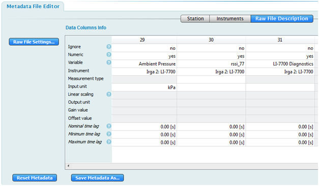
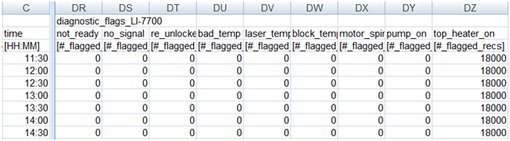

# Diagnostic settings for gas analyzers

Diagnostics are used to indicate whether your instrument is operating correctly. The LI-7500A/RS/DS Open Path CO2/H2O Analyzers output integers between 0 and 255 that correspond to as many as 5 diagnostic values. The LI-7200/RS Enclosed CO2/H2O Analyzer outputs integers between 0 and 65535, which corresponds with up to 10 diagnostics. The LI-7700 Open Path CH4 Analyzer outputs integers between 0 and 65535 that indicate up to 16 diagnostics.

Detailed explanations of the diagnostic values are provided in the instruction manuals for the instruments.

In the EddyFlow software, the diagnostic values of the gas analyzers are configured for processing in the ** Raw File Description ** of the ** Metadata File Editor **, as shown in the LI-7700 example in [Figure 4‑1](#settings).

The raw diagnostic integer values are first converted to bit values, and then the diagnostic records that are flagged are counted. A portion of an LI-7700 diagnostic output is shown in [Figure 4‑2](#excel) (no records flagged).

                                                            Figure 4‑1. Setting the LI-7700 diagnostic value in EddyFlow.

                                                            Figure 4‑2. An example of EddyFlow outputs for LI-7700 diagnostics.

A QA/QC system is automatically implemented in EddyFlow when the diagnostic values of the LI-7500A/RS/DS, LI-7200/RS, and LI-7700 are selected for processing. A diagnostic value that is flagged may or may not affect flux computation. If it does affect the computation, the related record will be discarded. Otherwise, the record will be processed normally.

- Flags for the LI-7500A/RS/DA are described in [Table 4‑1](#action).
- Flags for the LI-7200/RS are described in [Table 4‑2](#action2).
- Flags for the LI-7700 are described in [Table 4‑3](#action3).

For example, if the diagnostic bit map in the LI-7700 indicates that Bit number 5 is flagged (Instrument is calibrating), the record will be skipped. Bit values are 0 = bad (flagged) and 1 = OK (not flagged).

| Bit No. | Name | EddyFlow action if flagged |
| --- | --- | --- |
| 0 to 3 | AGC / Signal Strength | Calculate AGC / Signal Strength |
| 4 | Sync | Process normally |
| 5 | PLL | Skip record |
| 6 | Detector | Skip record |
| 7 | Chopper | Skip record |

| Bit No. | Name | EddyFlow action if flagged |
| --- | --- | --- |
| 0 to 3 | AGC / Signal Strength | Calculate AGC / Signal Strength |
| 4 | Sync | Process normally |
| 5 | PLL | Skip record |
| 6 | Detector | Skip record |
| 7 | Chopper | Skip record |
| 8 | Head pressure | Skip record |
| 9 | Auxiliary input | Process normally |
| 10 | Tin | Skip record |
| 11 | Tout | Skip record |
| 12 | Head connected | Skip record |
| 13 to 15 | Not used (always 0) | Process normally |

| Bit No. | Name | EddyFlow action if flagged |
| --- | --- | --- |
| 0 | LI-7550 Connected | Process normally |
| 1 | Auxiliary thermocouple input 1 failure | Process normally |
| 2 | Auxiliary thermocouple input 2 failure | Process normally |
| 3 | Auxiliary thermocouple input 3 failure | Process normally |
| 4 | Auxiliary thermocouple input 4 failure | Process normally |
| 5 | Instrument is calibrating | Skip record |
| 6 | Bottom heater on | Process normally |
| 7 | Top heater on | Process normally |
| 8 | Pump on | Skip record |
| 9 | Motor spinning (lower mirror) | Skip record |
| 10 | Block temperature unregulated | Skip record |
| 11 | Laser temperature unregulated | Skip record |
| 12 | Bad temperature | Process normally |
| 13 | Reference channel unlocked | Skip record |
| 14 | No sample signal | Skip record |
| 15 | Instrument not ready | Skip record |
