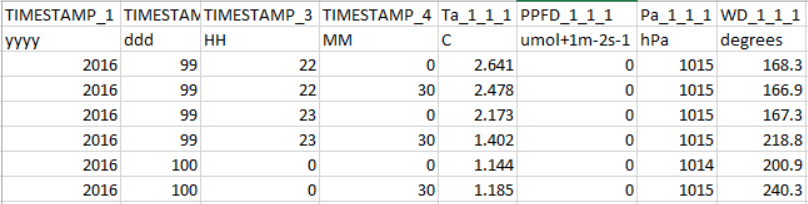
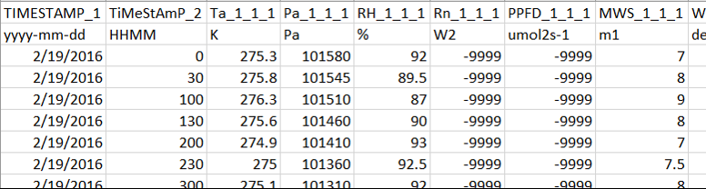
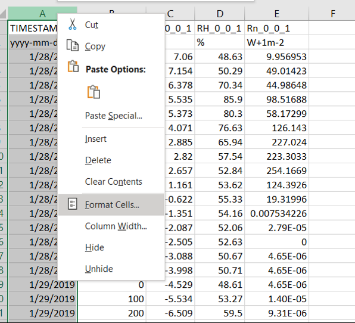
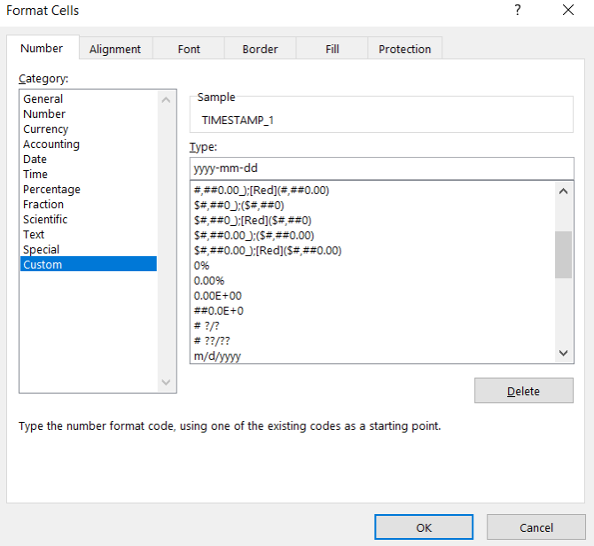
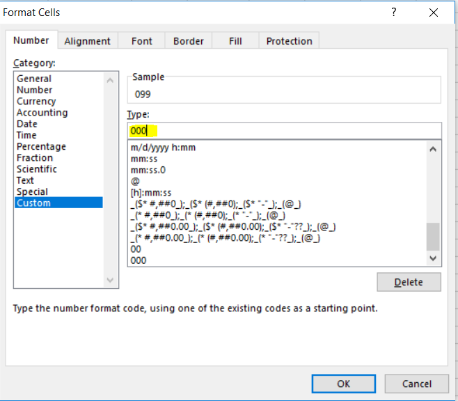
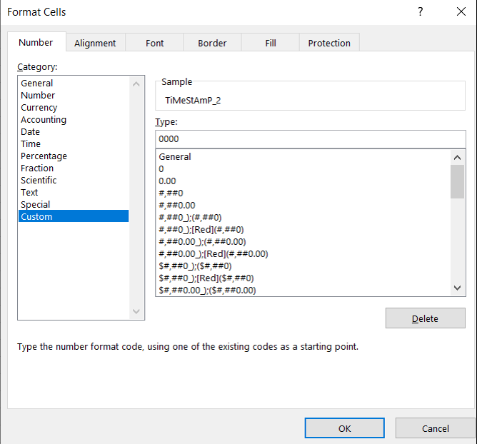

# Run errors

If an EddyFlow run fails, it typically has to do with the setup or data files being processed. Here are some solutions to common issues.

## EddyFlow processing stops immediately or does not start

The processing log typically says **No valid data files found** in the folder.

This often arises from an incorrect **Raw file name format**. See [Raw file name format](raw-file-name-format.md#top) for more details.

## EddyFlow starts processing but fails: Unable to use Biomet Data File or Dynamic Metadata File

This is typically caused by a timestamp issue in the data files.

Errors may arise from an improper number of characters or unacceptable formatting in the time stamp fields of external biomet files. Here are several examples and solutions:

**Example 1:** This file has incorrect formatting in the day-of-year, hour, and minute columns. All values in the day-of-year column should have three characters. Some have only two. The same applies to the hour and minute fields, which have one or two characters instead of the required two.

**Example 2:** This file shows automatic formatting done by Excel® for the first timestamp that contains the date. It also shows the same issue from Example 1 in the hour/minute column.

**Solutions:**

1. With the files open in Excel, configure the date formatting.
2. Select the column that needs to be corrected. Right click and select Format Cells.
3. 
4. To correct the date formatting, click Custom. Under Type, enter yyyy-mm-dd.
5. 
6. To correct day of year, select the column and open Format Cells. Select Custom and enter 000 to specify three-digit day of year.
7. 
8. To correct hour and minute, select the column and open Format Cells. Select Custom and enter 0000 to specify four-digit time.
9. 
10. Click **OK** and save the file in its original format.

## EddyFlow starts processing but fails: Too many implausible values for xyz columns

If the error happens at the first file:

1. The metadata is incorrect under Raw File Description, check the Number of Header Rows and separator
2. Go to the **Statistical Analysis > Absolute Limits** and clear the **Filter outranged values** option or expand the allowed ranges.

If the error happens after processing a few files, consider the following:

1. The data file format or structure has changed in one or more files.
2. The folder may have files with different metadata.
3. When processing `.ghg ` files, the EddyFlow interface loads the first file in the folder when you select the raw data folder. It uses the metadata for that file to set up processing. When data processing starts, the processing engine uses that information for subsequent files. Data processing proceeds until the file format or structure changes (i.e., different number of variables or variables in different order), at which point there is a mismatch between the metadata and the data file and EddyFlow fails to process that file. The solution is to processes files with different data format or structures separately by putting the raw data files into a separate folder.

## Numbered warnings and fatal errors in the run log

The engine writes numbered messages to the run log, in the form `Warning(116)>` for a warning (the run goes on) and `Fatal error(120)>` for an error that stops the run. The lines above the message name the file, period or setting concerned. The messages below were added with mixed acquisition rates and with shared-link inputs.

| Message | What it says | Cause | What to do |
| --- | --- | --- | --- |
| **Warning(116)** | "The acquisition frequency changes within this averaging period. Its files cannot be joined into one time series, so the period is skipped. The next period starts with the file named above, at its own frequency." | The raw files of one averaging period do not share one acquisition rate, either because the files themselves differ, or because an instrument in use states a different rate. Nothing is resampled. | No action is needed when the rate really changed. Only the periods that straddle the change are lost; later periods are processed at the new rate. If the rate did not change, check the **Acquisition frequency** in the metadata. See [Mixed acquisition rates](mixed-acquisition-rates.md#top). |
| **Warning(117)** | "This period is at a higher acquisition frequency than the frequency grid of the binned (co)spectra was built for, a frequency the startup survey of the raw files did not see. Binned spectra, cospectra and ogives of such periods stop at the grid's Nyquist frequency. Fluxes are not affected." | The start-up survey samples the files and missed a faster rate that occurs in some period. | Fluxes are correct. Only the binned spectra of those periods are cut at the grid's Nyquist frequency. |
| **Warning(118)** | "The dynamic metadata file states an acquisition frequency or file duration that differs from the one embedded in the GHG files. The GHG files' own values are used, as they describe the data actually recorded." | The dynamic metadata file lists an acquisition frequency or file duration that disagrees with a .ghg file. The message is written once. | Nothing to do for the run. To avoid the message, correct or leave unset the acquisition frequency and file duration in the dynamic metadata file. See [Time-varying (dynamic) metadata](dynamic-metadata.md#top). |
| **Warning(119)** | "The raw files are not all at one acquisition frequency for the gases listed above. Their spectral assessment is done separately at each of their rates ... The assessment file carries one column set per rate for these gases." | A gas is recorded at more than one rate (the file rate changes, or the analyser rate changes inside a constant file rate). | Informational. The log lists each gas and its rates. See [Mixed acquisition rates](mixed-acquisition-rates.md#top). |
| **Fatal error(120)** | "An input given as a shared Google Drive or Dropbox link, named above, could not be read. The link must be shared with "anyone with the link", and this computer must be able to reach the provider. Program execution aborted." | `curl` is not installed, the link is not a Google Drive or Dropbox folder or file link, a listing or download failed, a setting that needs a file links to a folder, or Dropbox changed its listing format. | Read the lines above it, which name the setting and the link. Check that the item is shared with **Anyone with the link**, that the computer is online and that `curl` is installed. See [Remote folders and shared links](remote-folders.md#troubleshooting). |
| **Warning(121)** | "The raw file named above is read from a shared link and could not be downloaded, after three attempts. It is treated as missing, so the period it belongs to is skipped or processed from the files that remain." | A raw file could not be fetched (network failure, quota, or the provider returned a web page instead of the file). A summary of the same warning at the end of the run counts the lost files. | Rerun when the connection is stable, or check the sharing of the file. |
| **Fatal error(122)** | "Output locations must be local folders; EddyFlow cannot write to a shared drive. Inputs - raw data, metadata, biomet, planar fit, time lag and spectral assessment files, cospectra folders - can be read from a shared link; the output folder cannot. Program execution aborted." | `out_path` is a Google Drive or Dropbox link. The run stops before anything is downloaded. | Set **Output directory** to a local folder. |

## Interface windows for unreadable data and shared drives

| Window title | Message | Cause | What to do |
| --- | --- | --- | --- |
| **Raw Data Unreadable** | "The following LI-COR GHG file could not be extracted and may be corrupt:" followed by the file name. | The .ghg archive could not be unpacked when EddyFlow read its metadata, usually because the file is truncated or damaged. | Remove or replace the file, or copy it again from the logger. EddyFlow no longer reads stale metadata left over from a previously opened archive. |
| **Biomet Data Unreadable** | "The following LI-COR GHG biomet file could not be extracted and may be corrupt:" followed by the file name. | Same, for the biomet part of the archive. | As above. |
| **Remote Drive** | A headline such as "This is not a Google Drive or Dropbox link." or "Could not list the shared folder.", a detail line, and the hint "Is the folder shared with "Anyone with the link", and can this computer reach the internet?" | A link given in a **Remote drive...** field could not be understood, listed or downloaded. | See [Remote folders and shared links](remote-folders.md#failures-and-hints). |

## Run log: lines that report what EddyFlow found

**Acquisition rate survey.** When the raw files are not all at one rate, the log opens with the line "The raw files are not all at one acquisition frequency:" followed by one line per rate and the time it starts, for example `5.000 Hz from 2021-08-21 01:00` and `10.000 Hz from 2021-08-21 02:30`. It then reports "(Frequencies read from N of M files.)", "Each averaging period is processed at its own files' frequency." and "Binned spectra are gridded up to the Nyquist frequency of X Hz." A project at a single rate prints none of this. Later, "Acquisition frequency changes to X Hz from this period on." marks the first period processed at a new rate.

**Shared-link listing.** With a raw data folder given as a link, the log shows "Raw files are read from a shared link:" with the link, then "Listing the shared folder.. N files.", and, for each small input, `Downloading "<setting>" from the shared link.. Done.` When the main pass starts, "N raw file(s) downloaded for the preparatory passes are used again, not downloaded again." tells how many files were kept from the pre-passes.

**Pre-pass workers.** When a pre-pass is split with `-j`, the log shows "Splitting the pre-pass across N worker processes."

**Pre-whitening block-bootstrap summary.** After a run with the PWB time lag method, the log lists for each gas `attempts=`, `S1/S2=` (lags detected), `S4_borrowed=` (lags taken from another gas on the same analyser), `S3=` (lags filled from other periods), `fallback=` and its breakdown, for example `S1/S2=0, S4_borrowed=7`. In earlier builds the `S4_borrowed` column was called `S4_instrument_filled`. A line starting with NOTE says that periods carry a reliability class the summary does not know, or that a gas names no instrument and therefore neither donates a lag to nor takes one from another gas.
