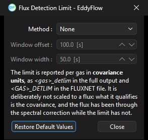

# Flux detection limit settings dialog

Under: Advanced Settings > Statistical Analysis > Flux Detection Limit

Click **Flux Detection Limit...** on the Statistical Analysis page to open this dialog. The button is always available: the calculation is switched on from the **Method** selector inside the dialog rather than from a checkbox on the page, and it is independent of the random uncertainty settings beside it. For the method itself, see [Flux detection limit](flux-detection-limit.md#top).

## Detection limit method

- **Method:** Selects how the detection limit is estimated. The default is *None*, which disables the calculation and greys out the two window fields below. Choosing a method enables them and makes the limit available both as an output column and as a selectable noise floor for conditional lag borrowing.
- **Window offset:** Offset, in seconds, from zero lag to the start of the window in which the noise floor is evaluated. The window must sit far enough from the covariance peak that it samples noise rather than flux.
- **Window width:** Width, in seconds, of that window.

## Dialog buttons

- **Restore Default Values:** Return the fields on this dialog to their defaults.
- **Close:** Close the dialog, keeping the current settings.

!!! note

    The limit is reported per gas in covariance units, as `<gas>_detlim` in the full output file and `<GAS>_DETLIM` in the FLUXNET file. It is deliberately not scaled to a flux: what it qualifies is the covariance, and the flux has been through the spectral correction while the limit has not.
