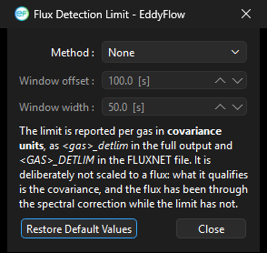

# Flux detection limit settings dialog

Under: Advanced Settings > Statistical Analysis > Flux Detection Limit

Click **Flux Detection Limit...** on the Statistical Analysis page to open this dialog (window title: Flux Detection Limit). The button is always available: the calculation is switched on from the **Method** selector inside the dialog rather than from a checkbox on the page, and it is independent of the random uncertainty settings beside it. For the method itself, see [Flux detection limit](flux-detection-limit.md#top).

## Detection limit method

**Exact UI label:** Method (project-file key `detlim_meth`).

- **None** (value 0, the default): no detection limit is estimated. The output columns `<gas>_detlim` and `<GAS>_DETLIM` are still written, but carry the error code. The two window fields below are greyed out.
- **Wienhold et al. (1994)** (value 1): the noise floor of each gas's covariance with the vertical wind is estimated from the scatter of the cross-covariance function away from its peak, in two windows placed symmetrically either side of the lag actually used for the gas, and the two standard deviations are averaged. Switching it on changes no flux; it only adds the limit alongside. It is particularly worth having for weak-flux species such as carbonyl sulfide or nitrous oxide. It is also required if you use the detection limit as the noise floor of conditional lag borrowing (see [Raw processing options](raw-processing-options.md#conditional-lag-borrowing)). The method is described in [Flux detection limit](flux-detection-limit.md#method).

**Exact UI label:** Window offset (project-file key `detlim_offset_s`; default 100 s; allowed range 1 to 3600 s).

How far from each gas's own time lag the two noise windows are centred, one before the lag and one after it. The offset must clear the cross-covariance peak: if it is too small, the windows measure the flux rather than the noise under it and return a detection limit that rises with the flux itself. Wienhold et al. use 100 s. Increase it for analysers or tubes with a broad covariance peak (long, strongly smoothing sampling lines).

**Exact UI label:** Window width (project-file key `detlim_window_s`; default 50 s; allowed range 1 to 3600 s).

How much of the cross-covariance function each noise window averages. A wider window gives a steadier estimate but reaches closer to the peak; a narrower window is noisier. Wienhold et al. use 50 s. The width is centred on the offset and must stay below it.

!!! warning

    If the window width is equal to or larger than the window offset, the windows would reach the peak and measure the flux. The dialog then shows a warning icon beside the width field, and the engine refuses the combination and falls back to 100 s and 50 s. The same fallback applies if either value is zero or negative in a project file.

## Dialog buttons

- **Restore Default Values:** Return the fields on this dialog to Wienhold's values (offset 100 s, width 50 s) with the method off.
- **Close:** Close the dialog, keeping the current settings.

!!! note

    The limit is reported per gas in covariance units, as `<gas>_detlim` in the full output file and `<GAS>_DETLIM` in the FLUXNET file. It is deliberately not scaled to a flux: what it qualifies is the covariance, and the flux has been through the spectral correction while the limit has not.
