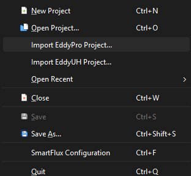
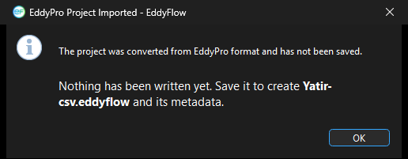

# Importing EddyPro and EddyUH projects

If you have an existing project from LI-COR's EddyPro or from EddyUH, you do not need to rebuild it from scratch in EddyFlow. EddyFlow can import a legacy project file and convert it to the current EddyFlow formats: Processing Project file (.eddyflow, format version 5.1.0) and metadata file (.metadata, format version 3.2.2). Because the current formats are newer than the legacy ones, imported settings are upgraded during conversion, not simply read as-is, so it is worth reviewing the result before running a full dataset through it.

Both importers are reached from the **File** menu:



## Importing an EddyPro project

The engine (v8.0.0 and later) can ingest a legacy **.eddypro** project file directly and auto-convert it into an .eddyflow/.metadata pair.

**From the GUI:**

1. Click **File > Import EddyPro Project...**.
2. Select the **.eddypro** file to import.
3. EddyFlow converts the project to the current .eddyflow (5.1.0) and .metadata (3.2.2) formats, opens it for review, and confirms that nothing has been written to disk yet:

    

4. Save the project to write the converted .eddyflow file and its metadata.

**From the command line:**

1. Run `eddyflow_rp` and pass the path to the legacy **.eddypro** file as the project file argument, for example:

   ```
   eddyflow_rp path\to\legacy_project.eddypro
   ```

2. The engine converts the file to .eddyflow/.metadata on this first run. The converted project is written alongside the original.
3. Run `eddyflow_fcc` against the resulting **.eddyflow** project to continue processing (flux computation).

!!! note

    The auto-conversion from `eddyflow_rp` happens once, on that first invocation. Subsequent runs should reference the converted .eddyflow project rather than the original .eddypro file.

## Importing an EddyUH project

**File > Import EddyUH Project...** converts an EddyUH project into a new, unsaved EddyFlow project.

**What you select.** Choose the project's `preproc_<stem>` file. The file dialog is titled **Import an EddyUH Project** and offers the filter **EddyUH Preprocessing Setup (preproc_*)**; the file has no extension. It is a MATLAB level-5 MAT-file, which EddyFlow reads directly, including compressed variables, so no MATLAB installation is needed. A file that is not a MAT-file, or a MAT-file that holds neither `set_sonic` nor `Columnorder`, is refused with the warning **Not an EddyUH Project** or **EddyUH Project Not Imported**.

**Sibling files.** An EddyUH project is several files. After you pick the `preproc_` file, EddyFlow looks in the same folder for the lag file (`lag_<stem>*`), the planar fit file (`planar_fit_<stem>*`) and the response time file (`resptime_<stem>*`). They are matched on the stem because the suffix changes with every EddyUH run (for example `lag_<stem>.10cl`, `.1cl`, `.8cl`). The names found are listed in the confirmation dialog under **Found beside it**. The siblings are only reported: their contents are not read into the project, and a project without them converts just as well.

**Nothing is written until you save.** The conversion happens in memory. EddyFlow opens the Project Creation page and names the file it would create, `eddyuh_<stem>.eddyflow`, beside the `preproc_` file. The .eddyflow file and its metadata file are written only when you save.

### What the import carries across

- **Site and timing:** site name, station identifier, altitude, latitude, canopy height, displacement height and roughness length; acquisition frequency and file duration.
- **Raw files:** the raw data folder and the file name template (converted to an EddyFlow file name prototype), the raw file type (always **ASCII**), the number of header rows, the column delimiter, and whether timestamps mark the start or the end of the averaging period. The project is set to read the column description from a metadata file (`use_pfile`), because ASCII files carry none of their own; the path of that file is filled in when you save.
- **Period:** when both a start date and an end date are given, they are set together with the 00:00 start and end times and the date-range (subset) switch, so the range is honored. If only one end is given, no range is set (see the caveat list).
- **Averaging and processing:** the averaging interval; the coordinate rotation (none, double, triple or planar fit); the detrending method (block average, linear or running mean), with the time constant carried across only for the running mean.
- **Instruments:** one anemometer, with its make and model when the name is recognized, its measurement height, its boom direction (stored as the north offset), its path length (metres in EddyUH, written in centimetres to both the horizontal and the vertical path length) and its time constant. Each gas analyser is added with its make and model when the name is recognized, its identifier, its tube length (cm), tube diameter (mm) and flow rate (l min-1), its inlet separation and its time constant. The anemometer is numbered first, the analysers follow in the order they have in the EddyUH project, and the anemometer is set as the master sonic.
- **Raw columns:** every raw column is declared in the metadata. Columns that no instrument claims, or whose variable name EddyFlow does not know, are set to Ignore so that the column count still matches the file. For the others the variable, instrument, input unit and measurement type are mapped, the conversion gain and offset become the `a` and `b` coefficients, and for gas columns the lag window is set (nominal lag, with the margin either side of it giving the minimum and maximum lag, in seconds).
- **Runnable gas and cell records:** a gas record (or, for a cell measurement, a cell record) is built for every column the importer can match to a species it knows, with its instrument and raw column filled in. The project therefore runs even if it is converted without the interface reading the metadata afterwards. The ambient temperature, air temperature and air pressure column selections are set to 0, meaning not taken from a raw column.
- **Despiking:** when the EddyUH project uses its consecutive-difference test, the consecutive-difference despiking method (`despike_vm=2`; see [Despiking and raw statistical screening](despiking-raw-statistical-screening.md#top)) is selected. EddyUH stores one step limit per used column. They are written to the wind and sonic temperature step limits (`sr_step_u`, `sr_step_v`, `sr_step_w`, `sr_step_ts`) and, for each gas column that was matched, to that gas record's own step limit. A column with no limit, or a limit of zero, is left undespiked.

### The import summary

The dialog **EddyUH Project Imported** states that the project was converted and has not been saved. Under **What was read:** it lists the state of the project after conversion. Each line appears only when it has something in it:

- **Site:** name and, in brackets, the station identifier.
- **Anemometer:** model, height in metres and boom direction in degrees.
- **Analyser n:** model, tube length (cm), tube diameter (mm) and flow rate (l min-1), one line per analyser.
- **Raw files:** the format, the total number of columns, how many of them are read, the field separator and the number of header rows.
- **File name template:** the file name prototype.
- **Measurements:** the number of gas records, the number of cell channels and the acquisition frequency in Hz.
- **Processing:** the averaging interval in minutes, the rotation (none, double rotation, triple rotation, planar fit), the detrending method (block average, linear detrending, running mean) and the despiking method (consecutive-difference, or Vickers and Mauder, as the dialog spells it).
- **Period:** start and end date, when a range was set.

The summary is read back from the converted project, not collected while converting, so a setting that was silently dropped shows up as **not set** or is missing.

### The caveat list

Below the summary, under **What you must still set:**, the dialog lists what could not be converted or needs a decision. The list is shown after every import, because some items are always present.

These items appear on every import:

- **Flux-time options not in the project files:** the spectral correction method, the cospectral model, the peak-frequency parameterisation, the time-lag method, the data screening and the footprint model are not stored in the files the import reads. All of them take EddyFlow's defaults and should be set deliberately.
- **No absolute limits:** the project states no absolute limits for any gas (the per-column limits it holds are despiking step limits, a different test), so the absolute-limits screening does not run. Set a minimum and a maximum per gas under **Advanced > Statistical Analysis** to use it.
- **Longitude:** it is not in the project and was left at zero. Set it on the Metadata page; the daytime/night split uses it.
- **Sonic north alignment:** it is not recorded and was set to **Axis**, the usual mounting. Change it if the head is spar-aligned, because it turns every wind direction.

Further items appear when the project calls for them:

- **Gas analyser path length:** each analyser's stored path length is not imported, because the source never uses it while the EddyFlow spectral correction does. Set it on the Metadata page.
- **Maximum number of spikes (`MaxNoSpikes`):** not imported. It is the number of spikes a period may contain, whereas the EddyFlow spike setting counts consecutive outliers within one spike; the two are different quantities.
- **Rotation:** a one-dimensional rotation has no EddyFlow equivalent. Rotation is switched off rather than promoted to a double rotation, which would also null the vertical wind. An unrecognized rotation code is read as a double rotation and the note says so.
- **Timestamps:** timestamps at the middle of the averaging period are imported as start-of-period, which shifts every record by half an interval.
- **Date range:** only one end of the range is stated, so no range is set and every raw file found is processed.
- **Delimiter and file type:** a column delimiter or raw file type EddyFlow does not offer.
- **Names not recognized:** an anemometer or analyser name EddyFlow does not know (make and model are left unset; choose them on the Metadata page, because the angle-of-attack, w-boost, spectroscopic and multiplier corrections are chosen from the model); an analyser name that gives a manufacturer but no model (imported with an assumed model that you should check); a raw column whose variable name is unknown (set to Ignore); a column whose unit EddyFlow does not offer.
- **Conversion:** a raw column with a non-trivial gain or offset is imported as the `a` and `b` coefficients; check the conversion type on the Metadata page, which the source does not record.
- **Inlet separation:** the source records one separation and no direction, so it is put on the northward axis. Correct it if the inlet is east of the sonic, because the separation correction is computed per wind direction.
- **Despiking:** a despiking method EddyFlow does not offer (the default test is kept), or a different number of used columns and step limits (they are matched in order and the surplus is ignored).
- **No gas matched:** no gas column could be matched to a known species, so the project runs as an anemometer-only site.

### Legacy conversion of linear column conversions

A metadata file written by older software can state a column's linear conversion in the legacy `zero_fullscale` form, which maps an input range [`min_value`, `max_value`] onto an output range [`a_value`, `b_value`]. The interface no longer offers that type; the current form is gain and offset (`gain_offset`).

- **Exact equivalent.** When the processing engine reads such a metadata file, it upgrades the conversion once to the exact gain/offset equivalent, out = gain * in + offset, with gain = (b - a) / (max - min) and offset = (a * max - b * min) / (max - min), where a and b are `a_value` and `b_value`. The log records the upgrade. Example: an input range of 0 to 5 V mapped onto 0 to 3000 ppm gives gain 600 and offset 0.
- **Zero-width range.** A range with max equal to min cannot be converted. The column is left as it was and the file is rejected, as it always was.
- **Interface fix.** Earlier interface versions converted the offset with a wrong expression, a constant shift (in the example above, 3000 ppm was read at 0 V). Legacy projects converted through the interface now receive the same gain and offset that the engine computes when it reads the file directly. If you converted a legacy project with an earlier version, check its offsets.
- **`min_value` and `max_value`.** They exist only to state the `zero_fullscale` range. The interface no longer writes them (it still reads them from a legacy file), and the EddyPro importer drops them from the metadata it writes, rewriting `conversion`, `a_value` and `b_value` for a column that declared the legacy type.

## What to verify after import

Imported projects should still be reviewed before production processing:

- Confirm the raw data directory, raw file name format, and date range are correct.
- Check the column/variable assignments in the metadata file, especially for gas analyzer and master sonic records.
- For EddyUH imports, confirm the despiking settings, the north alignment of the anemometer, the longitude, and every item listed under **What you must still set:**.
- Review anything flagged by the import dialog as not converted, and configure it manually.
