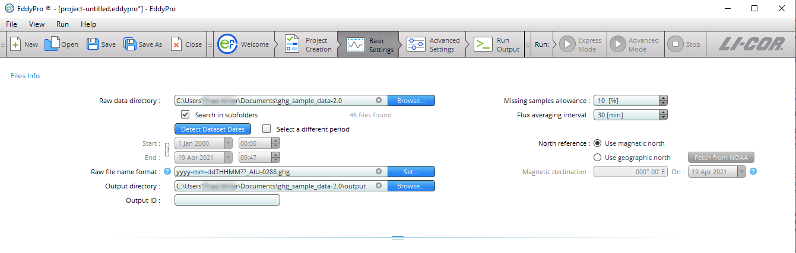
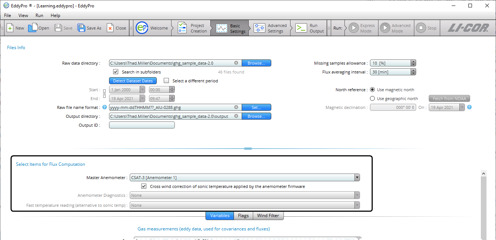
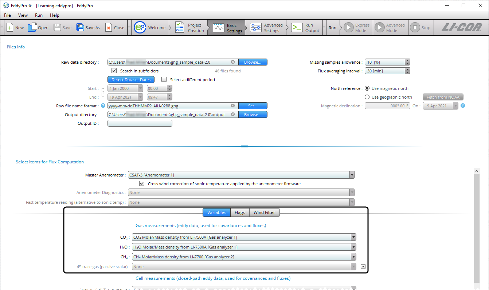
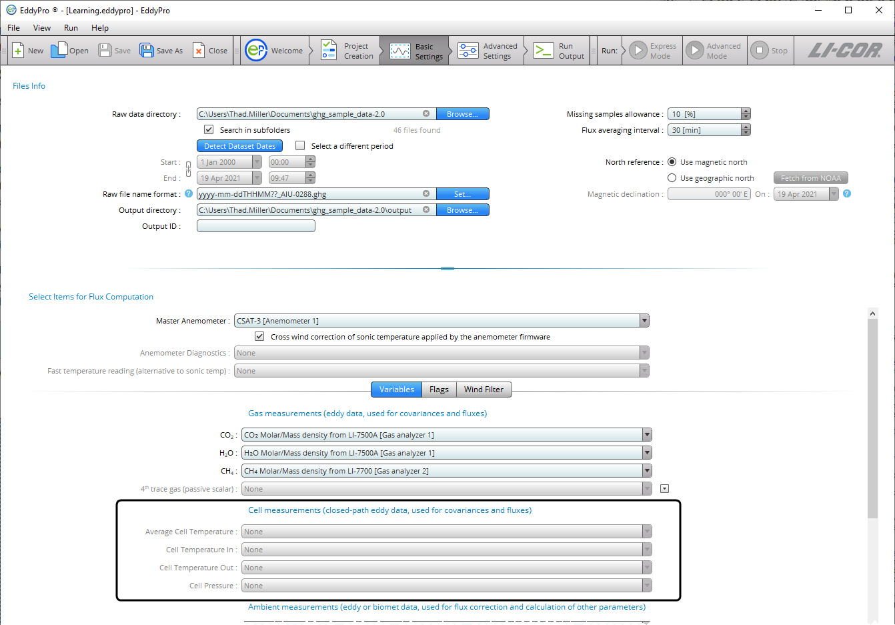
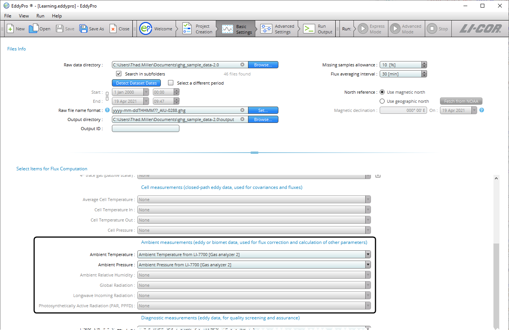
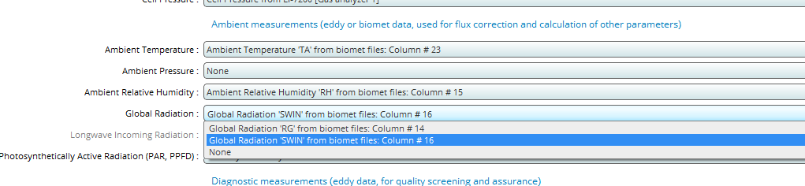
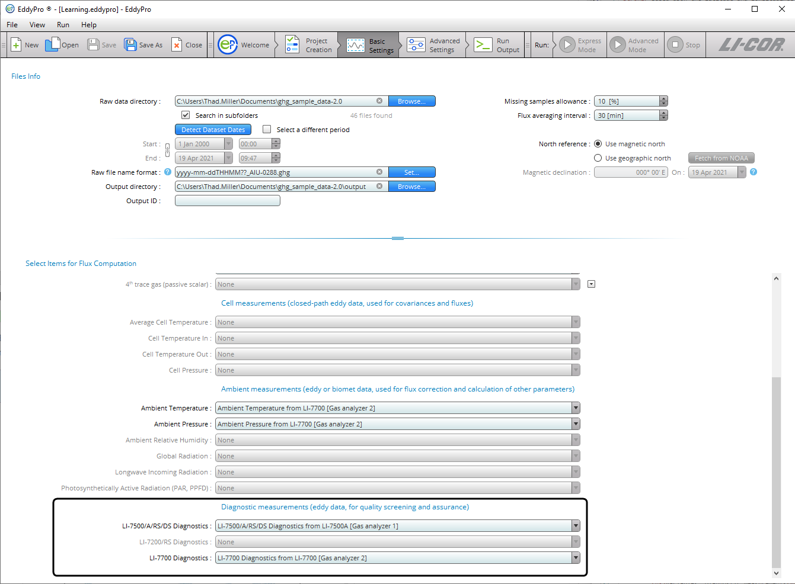
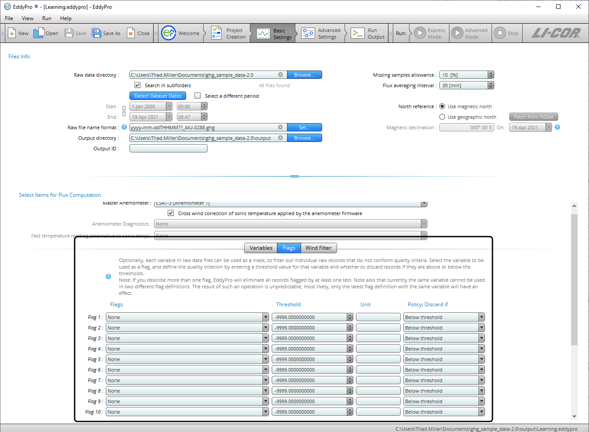
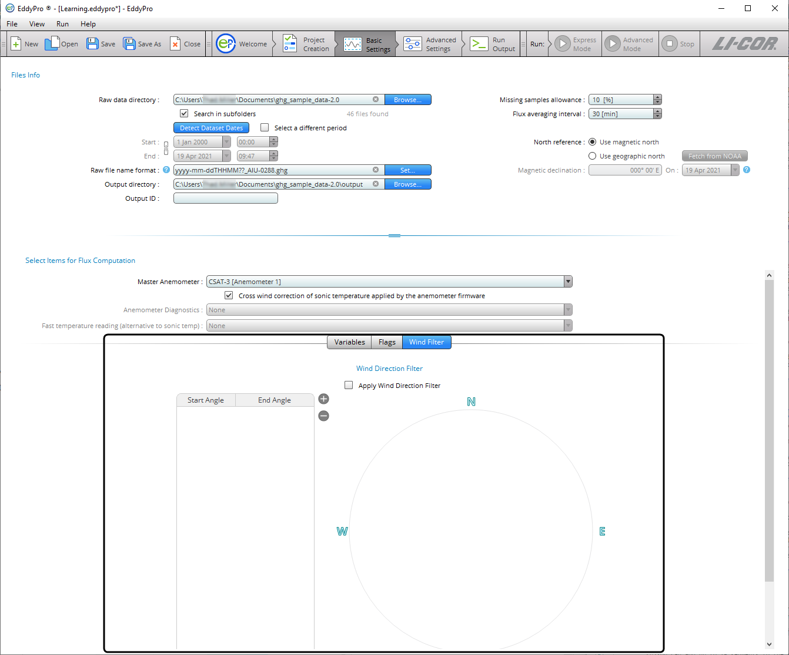
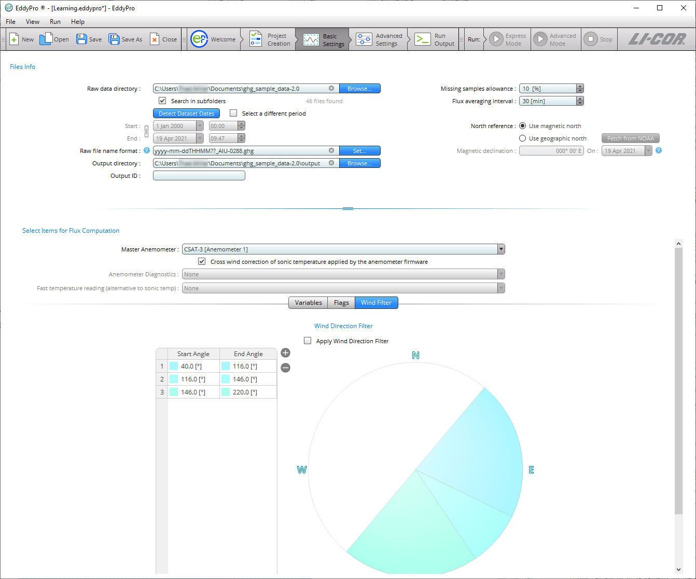

# Basic settings page

This page calls for information about the raw data used in this project. These options are used to specify directories, file length, a subset of data, and the items to include in flux computations.

## Files info

Files info is where you enter information about the raw files and output files.

** Raw data directory:** Click ** Browse…** to specify the folder that contains the raw data. If data are also contained in subfolders, select the ** Search in subfolders ** box.

** Search in subfolders:** Check this box if data are in subfolders in the selected directory. EddyFlow will process files that are in the ** Raw data directory ** and its ** subfolders ** if this box is checked.

** Detect Dataset Dates:** Click this button to ask EddyFlow to retrieve the starting and ending date of the raw dataset contained in the *Raw data directory*. You can override this automatic setting by using the ** Select a different period ** option.

** Select a different period:** If you wish to process a subset of data in the *Raw data directory*, check this box and enter the time constraints for the subset in the fields below. Leave this field unchecked to process all the data in the folder.

** Starting date and time:** This is the starting date of the dataset under consideration. It may or may not coincide with the date of the first raw file. This is used to select a subset of available raw data for processing.

** Ending date and time:** This refers to the ending date of the dataset under consideration. It may or may not coincide with the date of the last raw file. This is used to select a subset of available raw data for processing.

** Raw file name format:** For raw files other than .ghg, your entry in this field should indicate which parts of the file name are the year, month (mm if using dd for day, omit if using ddd), day (dd for day of month or ddd for day of year), hour (HH), minute (MM), and the extension of the file. See [Raw file name format](raw-file-name-format.md#top).

** Output directory:** Specify where the output files will be stored. Click the ** Browse…** button and navigate to the desired directory. You can also edit it directly from this text box. The software will create subfolders inside the selected output directory.

** Output ID:** Enter the ID. This string will be appended to each output file so a short ID is recommended. Again, the graphical interface does not allow the use of characters that result in file names unacceptable to the underlying operating system (for Windows® these include: \\ /: @ ? * " < >).

** Previous output directory:** This is the path of a directory containing results from previous run(s). EddyFlow will attempt to speed up the flux computation procedure by checking for any partial results obtained from previous run(s). If they are contained in this folder EddyFlow will check the settings against the current settings to determine if these data are suitable as an intermediate starting point in the current data processing session. See [Using results from previous runs](using-prev-results.md#top).

** Missing sample allowance:** Select the maximum percent of missing samples that are allowed in each output file. If the number of missing values exceeds this setting the file will be ignored in the dataset. The maximum is 40%.

** Flux averaging interval:** This is the time span over which fluxes will be averaged. The flux averaging interval can be shorter than, equal to, or longer than the raw file duration. Set to *0* to use the input file duration as the flux averaging interval, in which case *File as is* appears in the field.

** North reference:** Indicate whether you want the output data to be referenced to magnetic or geographic north. If you choose geographic north, EddyFlow can retrieve the Magnetic Declination at your site from NOAA (U.S. National Oceanic and Atmospheric Administration) online resources. You can also enter the magnetic declination manually. EddyFlow assumes that north is assessed at the site using the compass, so that everything you provide to the software is with respect to local geographic north. If your measurements are taken with respect to due (magnetic) north, then just select the option ** Use magnetic north ** or enter a declination of zero degrees.

** Magnetic Declination:** Based upon the latitude and longitudinal coordinates entered, EddyFlow determines the magnetic declination from the NOAA (U.S. National Oceanic and Atmospheric Organization) internet resources (U.S. National Geophysical Data Center). EddyFlow constrains the date to December 31st, 2023.

## Select items for flux computation

Specify variables to be used for flux computation.

** Master anemometer:** Select the sonic anemometer from which wind and sonic temperature data should be used for calculating fluxes.

** Crosswind correction for sonic temperature:** Check this box if the crosswind correction is applied internally by the anemometer firmware before outputting sonic temperature. Be aware that some anemometers do apply the correction internally, others not, and others provide it as an option.

** Anemometer Diagnostics:** Sonic anemometer diagnostic information can be stored in raw data files. EddyFlow will detect the information if present and give you options, if available.

** Fast temperature reading:** If raw files contain valid readings of air temperature collected at high frequency (e.g., by a thermocouple), you can use any of them in place of sonic temperature. In this case, corrections specific to sonic temperature (crosswind correction, humidity correction), will not be applied.

** Note:** Users of Gill WindMaster™ and WindMaster™ Pro: The crosswind correction is not applied internally in anemometer units of type 1352, while it is available in the firmware of later types 1561 and 1590.

### Variables: Gas measurements

EddyFlow presents lists of gas measurements in the dataset available for flux computations. At a minimum, it will include CO2 and H2O. Other gases will be present if logged.

** Important:** Flux data for the 4th gas from an open-path instrument cannot be completely processed. EddyFlow does not apply WPL terms to the computations and additional post-processing is required to compute the results for a 4th gas from an open-path gas analyzer. A ** passive scalar ** from a closed path analyzer will be fully processes, however.

### Variables: Cell measurements

For closed-path gas analyzers, the cell measurements (temperatures and pressure) are taken in the LI-7200/RS cell inlet and outlet.

### Variables: Ambient measurements

Ambient measurements are data provided by external sensors, either those that are part of the instrument array or added as external sensors. Here you assign the measurements to be used in computations. These can come from external biomet sensors, for example. The options available to you depend on the data in the raw dataset.

** Ambient Temperature:** Measurements of ambient air temperature.

** Ambient Pressure:** Measurements of ambient air pressure.

** Ambient Relative Humidity:** Measured relative humidity.

** Global Radiation:** If measurements are available in the dataset, you can select which to use.

** Long-wave Incoming Radiation:** If measurements are available in the dataset, you can select which to use.

** Photosynthetically Active Radiation (PAR, PPFD):** If measurements are available in the dataset, you can select which to use.

                                                            Figure 5‑1.The dataset selection page includes an option to select a global radiation measurement.

### Variables: Diagnostic measurements

Diagnostic measurements from gas analyzers can used in data processing. Here you'll select from the diagnostics available in the dataset.

### Flags

Each column of the raw data file that was not tagged as "to be ignored" can be used as a mask to filter out individual high frequency records. Up to ten flags can be specified.

** Note:** An entire record (that is, all variables measured at a certain time instant, one line of raw data) is eliminated any time a flag variable does not comply with its quality criterion. See [Filtering raw data records for instrument diagnostics and custom flags](flags.md#top).

### Wind Direction Filter

EddyFlow allows for graphical selection of "directions" to filter wind from selected directions under the ** Wind Filter ** tab.

You can add up to 16 segments to the radius of directions. Click **+** to add a segment. By default, the first segment will originate at 0.0 and span 10.0 degrees. You can specify the origin and width of each segment. Click the table of numbers to enter a ** Start Angle ** and ** End Angle **.

