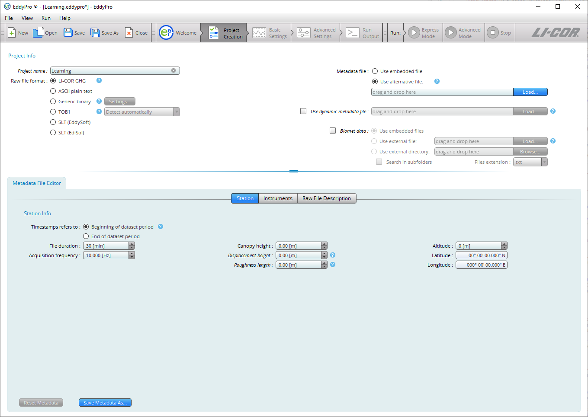

# Project creation page

The Project Creation page is where you specify details about your project, including the project name and raw file format. The visible fields on the projects page depend on the file type you are processing. For .ghg files, under a typical scenario, you will only need to enter the ** Project Name ** before advancing to the ** Basic Settings ** page. Under other circumstances, or any time you are processing a file other than the .ghg file type, you will need to use the ** Metadata File Editor ** to create or modify an existing metadata file.

You can also specify a dynamic metadata file, or instruct EddyFlow to use bio-meteorological ("biomet") data from another file or files contained in a folder.

Fields in the ** Project Creation ** page are described below:

## Project name

Enter a name for the flux computation project. This will be the default file name for this project, but you can edit it while saving the project. This field is optional. The graphical interface does not allow the use of characters that result in file names unacceptable to the underlying operating system (for Windows these include: \\ /: @ ? * " < >).

## Raw file format

Select the format of your raw files. Supported formats are described below:

** the original publisher .ghg:** A compressed raw file format for complete eddy covariance raw data files. Each .ghg file is an archive containing the raw high-frequency data (with a .data extension) and the corresponding metadata (with a .metadata extension) describing the format and content of the data file, and giving essential information about the study site. Both files are in readable text format. Files can also include bio-meteorological data and corresponding metadata. See [.ghg file type](ghg-file-format.md#top).

** ASCII Plain Text:** Any text file organized in data columns, with or without header. All typical field separators (tab, space, comma and semicolon) are supported. The Campbell® Scientific TOA5 format is an example of a supported ASCII data file. See [Processing ASCII and TOB1 raw data files](processing-ascii-and-tob1-files.md#top) for a tutorial.

** Generic Binary:** Generic binary (unformatted) raw data files. Limited to fixed-length binary words that contain data stored as single precision (real) numbers. Click the ** Settings...** button and provide specifications of the binary format:

- ** Number of ASCII header lines:** Enter the number of ASCII (readable text) header lines present at the beginning of the binary files. Enter 0 if there is no ASCII header.
- ** ASCII header end of line:** If an ASCII header is present in the files, specify the line terminator. Typically, Windows operating systems use Carriage Return + Line Feed (0x0D+0x0A), Linux operating systems and macOS use Line Feed (0x0A), while Mac operating systems up to version 9 and OS-9 use Carriage Return (0x0D).
- ** Number of bytes per variable:** Specify the number of bytes reserved for each variable stored as a single precision number. Typically, 2 bytes are reserved for each number.
- ** Endianess:** In a multi-bytes binary word, *little endian* means that the most significant byte is the last byte (highest address); *big endian* means that the most significant byte is the first byte (lowest address).

** TOB1:** Raw files in the Campbell® Scientific binary format. Support of TOB1 format is limited to files containing only ULONG and IEEE4 fields, or ULONG and FP2 fields. In the second case, FP2 fields must follow any ULONG field, while for ULONG and IEEE4 there is no such limitation. See [Processing ASCII and TOB1 raw data files](processing-ascii-and-tob1-files.md#top) for a tutorial.

** Note:** ULONG fields are not interpreted by EddyFlow, thus they can only be defined as "ignore" variables.

- ** Detect Automatically:** Let EddyFlow figure out whether TOB1 files contain (ULONG and) IEEE4 fields or (ULONG and) FP2 fields.
- ** Only ULONG and IEEE4 fields:** Choose this option to specify that your TOB1 files contain only IEEE4 fields and possibly ULONG fields. EddyFlow does not interpret ULONG fields. This means that any variable stored in ULONG format must be marked with "ignore" in the Raw File Description table. Typically ULONG format is used for time stamp information.
- ** Only ULONG and FP2 fields:** Choose this option to specify that your TOB1 files contain only FP2 fields and possibly ULONG fields. ULONG fields, if present, must come first in the sequence of fields. EddyFlow does not interpret ULONG fields. This means that any variable stored in ULONG format must be declared marked with the "ignore" option in the Raw File Description table. Typically ULONG format is used for time stamp information.

** SLT (EddySoft):** Format of binary files created by EddyMeas, the data acquisition tool of the EddySoft suite, by O. Kolle and C. Rebmann (Max Planck Institute, Jena, Germany). This is a fixed-length binary format. It includes a binary header in each file that needs to be interpreted to correctly retrieve data. EddyFlow does everything automatically.

** SLT (EdiSol):** Format of binary files created by EdiSol, the data acquisition tool developed by Univ. of Edinburg, UK. This is a fixed-length binary format. It includes a binary header in each file that needs to be interpreted to correctly retrieve data. EddyFlow does everything automatically.

## Metadata

Metadata is information that describes the raw eddy covariance data. More specifically, it describes where and how the data were collected, what instruments were used, and how the data are arranged in the data files. Choose whether to use metadata files embedded into .ghg files or to bypass them by using an alternative metadata file. See [Metadata file editor](metadata-file-editor.md#top) and [.ghg file type](ghg-file-format.md#top).

** Use embedded file:** Select this option to use file-specific metadata, retrieved from the metadata file residing inside the .ghg file.

** Use alternative file:** Select this option to use an alternative metadata file. In this case all files are processed using the same metadata, retrieved from the alternative metadata file. This file is created and/or edited in the ** Metadata File Editor **. If you are about to process .ghg files, you can speed up the completion of the alternative metadata file by unzipping any raw file and loading the extracted metadata file from the ** Use alternative metadata file > Load ** button. Make changes if needed and save the file.

** Load:** Load an existing metadata file. If you use the Metadata File Editor to create and save a new metadata file from scratch, its path will appear here.

** Use dynamic metadata file:** Check this option and provide the corresponding path to instruct EddyFlow to use an externally-created file that contains time changing metadata, such as canopy height, instrument separations and more. See [Time-varying (dynamic) metadata](dynamic-metadata.md#top).

## Biomet data

** Biomet data:** Select this option and choose the source of biomet data. Biomet data are slow (< 1Hz) measurements of biological and meteorological variables that complement eddy covariance measurements. Some biomet measurements can be used to improve flux results (ambient temperature, relative humidity and pressure, global radiation, PAR and long-wave incoming radiation). All biomet data available are screened for physical plausibility, averaged on the same time scale of the fluxes, and provided in a separate output file if requested.

- ** Use embedded files:** Choose this option to use data from biomet files embedded in the .ghg files. This option is only available for files collected with the original SmartFlux System or SmartFlux 2 and 3 Systems, provided a biomet system was used during data collection. EddyFlow will automatically read biomet files from the files, interpret them and extract relevant variables.
- ** Use external file:** Choose this option if you have all biomet data collected in a single external file. Provide the path to this file by using the ** Load...** button.
- ** Use external directory:** Choose this option if you have biomet data collected in more than one external file, and provide the path to the directory that contains those files by using the ** Browse...** button.

** Important:** All biomet files must be formatted according the guidelines that you can find in [External biomet files](biomet-data-format.md#ExternalBiomet).
