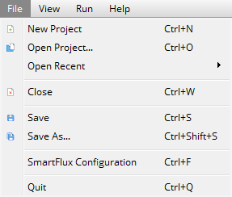
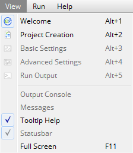
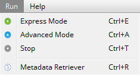
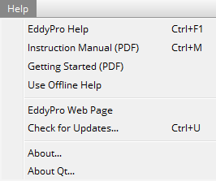
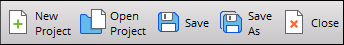
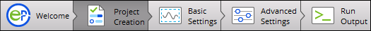
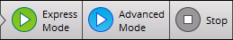

# Overview of the interface

This section provides a high-level overview of the EddyFlow interface. It should help you become familiar with the menus, toolbars, and the settings that are available on each page of EddyFlow.

## Welcome page

Upon entering the application, you will see the welcome page, which includes options to start a new project or open an existing project, and the customary [menus](#Menus) and [toolbars](#Toolbars). These include:

### Menus

In the top left of the EddyFlow window, you will see four menus.

The ** File ** menu provides options to create a ** New Project **, ** Open Project...**, ** Open Recent ** projects, ** Close ** the current project, ** Save ** the current project, or ** Save As…** to save a copy with a new file name.

The ** View ** menu provides navigation between the ** Project Creation ** page, ** Basic Settings ** page, ** Advanced Settings ** page, and ** Output Console **. You can also toggle EddyFlow Tooltips and EddyFlow messages. Some of these options are only available after you have entered the software suite.

Under the ** Run ** menu you can choose to run a project as ** Advanced ** or ** Express **, or to ** Pause/Stop ** a run. It also includes the ** Metadata Retriever ** run option. These options are available after the project has been started.

Under the ** Help ** menu you can access the online or offline help content, view video tutorials, check for software updates, view information about the application, and view information about the Qt development environment. If you are not online, select ** Use Offline Help ** to access a version of the help resources that are installed with the EddyFlow application.

### Toolbars

The ** File Toolbar ** includes many of the same options available under the ** File Menu ** (New Project, Open Project, Save, Save As.., and Close).

The ** Navigation Toolbar ** has five buttons.These are used to navigate between pages in the software.

The ** Run Toolbar ** provides the buttons that initiate data processing. The run buttons activate after EddyFlow has enough information to complete the project. ** Express Mode ** uses predefined default settings to process the project. ** Advanced Mode ** uses whichever settings you apply in the software interface. ** Stop ** will end a data processing session.

The tool bars can be moved to the desired position on your computer display.
