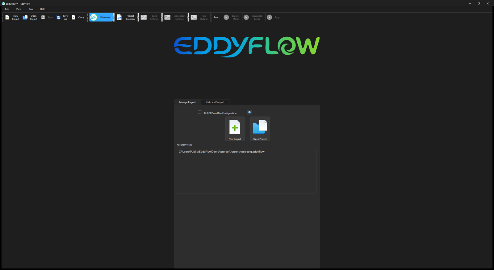
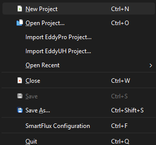
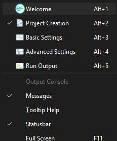
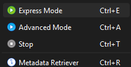
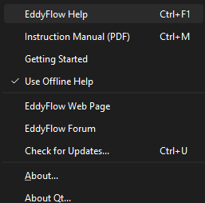
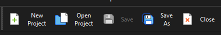
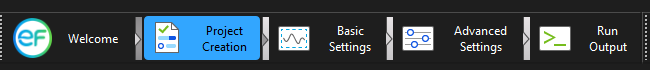
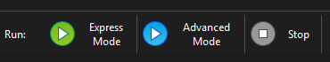

# Overview of the interface

This section provides a high-level overview of the EddyFlow interface. It should help you become familiar with the menus, toolbars, and the settings that are available on each page of EddyFlow.

## Welcome page

Upon entering the application, you will see the welcome page, which includes options to start a new project or open an existing project, a **Recent Projects** list for reopening recent work, and the customary [menus](#Menus) and [toolbars](#Toolbars). A second tab, **Help and Support**, collects links to the documentation and other resources. Checking **LI-COR Smartflux Configuration** before creating or opening a project puts the interface into SmartFlux mode; see [Running EddyFlow on the SmartFlux System](smartflux-settings.md#top).

### Menus

In the top left of the EddyFlow window, you will see four menus.

The **File** menu provides options to create a **New Project** (Ctrl+N), **Open Project...** (Ctrl+O), reopen one from **Open Recent**, **Close** the current project (Ctrl+W), **Save** it (Ctrl+S), or **Save As…** to save a copy with a new file name (Ctrl+Shift+S). It also holds **Import EddyPro Project...** and **Import EddyUH Project...**, which convert a legacy project to the current EddyFlow format (see [Importing EddyPro and EddyUH projects](importing-legacy-projects.md#top)), and **SmartFlux Configuration** (Ctrl+F), which switches the interface into SmartFlux mode.

The **View** menu navigates between the five pages of the interface: **Welcome** (Alt+1), **Project Creation** (Alt+2), **Basic Settings** (Alt+3), **Advanced Settings** (Alt+4), and **Run Output** (Alt+5). Below those it toggles the **Output Console** and **Messages** panels, **Tooltip Help**, the **Statusbar**, and **Full Screen** (F11). Some entries are unavailable until a project has been opened; the Output Console, for instance, is only active on the Run Output page.

Under the **Run** menu you can start a run in **Express Mode** (Ctrl+E) or **Advanced Mode** (Ctrl+A), **Stop** a run in progress (Ctrl+T), or start the **Metadata Retriever** (Ctrl+R). These become available once the project has enough information to run.

Under the **Help** menu, **EddyFlow Help** (Ctrl+F1) opens this documentation and **Instruction Manual (PDF)** (Ctrl+M) opens the manual; **Getting Started** opens the introductory material. Select **Use Offline Help** to read the copy installed alongside the application rather than the online version. The menu also links to the **EddyFlow Web Page** and **EddyFlow Forum**, checks for new releases with **Check for Updates...** (Ctrl+U), and shows information about the application and about the Qt development environment under **About...** and **About Qt...**.

### Toolbars

The **File Toolbar** includes many of the same options available under the **File Menu** (New Project, Open Project, Save, Save As.., and Close).

The **Navigation Toolbar** has five buttons.These are used to navigate between pages in the software.

The **Run Toolbar** provides the buttons that initiate data processing. The run buttons activate after EddyFlow has enough information to complete the project. **Express Mode** uses predefined default settings to process the project. **Advanced Mode** uses whichever settings you apply in the software interface. **Stop** will end a data processing session.

The tool bars can be moved to the desired position on your computer display.
