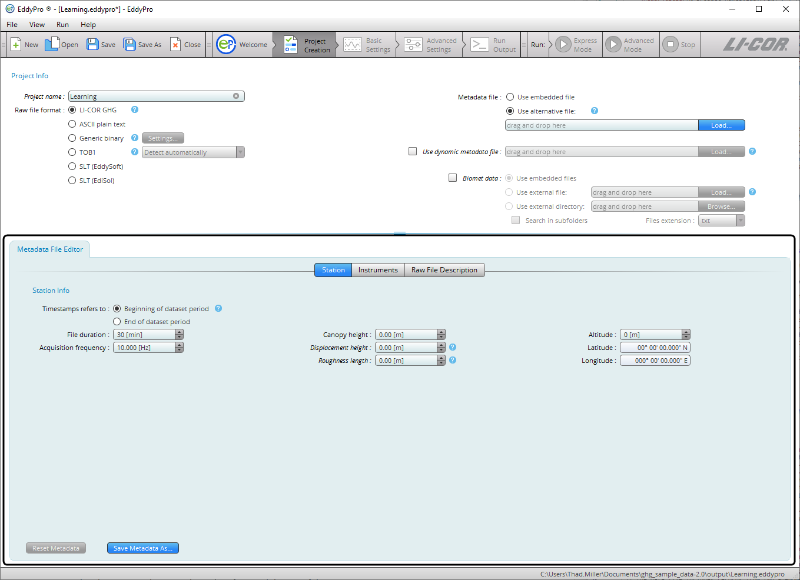
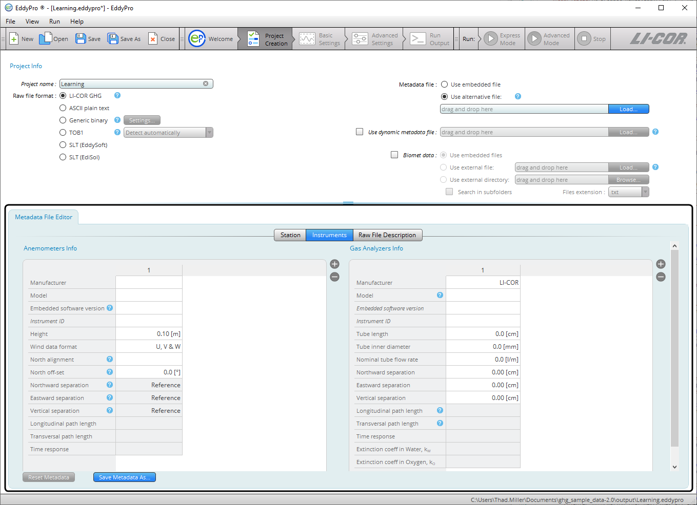
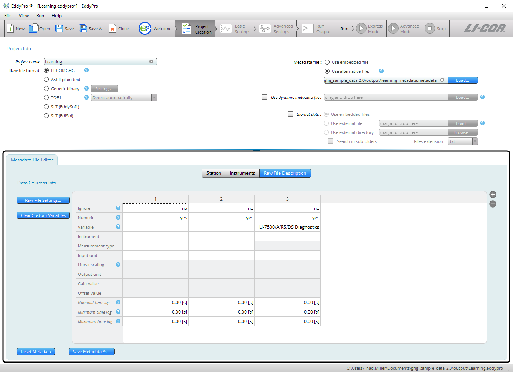
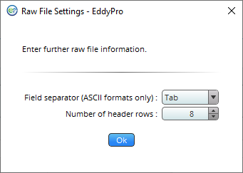

# Using the metadata file editor

The ** Metadata File Editor ** is used to enter site information, instrument information, and a description of the data file structure, if you have not entered this information during the the eddy covariance site setup. This information is required for any dataset processed in EddyFlow. You will use the Metadata File Editor under two circumstances:

- To correct or complete site information that is present in an existing metadata file, or
- When you are processing ASCII plain text, Generic binary, TOB1, SLT (EddySoft), or SLT (EdiSol) files.

The Metadata File Editor will activate when you select a raw file format other than the original publisher .ghg or if you select ** Use Alternative File **. It has three tabs: ** Station **, ** Instruments **, and ** Raw File Description **, as well as a dialog box called ** Raw File Settings **.

When you begin editing the ** Metadata File Editor **, EddyFlow will prompt you to save the metadata file. After you save it, all subsequent edits are saved automatically.

1. Configuring the Station Tab:
2. 
3. ** Time Stamp Refers to:** Specify whether the time stamp in the file name refers to the beginning or end of the time series contained within the file. See [Beginning of dataset](beginning-of-dataset.md#top).
                                                                    ** File duration:** Set the duration of input files.
                                                                    ** Acquisition frequency:** This refers to the number of samples per second in the data files.
                                                                    ** Canopy height:** Distance between the soil surface and the top of the canopy.
                                                                    ** Displacement height:** See [Displacement height](displacement-height.md#top).
                                                                    ** Roughness length:** See [Roughness length](roughness-length.md#top).
                                                                    ** Altitude:** Elevation above sea level of the flux site.
                                                                    ** Latitude and Longitude:** WGS84 coordinates in decimal degrees.
4. Configure the Instruments Tab. It has fields for anemometers and gas analyzers:
5. 
6. For Anemometer Info, enter:
7. ** Manufacturer:** The make of the anemometer.
                                                                    ** Model:** The model of the anemometer.
                                                                    ** Software version:** The anemometer's firmware (embedded software) version (see [Entering the sonic anemometer firmware version](sonic-anemometer-firmware-version.md#top)).
                                                                    ** Instrument ID:** This is for your records.
                                                                    ** Height:** Distance between the ground and the anemometer.
                                                                    ** Wind data format:** Output format for the anemometer. Choose from *U*, *V*, *W*: *Polar* and *W*; or *axis velocities*.
                                                                    ** North alignment:** Set to Axis or Spar, if applicable.
                                                                    ** North offset:** See [North offset](north-offset.md#top).
                                                                    ** Northward, Eastward, or Vertical separation:** Used to specify the distance between sensors. For the anemometer you only need to use this field if the data file includes records from two anemometers. See [Northward, eastward, and vertical separation](sensor-separation.md#top).
                                                                    ** Longitudinal path length:** Path length in the direction of a pair of transducers.
                                                                    ** Transversal path length:** Path length in the direction orthogonal to the longitudinal path length.
                                                                    ** Time response:** Time response of the anemometer. Its inverse defines the maximum frequency of the atmospheric turbulence that the instrument is able to resolve. Consult the anemometer's specifications or user manual.
8. For Gas Analyzers Info:
9. ** Manufacturer:** The make of your gas analyzer.
                                                                    ** Model:** The model of your gas analyzer. See [Model (gas analyzer)](gas-analyzer-model.md#top).
                                                                    ** Software version:** The embedded software version that was running on the LI-7550 Analyzer Interface Unit or LI-7500DS at the time data were collected. Mandatory only for the LI-7500A/RS/DS and LI-7200/RS CO2/H2O analyzers. 
                                                                    ** Instrument ID:** This is for your records, to distinguish instruments.
                                                                    ** Height:** The distance between the ground and the anemometer.
                                                                    ** Tube length:** For closed path analyzers only, enter the length of the intake tube. Ignore for open path analyzers.
                                                                    ** Tube inner diameter:** For closed path analyzers only, the inside diameter of the intake tube.
                                                                    ** Nominal tube flow rate:** For closed path analyzers only, the flow rate setting. Ignore for open path analyzers.
                                                                    ** Northward, Eastward, or Vertical separation:** Used to specify the distance between anemometer and gas analyzer. See [Northward, eastward, and vertical separation](sensor-separation.md#top).
                                                                    ** Longitudinal path length:** Path length between the optical source and detector of the analyzer.
                                                                    ** Transversal path length:** Path length in the direction orthogonal to the longitudinal path length.
                                                                    ** Time response:** Time response of the gas analyzer. Its inverse defines the maximum frequency of the atmospheric turbulent concentration fluctuations that the instrument is able to resolve. Consult the analyzer's specifications or user manual.
                                                                    ** Extinction coefficient in water, Kw:** In Krypton or Lyman-α hygrometers, the extinction coefficients for water vapor of the hygrometers, associated with the third-order Taylor expansion of the Lambert–Beer law around reference conditions ([van Dijk et al. 2003](references.md#vanDijk)).
                                                                    ** Extinction coefficient in water, Ko:** In Krypton or Lyman-α hygrometers, the extinction coefficients for oxygen of the hygrometers, associated with the third-order Taylor expansion of the Lambert–Beer law around reference conditions ([van Dijk et al. 2003](references.md#vanDijk)).
10. Enter information in the Raw File Description tab:
11. 
12. The Raw File Description tab is where you tell EddyFlow how data are arranged in the raw data files. Click the plus button (+) to add columns. In each column specify the following:
13. ** Ignore:** Select ** yes ** to instruct EddyFlow to ignore a column. Columns to be ignored include time stamps, line counters, etc.
                                                                    ** Numeric:** Select ** no ** to tell EddyFlow that a column is not purely numeric. Purely numeric variables are strings included within two consecutive field separators and containing only digits from 0 to 9 and, at most, the decimal point. Any other character makes a variable not numeric. For example, time stamps in the form of 2011-09-26 or times as 23:20:562 are not numeric variables. If a variable is not numeric, this must be specified even if you set 'yes' in the ignore field.
                                                                    ** Variable:** Specify the variable that is contained in the current column of the raw files or enter a custom variable of your choice. Custom variables are saved to the computer registry so they are available to you when you start a new project.
                                                                    ** Instrument:** Select the instrument that measured the current variable. Instruments listed here are those you entered under the Instruments tab.
                                                                    ** Measurement type:** Only applicable to gas concentrations, enter the units used to describe the gas concentration measurement. For other variables, leave the field blank or select *Other*.
                                                                    ** Input unit:** Specify the units for the variable, as it is stored in the raw data file.
                                                                    ** Linear scaling:** Specify a linear conversion type to rescale available data, if needed. Variables that are already in any of the supported physical units do not need to be rescaled.
                                                                    ** Output unit:** Enter the output units (physical units after conversion). The following *A* and *B* values must be such that the input variable is converted into the selected output unit.
                                                                    ** Gain value:** Enter the gain for the *Gain-Offset* conversion.
                                                                    ** Offset value:** Enter the offset for the *Gain-Offset* conversion.
                                                                    ** Nominal time lag:** Enter the expected (nominal) time lag of non-anemometric variables, with respect to the reference anemometer, where applicable. Time lags should be specified at least for gas concentrations and can be estimated based on instrument separation (open path) or the intake tube and flow rate (closed path).
                                                                    ** Minimum time lag:** Enter the minimum plausible time lag for the current variable, with respect to the sonic anemometer.
                                                                    ** Maximum time lag:** Enter the minimum plausible time lag for the current variable, with respect to the sonic anemometer.
14. More information on the metadata may be required in the ** Raw File Settings ** dialog:
15. 
16. ** Field separator character:** Specify the character that separates individual values within the same sample in the raw files (for ASCII formats only).
                                                                    ** Number of header rows:** Enter the number of rows in the header of the file, if present. In most cases, the software will be able to filter away individual text lines that do not comply with the description provided here. Therefore, most files with a variable number of header lines are supported.

The metadata file will be saved automatically. After completing it, the ** Basic Settings ** tab will become active, and you can proceed with the project.
