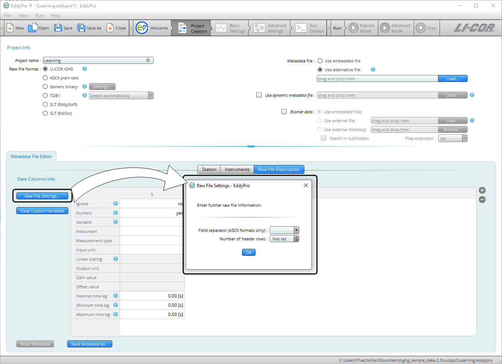

# Metadata file editor

The ** Metadata File Editor ** is part of the Project Creation page. It is used to create and edit metadata for the processing project. Metadata may include site information, station information, and information that describes how data are arranged in data files. If you are processing .ghg files, you may use the ** Metadata File Editor ** to modify the embedded metadata files. If you are processing other file types, use the Metadata File Editor to enter and save metadata. There are three tabs: [Station](#Station), [Instruments](#Instrume), and [Raw File Description](#Raw).

## Station

Under this tab, provide information that describes the research station. This information will be used for every data file processed with this metadata file.

** Timestamp refers to:** Select whether the timestamp provided in raw file names refers to the beginning or to the end of the data interval. See [Beginning of dataset](beginning-of-dataset.md#top).

- ** beginning of averaging period:** Select this option if timestamps in raw file names refer to the beginning of the data interval.
- ** end of averaging period:** Select this option if timestamps in raw file names refer to the end of the data interval.

** Note:** Timestamps on EddyFlow output files always refer to the end of the averaging interval.

** File duration:** Enter the time span covered by each raw file.

** Acquisition frequency:** Referred to as ** update rate ** or ** output rate ** in the LI-7500A/RS/DS, LI-7200/RS, or LI-7700 software. Enter the acquisition frequency (number of samples per second) used to collect raw data.

** Altitude:** Elevation above sea level to the base of the flux tower.

** Canopy height:** Effective average distance between the ground and the top of the plant canopy. Also referred to as *aerodynamic canopy height*.

** Displacement height:** Zero plane displacement height is the average level at which elements of the plant community absorb momentum. If left blank, this parameter is automatically estimated based on canopy height. See [Displacement height](displacement-height.md#top).

** Roughness length:** Canopy roughness length is a quantification of the surface roughness. If left blank, this parameter is automatically estimated, based on canopy height. See [Roughness length](roughness-length.md#top).

** Latitude:** Latitude at the site. Use N and S for north and south latitudes, respectively.

** Longitude:** Longitude at the site. Use E and W for east and west longitudes, respectively.

** Reset Metadata:** Reset the default settings in the Metadata File Editor. Does not affect other settings of the project.

** Save metadata as...:** Save the metadata file with a new file name. To save the processing project, use the file menu or toolbar.

## Instruments

Enter information that describes all anemometer(s) and gas analyzer(s) used at the EC station to collect the data you want to process.

### Anemometer Information

Describe the anemometers used at the EC station to collect wind and sonic temperature data you want to process.

** Manufacturer:** Specify the manufacturer of the anemometer among those supported. Choose ** Other ** for any manufacturer not explicitly listed. This field is mandatory.

** Model:** Identify the model of the anemometer. Choose ** Generic Anemometer ** for any model not explicitly listed. This field is mandatory.

** Software version:** Identify the firmware (embedded software) version that was running on the selected anemometer. For Gill WindMaster™ and WindMaster Pro models, the firmware version is required in order to select the proper Angle of Attack correction. Storing other anemometers' firmware versions is recommended for good record keeping. See [Entering the sonic anemometer firmware version](sonic-anemometer-firmware-version.md#top) for more information.

** Instrument ID:** Enter an ID for the anemometer, to distinguish it from the other instruments. This is only for your records and providing it is optional.

** Height:** Enter the distance between the ground and the center of the device sampling volume. This field is mandatory.

** Wind data format:** Specify in which format the wind components are provided. This can be *U*, *V*, *W*; *Polar* and *W*; or *axis velocities*.

** North alignment:** For Gill anemometers, specify whether the spar or axis of the anemometer is oriented toward north. This field only applies to Gill anemometers.

** North offset:** Enter the anemometer's yaw offset with respect to local magnetic north, positive eastward (magnetic north as assessed with a compass, not corrected for declination). See [North offset](north-offset.md#top).

** Northward separation:** Specify the distance between the current anemometer and the reference anemometer, as measured horizontally along the north-south axis (the one you assess with a compass). The distance is positive if the current anemometer is placed to the north of the reference anemometer. The reference anemometer is the first one you describe. For this anemometer you cannot enter the separation and you find the string *Reference*. See [Northward, eastward, and vertical separation](sensor-separation.md#top).

** Eastward separation:**. Specify the distance between the current anemometer and reference anemometer, as measured horizontally along the east-west axis (the one you assess with a compass). The distance is positive if the current anemometer is placed to the east of the reference anemometer. The reference anemometer is the first one you describe. For this anemometer you cannot enter the separation and you find the string ** Reference **. See [Northward, eastward, and vertical separation](sensor-separation.md#top).

** Vertical separation:** Specify the distance between the current anemometer and reference anemometer, as measured horizontally along the vertical axis. The distance is positive if the current anemometer is placed above the reference anemometer. The reference anemometer is the first one you describe. For this anemometer you cannot enter the separation and you find the string *Reference*. See [Northward, eastward, and vertical separation](sensor-separation.md#top).

** Longitudinal path length (anemometer):** Path length in the direction defined by any transducer pair. Consult the anemometer's specifications or user manual. See [Longitudinal and transversal path lengths and time response](longitude-transverse-pathlengths.md#top).

** Transversal path length (anemometer):** Path length in the direction orthogonal to the longitudinal path length (e.g., as defined by the diameter of transducers). See [Longitudinal and transversal path lengths and time response](longitude-transverse-pathlengths.md#top).

** Time response (anemometer):** Time response of the anemometer. Its inverse defines the maximum frequency of the atmospheric turbulence that the instrument is able to resolve. Consult the anemometer's specifications or user manual. See [Longitudinal and transversal path lengths and time response](longitude-transverse-pathlengths.md#top).

**+** Add a new anemometer.

**-** Remove the currently selected anemometer.

### Gas analyzers information

Describe gas analyzers used at the EC station to collect data you want to process.

** Manufacturer:** Specify the manufacturer of the gas analyzer. For gas analyzers other than the original publisher, select *Other*. This field is mandatory.

** Model:** Identify the model of the gas analyzer. For gas analyzers other than the original publisher, select the appropriate typology. OP and CP stand for open path and closed path, respectively. See [Model (gas analyzer)](gas-analyzer-model.md#top).

** Software version:** For the LI-7500A/RS and LI-7200/RS CO2/H2O analyzers, identifies the embedded software version that was running on the LI-7550 Analyzer Interface Unit at the time data were collected.

** Instrument ID:** Enter an ID for the gas analyzer. This is only for your records and providing it is optional.

** Height:** Enter the distance between the ground and the center of the device sampling volume or inlet of the intake tube. This field is mandatory.

** Tube length:** Specify the length of the intake tube in centimeters. This field is mandatory for closed path instruments. Ignore it for open path instruments.

** Tube inner diameter:** Specify the inside diameter of the intake tube in centimeters. This field is mandatory for closed path instruments. Ignore it for open path instruments.

** Nominal tube flow rate:** Specify the flow rate in the intake tube expected during normal operation. This field is mandatory for closed path instruments. Ignore it for open path instruments.

** Northward separation:** Specify the distance between the center of the sample volume (or the inlet of the intake tube) of the current gas analyzer and the reference anemometer, as measured horizontally along the north-south axis (the one you assess with a compass). The distance is positive if the gas analyzer is placed to the north of the anemometer. See [Northward, eastward, and vertical separation](sensor-separation.md#top).

** Eastward separation:** Specify the distance between the center of the sample volume (or the inlet of the intake tube) of the current gas analyzer and the reference anemometer, as measured horizontally along the east-west axis (the one you assess with a compass). The distance is positive if the gas analyzer is placed to the east of the anemometer. See [Northward, eastward, and vertical separation](sensor-separation.md#top).

** Vertical separation:** Specify the distance between the center of the sample volume (or the inlet of the intake tube) of the current gas analyzer and the reference anemometer, as measured vertically. The distance is positive if the gas analyzer is above the anemometer. See [Northward, eastward, and vertical separation](sensor-separation.md#top).

** Longitudinal path length (gas analyzer):** Path length in the direction of the optical source. Consult analyzer's specifications or user manual. See [Longitudinal and transversal path lengths and time response](longitude-transverse-pathlengths.md#top).

** Transverse path length (gas analyzer):** Path length in the direction orthogonal to the optical source. Consult the analyzer's specifications or user manual. See [Longitudinal and transversal path lengths and time response](longitude-transverse-pathlengths.md#top).

** Time response (gas analyzer):** Time response of the gas analyzer. Its inverse defines the maximum frequency of the atmospheric turbulent concentration fluctuations that the instrument is able to resolve. Consult analyzer's specifications or user manual. See [Longitudinal and transversal path lengths and time response](longitude-transverse-pathlengths.md#top).

** Extinction coefficient of water, Kw ****:** In Krypton or Lyman-α hygrometers, the extinction coefficients for water vapor, associated with the third-order Taylor expansion of the Lambert–Beer law around reference conditions ([van Dijk et al. 2003](references.md#vanDijk)).

** Extinction coefficient of oxygen Ko:** In Krypton or Lyman-α hygrometers, the extinction coefficients for oxygen, associated with the third-order Taylor expansion of the Lambert–Beer law around reference conditions ([van Dijk et al. 2003](references.md#vanDijk)).

**+** Add another gas analyzer.

**-** Remove the currently selected gas analyzer.

## Raw file description

In this tab you describe the raw files, including their format and content. If needed, you can also provide scaling information to turn raw variables into physical units and estimation time lags for non-anemometric variables.

** Ignore:** Select *yes* to instruct EddyFlow to ignore a column (variable). Columns to be ignored include time stamps, line counters, etc.

** Note:** If a variable is not numeric, this must be specified even if you set *yes* in the *ignore* field.

** Numeric:** Select *no* to tell EddyFlow that a column (variable) is not purely numeric. Purely numeric variables are strings included within two consecutive field separators and containing only digits from 0 to 9 and, at most, the decimal point. Any other character makes a variable not numeric. For example, time stamps in the form of 2011-09-26 or times as 23:20:562 are not numeric variables.

** Variable:** Specify the variable that is contained in the current column of the raw files (or position, for binary files). Choose from the available list or type in a custom variable label.

** Note:** Custom variables created in the file description table of the Metadata Editor will be permanently available in the local computer for future use.

** Instrument:** Select the instrument that measured the current variable. Instruments listed here are those entered under the instruments tab.

** Measurement type:** Only applicable to gas concentrations. Enter the description of the concentration measurement (either *Molar/Mass density*, *Mole fraction*, or *Mixing ratio*). For all other variables, either leave the field blank or select *Other*. *Molar/Mass density* is a measure of moles/mass per unit volume of air. *Mole fraction* is a measure of mass per mass of wet air. *Mixing ratio* is a measure of mass per mass of dry air. Measures of mass can be expressed as number of moles, grams, etc.

** Input unit:** Specify the units of the variable as it is stored in the raw file.

** Linear scaling:** Specify whether to perform a linear conversion to rescale data. Variables that are already in any of the supported physical units do not need to be rescaled. See [Linear scaling](conversion-type.md#top).

** Output unit:** Only if you are doing a conversion, enter the output units (physical units after conversion). The following *Gain* and *Offset* values must be such that the input variable is converted into the selected output unit.

** Gain value:** Enter the gain (slope) of the linear relation between input and output units.

** Offset value:** Enter the offset (y-axis intercept) of the linear relation between input and output units.

** Nominal time-lag:** Enter the expected (nominal) time lag of the variable, with respect to the measurements of the anemometer that you plan to use for flux computation, as applicable. Time lags should be specified at least for gas concentrations and can be estimated based on instrument separation (open path) or on the sampling line characteristics and the flow rate (closed path). See [Nominal, minimal, and maximum Time Lag](nominal-time-lag.md#top).

** Minimum time-lag:** Enter the minimum expected time lag for the current variable, with respect to anemometric measurements.

** Maximum time-lag:** Enter the maximum expected time lag for the current variable, with respect to anemometric measurements.

**+** Add a variable.

**-** Remove a variable

## Clear custom variables

This button resets the Metadata variables list to the default selection and removes any custom variables that you've added.

** Note:** Custom variables created in the file description table of the Metadata Editor will be permanently available in the local computer for future use.

## Raw file settings

** Field separator character:** Specify the character that separates individual values within the same sample in the raw files.

** Number of header rows:** Enter the number of rows in the header of the file, if present. In most cases, the software will be able to filter away individual text lines that do not comply with the description provided here. Therefore, most files with a variable number of header lines are supported.
