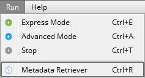

# Metadata retriever tool

The ** Metadata Retriever ** tool is accessible under the ** Run ** menu in the main menu bar.

This tool is only available when the selected file type is ** the original publisher .ghg **. The tool is intended to extract information from all metadata files included in the dataset and collect them into a unique file that can:

- Be provided to EddyFlow as a ** Dynamic metadata file **, possibly after making changes to account for information that was not updated during data collection;
- Be used to analyze the evolution of the site (canopy height, roughness length, etc.) and setup (anemometer height, sensors separation, etc.) parameters.

The ** Metadata Retriever ** is by all means a run mode, like Express or Advanced modes. If you click on the ** Metadata Retriever ** button, EddyFlow will start processing the selected dataset. However, all settings entered in the software will be ignored (except for those that are needed to identify the dataset, i.e., the raw data directory and the start/end dates) and EddyFlow will simply unzip all .ghg files, retrieve the metadata contained in them and output them in a corresponding metadata file.

## When to use it

The ** Metadata Retriever ** tool is useful, for example, if you are aware that the metadata files in the .ghg dataset contain errors or were not updated at the proper time. In this scenario, using .ghg files with "embedded metadata" is not a viable option, because (some) embedded files are corrupted or include incorrect data. Thus, you need to bypass them using the "alternative metadata" file. However, if you still need to account for time-dependent site or setup parameters, you need to use a dynamic metadata file: the latter file can be created by first running the ** Metadata Retriever ** and then manually (e.g., in a text editor or spreadsheet program) adjusting the wrong parameters, paying attention to only modify the numbers, and not the format of the timestamp or the spellings in the header lines.

## How to use it

Use a retrieved metadata file in the same way you would use a Dynamic metadata file, as described in [Time-varying (dynamic) metadata](dynamic-metadata.md#top).
