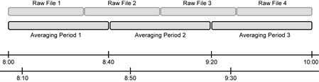

# EddyFlow output files

After clicking ** Run **, EddyFlow will generate some temporary intermediate files and compute fluxes based on the information provided in the data and metadata. These files are stored in folders and subfolders in the ** Output Directory ** you assigned in the ** Project Page **.

In these folders and files, you will find summary results. Each line in these files refers to a flux averaging period and starts with the corresponding raw file name and the timestamp of *the end* of the averaging period. File names are created with the ** Project ID** that you entered in the ** Project Page **.

** Note:** Each run produces output files in the assigned directory. The output files are marked with the date and time of the run in the file name.

## Time structure of output files

A fundamental concept behind the implementation of EddyFlow is that you are attempting to obtain a dataset with a regular time step, which is the flux averaging period. To achieve this, once EddyFlow has read the names of all raw files to be processed, it will detect the first and the last one (in a chronological sense) and create a time structure (a timeline) where the beginning is given by the timestamp of the first file and the time step is given by the flux averaging period. Results of EddyFlow calculations for each flux averaging period will be associated to the closest time step in the time structure, with the condition that the difference between the actual timestamp of the current averaging period and the closest timestamp in the time structure is less than half the averaging period.

                                                            Figure 3‑1. Timelines representing the handling of averaging periods by EddyFlow.

Consider the figure above. Two timelines are represented in the bottom part of the figure. They represent two different time structures, both of which have the same time step (40 minutes) but with an offset of 10 minutes between the two. For example, they might have been established with EddyFlow by setting a flux averaging period of 40 minutes (in both cases) but having found a first chronological raw file with a timestamp such as 04:00 (upper case) and 4:10 (bottom case). In EddyFlow, both time series would be filled with results for the averaging periods sketched on the upper part of the figure: results would be the same for the 08:00/08:10, 08:40/08:50 and 09:20/09:30 pairs. Some trials with the software will help you gain a better understanding of this feature of EddyFlow. Currently, there is no option to force EddyFlow to consider a file's timestamp as the actual timeline.

## Common features of output files

EddyFlow output results are provided in comma separated ASCII data files. Based on certain processing options, EddyFlow may force you to output certain files. This is the case, for instance, with the high-frequency spectral corrections. If any of the available in-situ methods are selected, EddyFlow will automatically select certain spectral outputs and deactivate the corresponding entry, so that you cannot unselect them. This is because those outputs are essential to the spectral assessment and correction procedure.

All text is written without spaces, except where not applicable; spaces are replaced by "_" (underscores). Files may have a header that briefly describes the content of the file. Then the data columns begin, with a first line providing the labels and, in some cases, a second line providing units.

The names of output files produced by EddyFlow follow the convention:

eddypro_projID_filecontent_date_time.csv

where EddyFlow is a constant string, projID is the Output ID entered in the [Project Page](introduction-interface.md#Project3), ` filecontent ` gives a short description of the content of the file, and ` date ` and ` time ` refer to the date and time that the data were processed.

All EddyFlow results begin with the same three fields: the name of the raw file for which results are provided (or the name of the first file in case results come from several adjacent raw files), and the date and time of the *end* of the averaging period for the current result record. For example:

2011-01-29T130000_mysite.ghg,2011-01-29,13:30,

is the beginning of an output record referring to a dataset that ends at 13:30 of 29/01/2011, and is contained in the raw file 2011-01-29T130000_mysite.ghg (or a set of files of which this is the first one).
