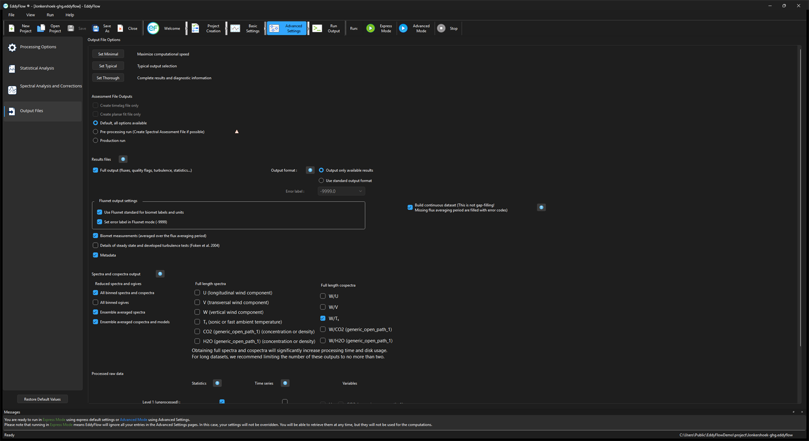

# Output files

EddyFlow provides a broad range of file output options. These may seem daunting, so to keep things simple, you can select a predefined set, or you can customize the outputs to meet your needs.

**Set Minimal:** Click this button to select a minimal set of output files, providing you with the essential results while speeding up the computation process. Suggested for processing long datasets without a need for an in-depth analysis and validation of the computations.

**Set Typical:** Click this button to select a balanced set of output files, providing you with the essential results as well as diagnostic information. The computation time increases with respect to the minimal output configuration.

**Set Thorough:** Click this button to select a complete set of output files, providing you with all the results as well as complete diagnostic information. The computation time may increase considerably with this option.

## Assessment file outputs

These three options configure the whole run around producing or consuming a planar fit or spectral assessment file, rather than adjusting individual output checkboxes:

- **Default, all options available:** Applies no assessment-output preset. Every option remains under manual control from this page and from Spectral Analysis and Corrections.
- **Pre-processing run (Create Spectral Assessment File if possible):** Prepares a run that creates a new spectral assessment file, if enough data are available. Selects the required spectral assessment and output options and locks the settings that must stay fixed during that run.
- **Production run:** Prepares a normal processing run that uses existing spectral assessment inputs and production QA/QC defaults, while leaving the usual output choices free to edit.

Two related checkboxes run only one assessment step in isolation:

- **Create timelag file only:** Runs only the step that creates a time lag assessment file. Requires **Time lags compensation** to be enabled with either **Automatic time lag optimization** or **Pre-whitening block-bootstrap** selected.
- **Create planar fit file only:** Runs only the step that creates a planar fit assessment file. Requires a planar fit rotation method to be enabled with **Planar fit file not available** selected in the Planar Fit Settings.

## Results files and options

**Full Output:** This is the primary EddyFlow results file. It contains fluxes, quality flags, micrometeorological variables, gas concentrations and densities, footprint estimations and diagnostic information along with ancillary variables such as uncorrected fluxes, main statistics, etc.

## Output format

- **Output only available results** to write on the **Full output** file only the results which are actually available, eliminating "error code" columns that are created when results are unavailable.
- **Use standard output format** to write the **Full output** file in its predefined standard format, regardless of the results currently available. This may come in handy if you wish to import the file in a post-processing analysis tool.
- **Error label:** Customize the error code into any string that you prefer (such as NaN). You can choose from the drop-down list or enter any string you want. The default is "-9999."

**Build continuous dataset:** Fills any flux averaging period missing from the output with the error label, so the full output file has one row per period across the whole run with no gaps in the time series. This is not gap-filling — no value is estimated for the missing periods, they are simply written with the error code rather than omitted.

**Biomet measurements:** Aggregated values (averages or sums) of all available biomet measurements, calculated over the same time period selected for fluxes. Biomet measurements that are recognized by EddyFlow (i.e., marked by recognized labels) are screened for physical plausibility before aggregation and they are converted to units that coincide with other EddyFlow results. All other variables are solely averaged and provided on output.

Details of steady state and developed turbulence tests (Foken et al., 2004): Partial results obtained from the steady state and the developed turbulence tests. It reports the percentage of deviation from expectation and individual test flags.

**Metadata:** Summarizes metadata used for the processed data sets. If an alternative metadata file is used without a dynamic metadata file, the contents of this file will be identical to the alternative metadata. If you are processing .ghg files and/or a dynamic metadata file, this results file will tell you which metadata were used during data processing.

## Spectral outputs

**Binned (co)spectra and ogives:** If selected, a subfolder will be created that contains one file for each flux averaging period. These files contain all relevant binned spectra and cospectra (or the corresponding ogives). Binned spectra and cospectra files are necessary for in-situ spectral correction methods ([Horst, 1997](references.md#horst1997); [Ibrom et al, 2007](references.md#Ibrom); [Fratini et al. 2012](references.md#Fratini2012)).

**Full length spectra:** If selected, a subfolder will be created that contains one file for each flux averaging period. These files contain full spectra and/or cospectra of selected variables.

**Full length cospectra:** Cospectra with the vertical wind component, calculated for each variable, for each flux averaging interval. Results files are stored in a separate subfolder inside the output folder.

**Ensemble averaged spectra:** If selected, two additional files will be created in the 'spectral analysis' subfolder of the selected output folder. One file contains ensemble averaged spectra of all passive gases along with that of sonic/fast temperature. The second file contains ensemble averaged H2O spectra sorted in 9 relative humidity classes. If the high-frequency noise elimination option is selected, for each gas (and for each RH class in the case of H2O) both spectra with and without noise elimination are provided. Furthermore, a 'simulation' of gas spectra is provided - for each gas and for each RH class - obtained by multiplying sonic/fast temperature spectra by an IIR-shaped transfer function (see Ibrom et al. 2007 and Fratini et al. 2012 for details).

**Ensemble averaged cospectra and models:** If selected, two additional files will be created in the 'spectral analysis' subfolder of the selected output folder. One file contains ensemble averaged cospectra sorted by time of the day (8 periods of 4 hours each, starting at midnight). The second file contains ensemble averaged cospectra sorted by stability stratification. In this file, model cospectra and a fitting of the actual co-spectra with models by Massman are also provided.

## Processed raw data

- **Statistics:** Files containing main statistics on the time series (mean values, variances, covariances, Skewness, Kurtosis) for all sensitive variables, after the selected processing step. These files are stored in a dedicated folder.
- **Time series:** Files containing time series for the selected variables, after the selected processing step. One file for each selection is created for each flux averaging interval (up to 7 files for each flux averaging interval). Files are stored in a dedicated folder.
- **Variables:** When you select **Time series**, EddyFlow enables options to select variables from the time series.
