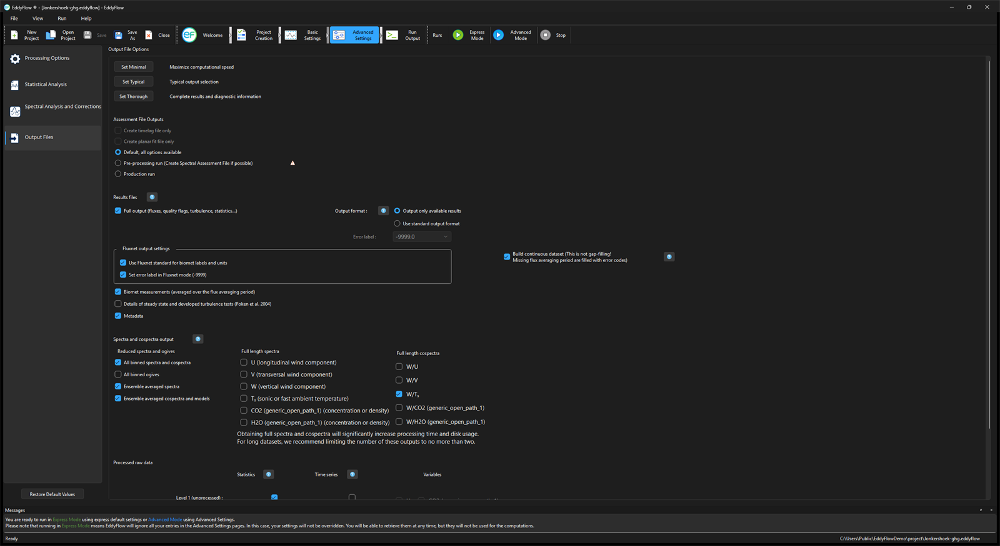

# Output files

EddyFlow provides a broad range of file output options. These may seem daunting, so to keep things simple, you can select a predefined set, or you can customize the outputs to meet your needs.

**Set Minimal:** Click this button to select a minimal set of output files, providing you with the essential results while speeding up the computation process. Suggested for processing long datasets without a need for an in-depth analysis and validation of the computations. Choosing a preset only pre-selects checkboxes; you can add or remove any item afterwards. The two **Fluxnet output settings** checkboxes stay on.

**Set Typical:** Click this button to select a balanced set of output files, providing you with the essential results as well as diagnostic information. The computation time increases with respect to the minimal output configuration.

**Set Thorough:** Click this button to select a complete set of output files, providing you with all the results as well as complete diagnostic information. The computation time may increase considerably with this option. The same applies to the **Fluxnet output settings** checkboxes, which stay on.

## Assessment file outputs

These three radio buttons choose how the whole run is set up around producing or consuming a spectral assessment file. They do not adjust one output checkbox: choosing one applies a coordinated group of settings on this page and on **Spectral Analysis and Corrections**, and locks the ones that must stay fixed. Whatever a mode applies is applied **in one go**, as a single change to the project, and each setting a mode touches is changed only if its value actually differs. The pages refresh once at the end. Before this was fixed, choosing a mode opened a stack of warning windows, one for every setting being changed. In 8.1.2 (unreleased) any informational warning that would only announce a setting changed on your behalf goes to the interface's message log instead of opening a window.

!!! note

    Choosing a mode also clears the two single-step checkboxes **Create timelag file only** and **Create planar fit file only**. Ticking one of those two clears the mode radios, so none of the three is selected.

**Exact UI label:** **Default, all options available**

The three radios share one project-file key, `flux_run_mode` (section `[FluxCorrection_SpectralAnalysis_General]`): 0 is **Default, all options available**, 1 is **Pre-processing run (Create Spectral Assessment File if possible)** and 2 is **Production run**. The default mode applies no preset. Every option stays under manual control on this page and on **Spectral Analysis and Corrections**. Choose it for ordinary processing, and whenever you want to set the spectral options yourself. It is the only mode that can be chosen in SmartFlux configuration mode, where the other two are greyed out.

**Exact UI label:** **Pre-processing run (Create Spectral Assessment File if possible)**

Prepares a run whose purpose is to create a new spectral assessment file from the dataset itself. Choosing it applies these settings:

- A spectral correction method that needs an in situ assessment is selected: if the current method is not **Horst (1997)**, **Ibrom et al. (2007)** or **Fratini et al. (2012)**, the **Fratini et al. (2012)** method is chosen.
- **Spectral assessment file not available** is selected, so the assessment is calculated during the run.
- **All binned spectra and cospectra** is switched on (the assessment is built from them).
- **Binned (co)spectra files available for this dataset** and **Full w/Ts cospectra files available for this dataset** are switched off, and the **Full length cospectra** output for **W/Ts** is switched on.
- **Filter (co)spectra according to Vickers and Mahrt (1997) test results** and **Moderate data quality (flag value = 1)** are switched off, so that the assessment uses all periods that are not excluded otherwise.
- **Create timelag file only** and **Create planar fit file only** are cleared.

The mode needs raw data to work on. It is greyed out when a spectral assessment file is already selected as available, and in SmartFlux configuration mode. When you click it, EddyFlow checks that the **Raw data directory** is valid and contains files, that the assessment period is valid, and that the period contains at least the minimum number of averaging periods set for the assessment. If any check fails, a warning titled **Create Spectral Assessment File** says which ("Raw data are not available. Please select a valid raw data directory first.", "The selected assessment period is invalid. Please check the selected timestamps.", "Not enough samples; please select more timestamps to process.", or that a selected binned (co)spectra or full cospectra directory is not valid), and the selection falls back to **Default, all options available**. Choose this mode for the first run on a new site or instrument set-up, to obtain the cut-off frequencies; then use the resulting file in a **Production run**.

**Exact UI label:** **Production run**

Prepares a normal processing run that uses spectral assessment inputs that already exist, with production QA/QC defaults. Choosing it applies these settings:

- As above, an in situ correction method is selected if the current one is not Horst (1997), Ibrom et al. (2007) or Fratini et al. (2012) (Fratini et al. (2012) is chosen).
- **Binned (co)spectra files available for this dataset** and **Full w/Ts cospectra files available for this dataset** are switched on, and **Spectral assessment file available for this dataset** is selected. You must then point those fields at the files (or at a shared drive, see [Remote folders and shared links](remote-folders.md#top)).
- **Filter (co)spectra according to Vickers and Mahrt (1997) test results**, **Low data quality (flag value = 2)** and **Moderate data quality (flag value = 1)** are switched on.
- The outputs that are not needed for a production run are switched off: **Ensemble averaged spectra**, **Ensemble averaged cospectra and models**, and all the **Full length spectra** and **Full length cospectra** boxes.
- **Create timelag file only** and **Create planar fit file only** are cleared.

The ordinary output choices remain free to edit afterwards. Choose it when the assessment file from a **Pre-processing run** is available, and you want results that are all corrected consistently with it.

Two related checkboxes run only one assessment step in isolation:

- **Create timelag file only:** (`tlag_assessment_only`) Runs only the step that creates a time lag assessment file. Requires **Time lags compensation** to be enabled with either **Automatic time lag optimization** or **Pre-whitening block-bootstrap** selected. It is unavailable while the pre-processing or production run mode, or SmartFlux configuration mode, is active.
- **Create planar fit file only:** (`rot_pf_assessment_only`) Runs only the step that creates a planar fit assessment file. Requires a planar fit rotation method to be enabled with **Planar fit file not available** selected in the Planar Fit Settings. It is unavailable under the same conditions.

## Results files and options

**Full Output:** This is the primary EddyFlow results file. It contains fluxes, quality flags, micrometeorological variables, gas concentrations and densities, footprint estimations and diagnostic information along with ancillary variables such as uncorrected fluxes, main statistics, etc.

## Output format

- **Output only available results** to write on the **Full output** file only the results which are actually available, eliminating "error code" columns that are created when results are unavailable.
- **Use standard output format** to write the **Full output** file in its predefined standard format, regardless of the results currently available. This may come in handy if you wish to import the file in a post-processing analysis tool.
- **Error label:** Customize the error code into any string that you prefer (such as NaN). You can choose from the drop-down list or enter any string you want. The default is "-9999."

### Error label validation

The error label is checked when you leave the field or pick an entry from the list, not at every keystroke. An empty label, or the word "none" in any capitalization, is refused with a warning titled **Error Label** ("Enter a label other than "none" (case insensitive)."), and the box returns to the first entry (-9999.0). The list offers -9999.0, -6999.0, NaN, Error, N/A and NOOP, and any other text of up to 32 characters can be typed. While **Set error label in Fluxnet mode (-9999)** is ticked, the **Error label** field is greyed out and the Fluxnet value is used instead.

## Fluxnet output settings

**Exact UI label:** **Fluxnet output settings** (group), containing two checkboxes.

- **Use Fluxnet standard for biomet labels and units:** (`fluxnet_standardize_biomet`) writes the biomet variables of the FLUXNET-format output with the standard FLUXNET names and units. It changes the labels and units of output that is written anyway.
- **Set error label in Fluxnet mode (-9999):** (`fluxnet_err_label`) writes -9999 as the error (missing value) label in the FLUXNET-format output. While it is ticked the general **Error label** field is disabled.

Both boxes are on by default (since 8.0.0). The presets **Set Minimal**, **Set Typical** and **Set Thorough** all leave them on. Earlier versions switched both off when you clicked **Set Minimal** or **Set Typical**, which silently dropped them; they cost nothing to compute, because they only change labels, units and the missing-value token of output that is produced anyway. Untick them yourself after choosing a preset if you need the unstandardized labels.

**Build continuous dataset:** Fills any flux averaging period missing from the output with the error label, so the full output file has one row per period across the whole run with no gaps in the time series. This is not gap-filling — no value is estimated for the missing periods, they are simply written with the error code rather than omitted.

**Biomet measurements:** Aggregated values (averages or sums) of all available biomet measurements, calculated over the same time period selected for fluxes. Biomet measurements that are recognized by EddyFlow (i.e., marked by recognized labels) are screened for physical plausibility before aggregation and they are converted to units that coincide with other EddyFlow results. All other variables are solely averaged and provided on output.

Details of steady state and developed turbulence tests (Foken et al., 2004): Partial results obtained from the steady state and the developed turbulence tests. It reports the percentage of deviation from expectation and individual test flags.

**Metadata:** Summarizes metadata used for the processed data sets. If an alternative metadata file is used without a dynamic metadata file, the contents of this file will be identical to the alternative metadata. If you are processing .ghg files and/or a dynamic metadata file, this results file will tell you which metadata were used during data processing.

## Spectral outputs

**Binned (co)spectra and ogives:** If selected, a subfolder will be created that contains one file for each flux averaging period. These files contain all relevant binned spectra and cospectra (or the corresponding ogives). Binned spectra and cospectra files are necessary for in-situ spectral correction methods ([Horst, 1997](references.md#horst1997); [Ibrom et al, 2007](references.md#Ibrom); [Fratini et al. 2012](references.md#Fratini2012)).

**Full length spectra:** If selected, a subfolder will be created that contains one file for each flux averaging period. These files contain full spectra and/or cospectra of selected variables.

**Full length cospectra:** Cospectra with the vertical wind component, calculated for each variable, for each flux averaging interval. Results files are stored in a separate subfolder inside the output folder.

**Ensemble averaged spectra:** If selected, two additional files will be created in the 'spectral analysis' subfolder of the selected output folder. One file contains ensemble averaged spectra of all passive gases along with that of sonic/fast temperature. The second file contains ensemble averaged H2O spectra sorted in 9 relative humidity classes. If the high-frequency noise elimination option is selected, for each gas (and for each RH class in the case of H2O) both spectra with and without noise elimination are provided. Furthermore, a 'simulation' of gas spectra is provided - for each gas and for each RH class - obtained by multiplying sonic/fast temperature spectra by an IIR-shaped transfer function (see Ibrom et al. 2007 and Fratini et al. 2012 for details).

**Ensemble averaged cospectra and models:** If selected, two additional files will be created in the 'spectral analysis' subfolder of the selected output folder. One file contains ensemble averaged cospectra sorted by time of the day (8 periods of 4 hours each, starting at midnight). The second file contains ensemble averaged cospectra sorted by stability stratification. In this file, model cospectra and a fitting of the actual co-spectra with models by Massman are also provided.

## Processed raw data

- **Statistics:** Files containing main statistics on the time series (mean values, variances, covariances, Skewness, Kurtosis) for all sensitive variables, after the selected processing step. These files are stored in a dedicated folder.
- **Time series:** Files containing time series for the selected variables, after the selected processing step. One file for each selection is created for each flux averaging interval (up to 7 files for each flux averaging interval). Files are stored in a dedicated folder.
- **Variables:** When you select **Time series**, EddyFlow enables options to select variables from the time series.
