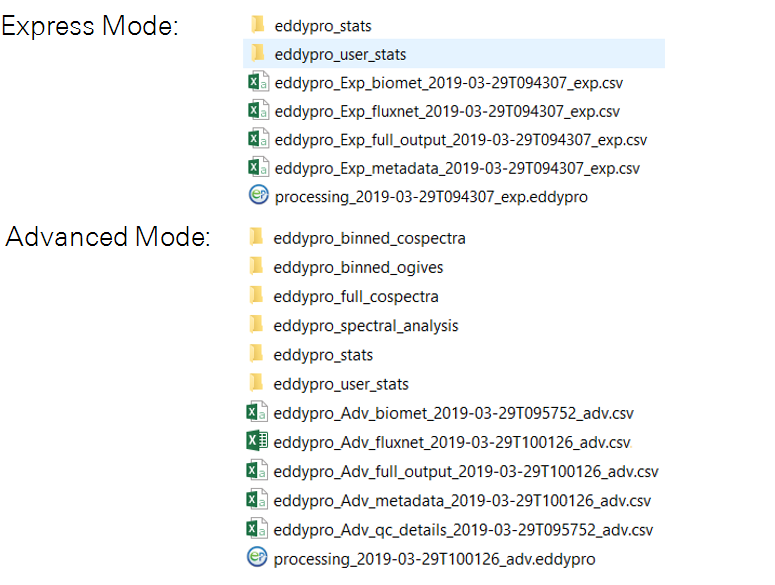
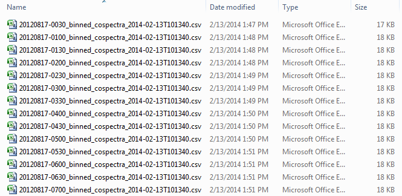
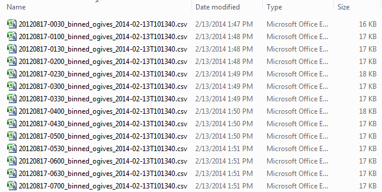
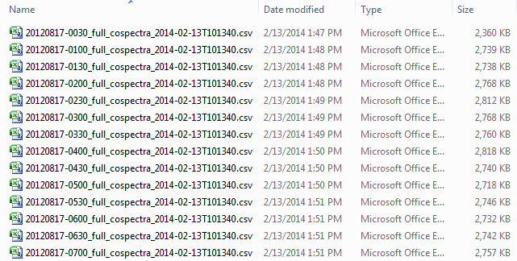
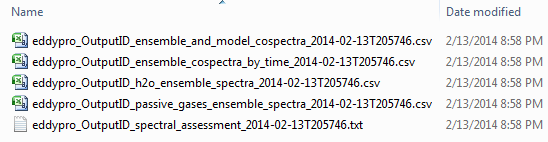
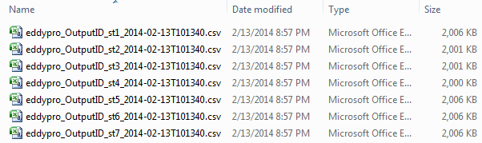
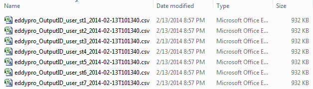

# List of outputs

This section provides a summary of the output files generated by EddyFlow. Some of the files described below may not be included in your output folder, depending upon the files specified in the Output Files tab (see [Output files](output-files.md#top)). A full set of output files is shown in [Figure 3‑2](#files).

                                                            Figure 3‑2. Output folder created by EddyFlow when all outputs are selected.

[Table 3‑1](#files2) provides more details about the folders and files created by EddyFlow.

| File/Folder Name | Description |
| --- | --- |
| eddypro_binned_cospectra | Folder containing binned cospectra files (see Binned cospectra outputs). |
| eddypro_binned_ogives | Folder containing binned ogives files (see Binned ogives). |
| eddypro_full_cospectra | Folder containing full cospectra files (see Full cospectra). |
| eddypro_spectral_analysis | Folder containing spectral analysis files (see Spectral analysis). |
| eddypro_stats | Folder containing statistical output files (see Stats). |
| eddypro_user_stats | Folder containing user statistics files. |
| eddypro_OutputID_essentials_yyyy-mm-ddThhmmss.csv | Intermediate flux results that have not been corrected. EddyFlow uses this file when you want to quickly reprocess data. See Using results from previous runs for more information. |
| eddypro_OutputID_biomet_yyyy-mm-ddThhmmss.csv | Summarized output variables. |
| eddypro_OutputID_fluxnet_yyyy-mm-ddThhmmss.txt | File conforming FLUXNET and AmeriFlux FP-In Standards for labels, units and format. Features new output variables, including many intermediate results, statistics on all high-frequency variables, covariances between all high-frequency variables, biomet mean values and metadata, as well as results of new implementations |
| eddypro_OutputID_full_output_yyyy-mm-ddThhmmss.csv | Final flux results. |
| eddypro_OutputID_metadata_yyyy-mm-ddThhmmss.csv | A summary of information stored in each of the metadata files for the project. |
| eddypro_OutputID_qc_details_yyyy-mm-ddThhmmss.csv | A summary of errors and tests for each 30 minute data set. |
| processing_yyyy-mm-ddThhmmss.eddypro | EddyFlow project file. |

## Binned cospectra outputs

This folder includes one .csv file for each 30 minute dataset. See [Calculating spectra, cospectra, and ogives](calculate-spectra-cospectra-and-ogives.md#top) for more information.

## Binned ogives

This folder includes one .csv file for each 30 minute dataset. See [Calculating spectra, cospectra, and ogives](calculate-spectra-cospectra-and-ogives.md#top) for more information.

## Full cospectra

This folder includes one .csv file for each 30 minute dataset. See [Calculating spectra, cospectra, and ogives](calculate-spectra-cospectra-and-ogives.md#top) for more information.

## Spectral analysis

This folder includes spectra and cospectra data files in .csv format. It also includes a spectral assessment file that can be used to reprocess a data set if the spectral assessment file applies. See [Calculating Spectral correction factors](calculate-spectral-correction-factors.md#top) for more information.

## Stats

The stats folder includes a .csv file for each level of processing.

## User stats

The user stats folder includes a .csv file for each level of processing.

