# Processing ASCII and TOB1 raw data files

EddyFlow gets timestamps information from the names of raw flux data files. The file names should have year, month, day, hour, and minute and this should be consistent across all the files. The second is not needed in the file names. The best strategy to process ASCII and TOB1 files is to split them to the same size as the averaging interval since EddyFlow does not read time stamps within a file and any missing data in large is always attributed to the end of the file.

If your files are not in the right format, you can reformat them following the instructions in [Preparing ASCII/TOA5 raw data for processing](#How) and [Preparing raw flux data logged by a Campbell Datalogger for processing](#How2).

## ASCII data

1. Create a new project
2. Click ** New Project **.
                                                                    Type in a ** Project name **.
                                                                    Check ** ASCII plain text ** box.
                                                                    Click ** Save As ** to save the project.
                                                                    Click ** Save Metadata As…** to create a metadata file.
3. 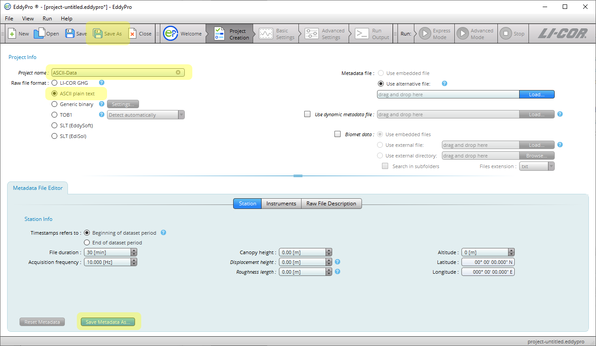
4. Build the metadata file
5. Determine the data format of the raw ASCII data file.
                                                                    Open one ASCII sample file in Excel to see the header and the field separator. Here is an example:
6. 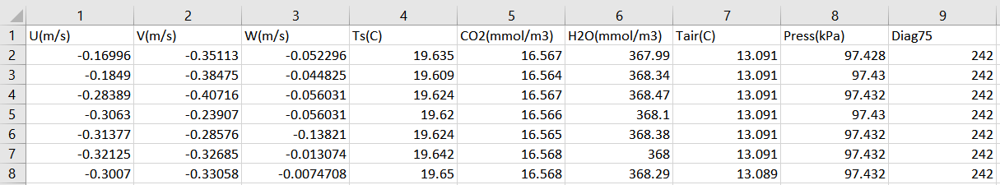
7. Fill all the required information for ** Station **, ** Instruments **, ** Raw File Description **, and ** Raw File Settings…**.
8. Click the **+** or **-** sign to add or remove a column in raw file description. Use the mouse to a cell to select variable name, measurement type, input unit, etc. from the drop-down menus or directly type in what you need. If a variable such as date or time is non-numeric, it must be specified even if it is ignored. Here is an example of the raw file description with settings for the aforementioned ASCII sample data file.
9. 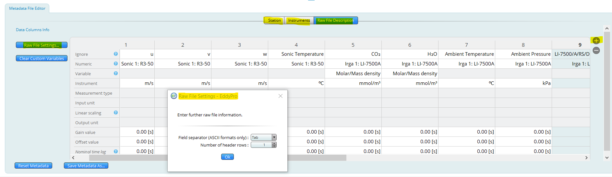
10. Complete basic settings
11. Select raw data directory by clicking ** Browse…**.
                                                                    Set up raw file name format following the prompt.
                                                                    Select or create an output directory.
                                                                    Type in an output ID.
12. Select the variables for flux computation from the drop-down menus.
13. 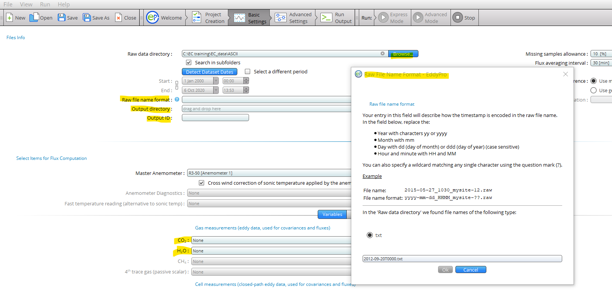
14. Run EddyFlow
15. There are ** Express Mode ** and ** Advanced Mode ** in EddyFlow. In express mode, EddyFlow uses pre-determined processing settings including 2D coordinate rotation for flat terrain that are well established and accepted in the community. In advanced mode, you can configure the data processing settings to what you prefer, including planar fit coordinate rotation for complex terrain. Click ** Express Mode ** to run in express mode, orClick ** Advanced Settings ** and then ** Restore Default Values ** to reset the settings to the default settings, which are the same as the settings for express mode.If needed, select a planar fit method and then set up planar fit. See [Planar fit settings in advanced mode](#Planar).If needed, change other settings including output files based on your need.Click ** Advanced Mode ** to run EddyFlow in advanced mode.
16. 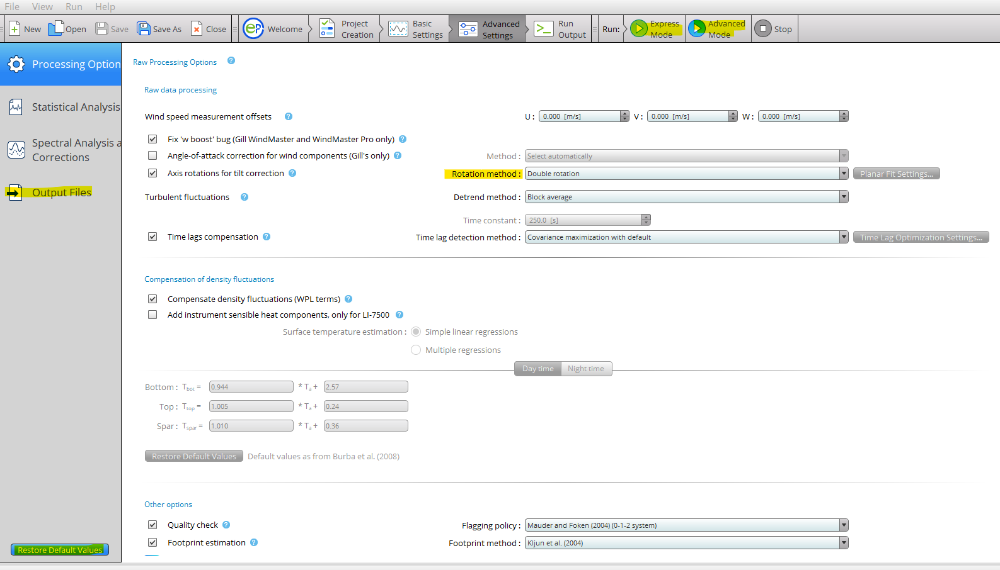
17. View and understand EddyFlow outputs
18. Outputs are written to the output directory:
19. 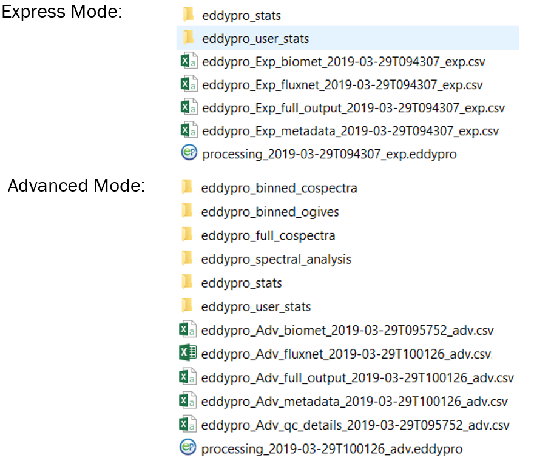
20. View flux results from the full output file:
21. 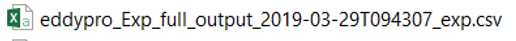
22. Outputs are described in [Table 3‑2](output-files-full-output.md#shorthand).

## TOB1 data

The instructions for processing TOB1 data are the same as those for ASCII except the following:

1. Check ** TOB1 ** box when creating a project.
2. The TOB1 files have ASCII headers and the information in the headers can be used as the metadata.
3. When building the metadata file, open a TOB1 sample file in Excel to get the header of the data file including unit and data format as shown below.
4. 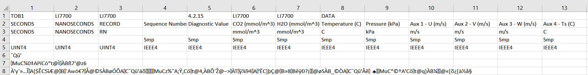
5. Support of TOB1 format is limited to files containing only ULONG and IEEE4 data types, or ULONG and FP2 data types.

In the second case, FP2 data type must follow any ULONG data type, while for ULONG and IEEE4 there is no such limitation. Otherwise, EddyFlow will not work and you must convert the TOB1 files to ASCII and then process them. Additional information for ASCII or TOB1 raw flux data logged with a Campbell datalogger:

- The "LI-7500/A/RS/DS Diagnostics", "LI-7200/RS Diagnostics", "LI-7700 Diagnostics", and "Anemometer Diagnostics" are used for raw data quality control in EddyFlow (see [Overview of the interface](introduction-welcome-page.md#top)). If the diagnostics for gas analyzer and anemometer in your raw data have different definitions from what described in EddyFlow manual, you should not assign them to the diagnostics variables in EddyFlow. Otherwise, your data could be processed incorrectly or cause EddyFlow to stop working.
- When the signal strength of LI-7700 is below 10%, the CH4 data are invalid. That is flagged as "NOSIGNAL" (no laser signal detected) in the LI-7700 diagnostics. If the LI-7700 diagnostic value is not recorded in your raw data files, you should set up a flag to filter out data with signal strength less than 10% (or 0.1 depending on the unit) as shown below.

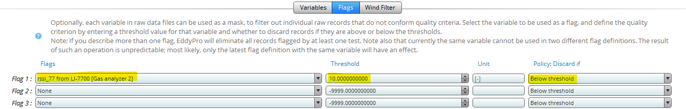

## Preparing ASCII/TOA5 raw data for processing

You need LoggerNet software to split your ASCII/TOA5 files into 30 minute files.

1. Go to the Window Start menu and then Programs \\ Campbell Scientific \\ LoggerNet \\ Utilities to open ** File Format Convert ** as shown below. You may need to access the utility from your program files if not visible from the Start menu.
2. 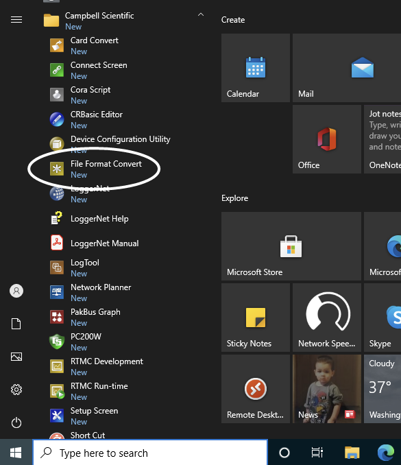
3. Use ** Open ** to select the TOA5 file you want to split as shown below.
4. 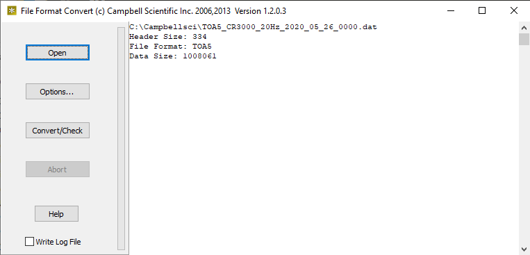
5. Click ** Options…** and set up time settings as shown below for splitting TOA5 files at an interval of 30 minutes.
6. The start time is fine as long as it is before the start time of your file. It does not need to be the same as your file start time.
7. 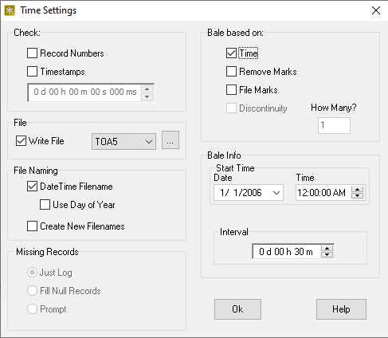
8. Click ** Convert/Check ** to start the processing. The split files will be in the same folder as your TOA5 file.
9. Check the first and last split files in the folder to see if each contains at least 27 minutes of data (90% of 30 minutes). If not, delete it because it could cause errors due to lack of enough data when being processed by EddyFlow.

## Preparing raw flux data logged by a Campbell Datalogger for processing

Raw flux data files logged by a Campbell datalogger are in Table Oriented Binary Format 1 (TOB1). A TOB1 file usually contains weeks of data. Such TOB1 files need to be split into files with a shorter duration and proper timestamps in file names.

1. Download PC200W software from [https://www.campbellsci.com/pc200w](https://www.campbellsci.com/pc200w).
2. If you have LoggerNet, skip this step.
3. Go to Card Convert.
4. 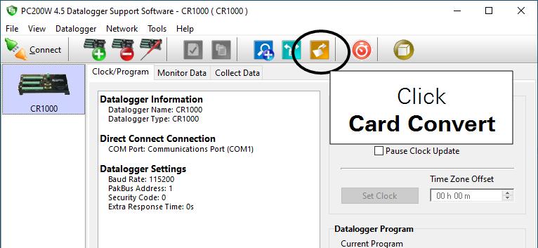
5. Click ** Select Card Drive…** and then select your TOB1 file.
6. 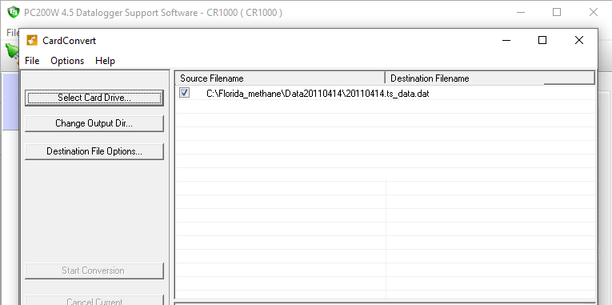
7. Click ** Change Output Dir…** and then select an output directory.
8. 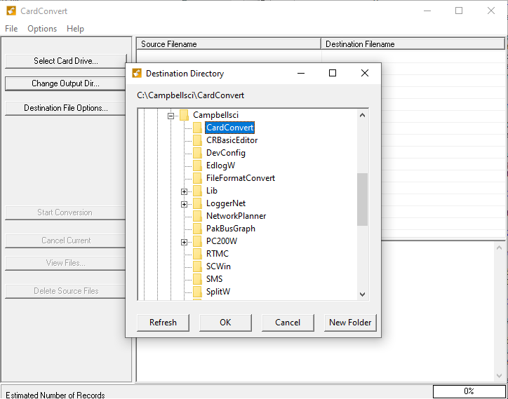
9. Click ** Destination File Options…** and then set up file options.
10. Check only the four options shown below.
11. 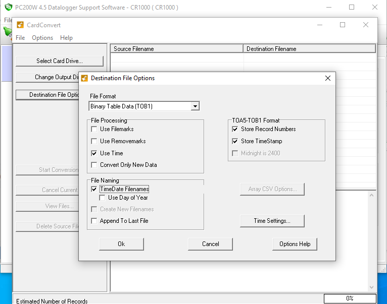
12. Click ** Time Settings ** and then set up start time and an interval of 30 minutes as shown below.
13. The start time is fine as long as it is before the start time of your file. It does not need to be the same as your file start time.
14. 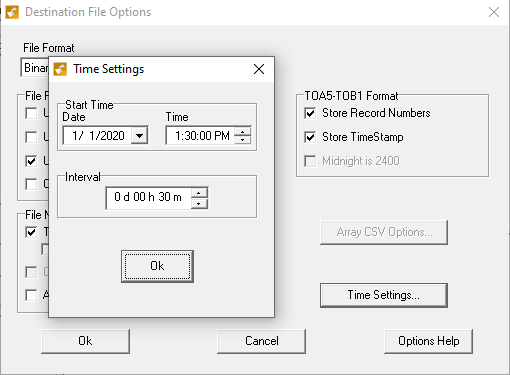
15. Click ** Start Conversion ** to run.
16. 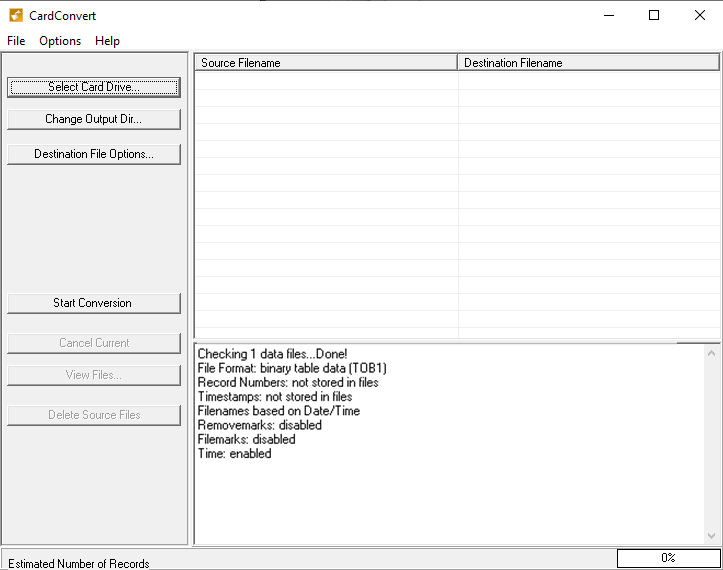

The split files will be saved to the output directory you selected previously. Check the first and last split files in the folder to see if each contains at least 27 minutes of data (90% of 30 minutes). If not, delete it because it could cause errors due to lack of enough data when being processed by EddyFlow.

## Planar fit settings in advanced mode

If needed, more wind sectors could be added by clicking the **+** sign and alignments of the sectors can be adjusted by changing the ** North offset first sector **.

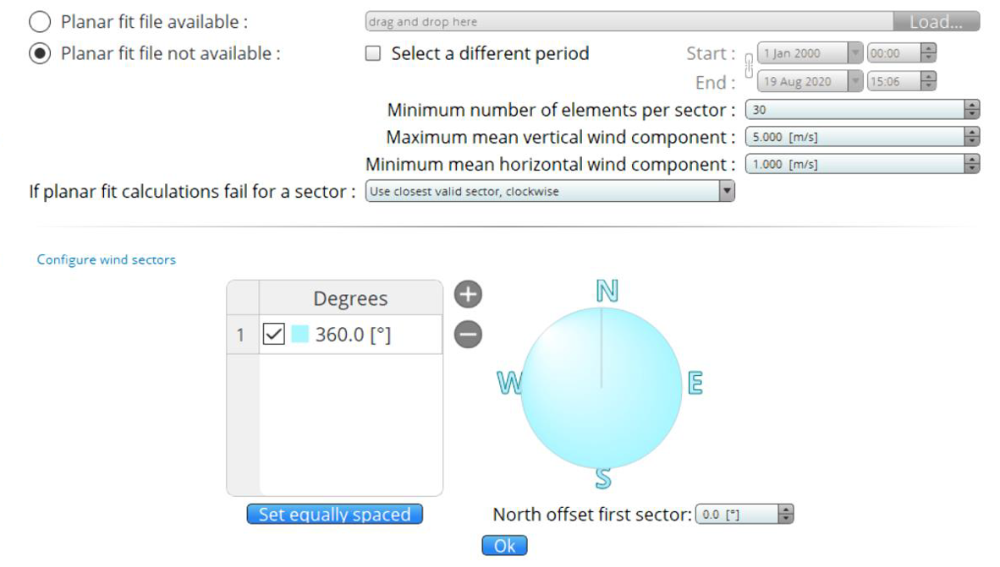
