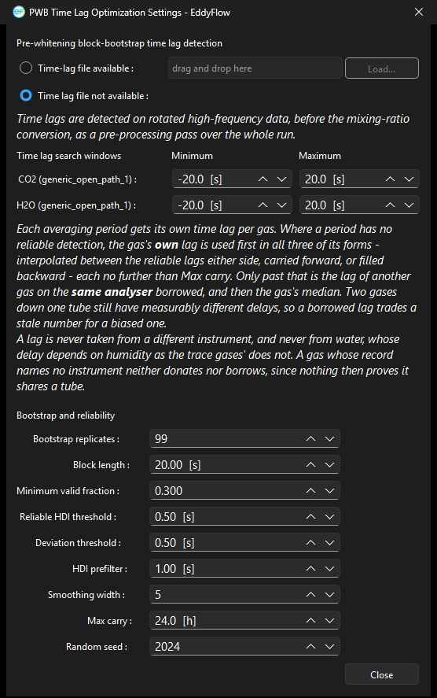

# PWB time lag optimization settings dialog

Under: Advanced Settings > Processing Options > Time lags compensation > Time Lag Optimization Settings

Selecting **Pre-whitening block-bootstrap (Vitale et al. 2024)** as the **Time lag detection method** changes what the **Time Lag Optimization Settings** button opens: instead of the settings for the automatic optimizer, it opens the PWB dialog described here. For the method itself, see [Detecting and compensating time lags](time-lag-detect-correct.md#top).

Time lags are detected on rotated high-frequency data, before the mixing-ratio conversion, as a pre-processing pass over the whole run.

## Using results from a previous run

- **Time-lag file available:** Reuse the time lag assessment written by an earlier EddyFlow run. Use **Load...** to select the file. The file must correspond to the current dataset.
- **Time lag file not available:** Perform the assessment during this run, using the settings below.

## Time lag search windows

One row per gas, each naming the channel and its instrument.

- **Minimum:** Earliest lag, in seconds, that the search will consider for that gas. Negative values allow the gas to lead the wind measurement.
- **Maximum:** Latest lag, in seconds, considered for that gas.

## Bootstrap and reliability

- **Bootstrap replicates:** Number of block-bootstrap resamples drawn per averaging period. More replicates tighten the interval at the cost of processing time.
- **Block length:** Length, in seconds, of the contiguous blocks resampled by the bootstrap. Blocks must be long enough to preserve the autocorrelation of the series.
- **Minimum valid fraction:** Smallest share of valid samples a period may have and still be given a lag of its own.
- **Reliable HDI threshold:** Maximum width, in seconds, of the highest-density interval for a detection to count as reliable. Wider intervals mean the peak was not resolved and the period falls back to a borrowed or carried lag.
- **Deviation threshold:** Maximum departure, in seconds, from the surrounding reliable lags before a detection is treated as an outlier.
- **HDI prefilter:** Smoothing applied, in seconds, to the cross-covariance function before the interval is computed.
- **Smoothing width:** Width, in samples, of the smoothing applied to the lag series across periods.
- **Max carry:** Longest interval, in hours, over which a reliable lag may be interpolated, carried forward, or filled backward into periods that had no reliable detection of their own.
- **Random seed:** Seed for the bootstrap resampling, so a run can be reproduced exactly.

## Dialog button

- **Close:** Close the dialog, keeping the current settings.

!!! note

    Where a period has no reliable detection, the gas's own lag is used first — interpolated between the reliable lags either side, carried forward, or filled backward — and never further than **Max carry**. Only past that is another gas's lag borrowed, and only from the same analyser. The controls governing that borrowing (**Borrow a tube-mate's lag below the detection limit**, **Judged against** and **Borrow from**) sit on the Processing Options page itself rather than in this dialog; see [Advanced settings: processing options](raw-processing-options.md#top).

!!! note

    A lag is never taken from a different instrument, and never from water vapor, whose delay depends on humidity in a way the trace gases' does not. A gas whose record names no instrument neither donates nor borrows, since nothing then proves it shares a tube.
