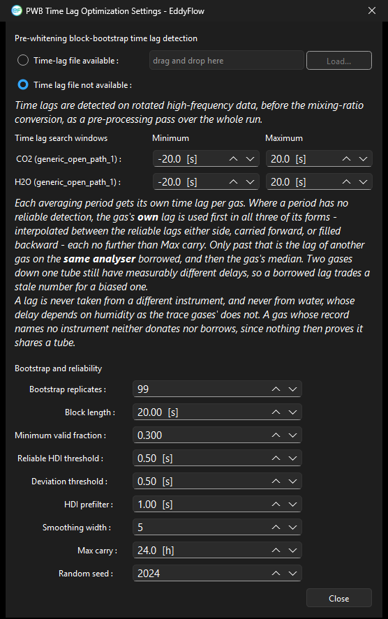

# PWB time lag optimization settings dialog

Under: Advanced Settings > Processing Options > Time lags compensation > Time Lag Optimization Settings

Selecting **Pre-whitening block-bootstrap (Vitale et al. 2024)** as the **Time lag detection method** changes what the **Time Lag Optimization Settings** button opens: instead of the settings for the automatic optimizer, it opens the PWB dialog described here (window title **PWB Time Lag Optimization Settings**). For the method itself, see [Detecting and compensating time lags](time-lag-detect-correct.md#pre-whitening-block-bootstrap-pwb).

Time lags are detected on rotated high-frequency data, before the mixing-ratio conversion, as a pre-processing pass over the whole run. Where the project also uses the **Parallelise the planar fit and time lag pre-passes** option (see [Advanced settings: processing options](raw-processing-options.md#parallelise-the-planar-fit-and-time-lag-pre-passes)), this pass is split across the available cores.

## Using results from a previous run

- **Time-lag file available:** Reuse a time lag result from an earlier EddyFlow run. Two kinds of file are accepted. A PWB half-hourly time-lag table (`*_pwb_timelag_*.csv`, written by a previous run) reuses the exact lag recorded for each timestamp and gas; any period missing from the table is detected during this run and the table is rewritten. An aggregate file (the standard `Time-lag_optimisation_results` file written by the automatic time lag optimization) applies its gas and H2O relative-humidity-class lags to the whole run and does **not** run PWB. The file must correspond to the current dataset. Use **Load...** to select the file (project key `to_file`); the file browser is titled "Select a PWB Time-Lag Table or Time-Lag Results File". Next to **Load...** a **Remote drive...** button lets you select the file from a shared Google Drive or Dropbox link, see [Remote folders](remote-folders.md#top).
- **Time lag file not available:** Perform the detection during this run, using the settings below (project key `to_mode`).

## Time lag search windows

One row per gas of the project, each naming the channel and its instrument; the rows follow the gases selected for the site rather than a fixed four.

- **Minimum:** Earliest lag, in seconds, that the search will consider for that gas (`pwb_<gas>_min_lag`, default 0). Negative values allow the gas to lead the wind measurement.
- **Maximum:** Latest lag, in seconds, considered for that gas (`pwb_<gas>_max_lag`, default 25). The window must be wide enough to hold every lag the tube can produce, but a wider window also raises the chance of a spurious peak. The bootstrap block length is tied to the widest bound (see **Block length**).

Gases on one analyser share a detected lag in the borrowing step described below, so a window set for one of them can move the lag of the others as well.

## Bootstrap and reliability

- **Bootstrap replicates:** (`pwb_n_bootstrap`, default 99) Number of block-bootstrap resamples drawn per averaging period. More replicates tighten the interval at the cost of processing time.
- **Block length:** (`pwb_block_length_s`, default 20 s; 0 is shown as "Auto (2 x search window)") Length of the contiguous blocks resampled by the bootstrap, which preserve local autocorrelation. This is a **floor applied per gas**: a block shorter than the lag range cannot contain the lag structure the bootstrap exists to preserve, so each gas actually uses the larger of this value and twice its widest search bound. A gas searching to 25 s therefore resamples in 50 s blocks whatever is set here.
- **Minimum valid fraction:** (`pwb_min_valid_frac`, default 0.3) Smallest share of valid samples a period may have and still be given a lag of its own.
- **Reliable HDI threshold:** (`pwb_hdi_thresh_s`, default 0.5 s) Maximum width, in seconds, of the 95% highest-density interval (HDI) for a detection to count as reliable. Wider intervals mean the peak was not resolved and the period is settled by a later step (the gas's own lag from neighbouring periods, then a borrowed lag).
- **Deviation threshold:** (`pwb_dev_thresh_s`, default 0.5 s) Maximum departure, in seconds, from the previous reliable lag before a detection is treated as an outlier.
- **HDI prefilter:** (`pwb_hdi_prefilter_s`, default 1.0 s; 0 is shown as "Disabled") Detections whose 95% HDI is wider than this are discarded before the S1/S2 classification runs, so temporal continuity cannot accept a vague detection merely because it lands near the previous period's lag. It is stricter than the reliable-HDI threshold, which only decides whether a detection is accepted outright.
- **Smoothing width:** (`pwb_smoothing_width`, default 5 records) Width of the centred rolling mean applied to each bootstrap cross-correlation before its peak is located. Either parity is allowed; an odd window is symmetric, an even one puts its extra sample after the centre (the R convention). The default is 5. The published method specifies a window of hz/2 + 1 instead (6 at 10 Hz, 11 at 20 Hz), and the choice is not cosmetic: on one reference test dataset, widening from 5 to 11 at 20 Hz widened the 95% interval from 0.00/0.05 s to 0.30/0.20 s, against the 0.5 s threshold that decides whether a detection is accepted.
- **Max carry:** (`pwb_max_carry_h`, default 24 h; 0 is shown as "Unlimited") How far a detected time lag may travel to a period that detected none. It bounds all three ways a gas reaches its own lag, interpolation between reliable neighbours, carrying the last one forward and filling backward from the next, with one value, because bounding only one direction would achieve nothing: with detections either side of a long unusable stretch, an unbounded backward fill would cover exactly the span the forward carry was forbidden to cross. Past this distance the period takes the lag of another gas on the same analyser instead, and failing that the gas's median; the row is classed `S3_expired`. The distance is measured in **elapsed hours**, not in averaging periods, so a gap in the raw files is not crossed silently. Setting 0 gives the published rule, under which one reliable half hour can supply days.
- **Random seed:** (`pwb_random_seed`, default 2024) Seed for the bootstrap resampling, so a run can be reproduced exactly.

## Dialog button

- **Close:** Close the dialog, keeping the current settings.

!!! note

    Where a period has no reliable detection, the gas's own lag is used first (interpolated between the reliable lags either side, carried forward, or filled backward) and never further than **Max carry**. Only past that is another gas's lag borrowed, and only from the same analyser. This borrowing takes place inside PWB and has no controls in this dialog. It is separate from the detection-limit based borrowing (**Borrow a tube-mate's lag below the detection limit**, **Judged against** and **Borrow from**) whose controls sit on the Processing Options page itself; see [Advanced settings: processing options](raw-processing-options.md#conditional-lag-borrowing) and [Detecting and compensating time lags](time-lag-detect-correct.md#conditional-lag-borrowing).

!!! note

    A lag is never taken from a different instrument, and never from water vapor, whose delay depends on humidity in a way the trace gases' does not. A gas whose record names no instrument neither donates nor borrows, since nothing then proves it shares a tube.

!!! note

    In the PWB log summary a lag taken from another gas is counted as `S4_borrowed` (formerly `S4_instrument_filled`), and borrowed lags are not counted as detections. See [PWB behaviour in detail](time-lag-detect-correct.md#pwb-behaviour-in-detail).
