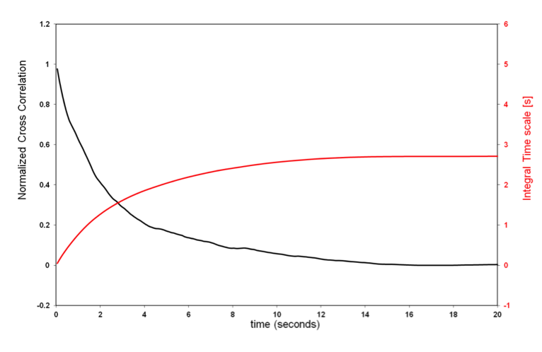
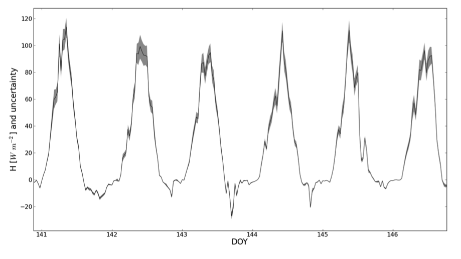
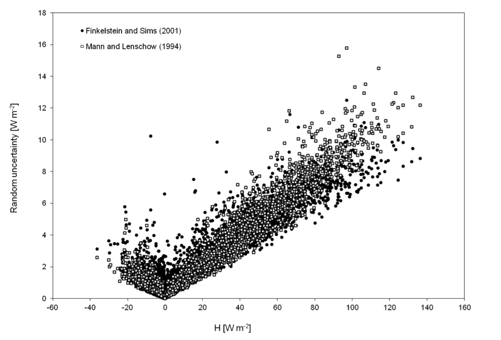

# Random uncertainty estimation

EddyFlow can calculate flux random uncertainty due to sampling errors according to two different methods: [Mann and Lenschow (1994)](references.md#Mann) and [Finkelstein and Sims (2001)](references.md#Finkelstein). Both methods require the preliminary estimation of the Integral Turbulence time-Scale (ITS), which – for our purposes – can be defined as the integral of the cross-correlation function. The cross-correlation function is given by:

6‑2
                                                            

where w is the vertical wind component, c is any scalar of interest (e.g., temperature, gas concentration, etc.), t is time and Ï" is the lag-time between the two time series. For Ï"=0 the cross-correlation function provides the covariance of w and c; as Ï" attains values > 0 the cross-correlation function typically decreases towards values close to zero, representing an increasing non-correlation as Ï" increases (black line in [Figure 6?13](#CrossCorrelation)).

                                                            Figure 6‑13. Normalized cross correlation and integral time scale over time.

The following integral represents the ITS:

6‑3
                                                            

The red line in the figure above represents the integral for any given value of the upper limit, which is theoretically set to infinity. In practical implementations, however, this integral must be stopped at a finite upper limit, which should be defined in such a way that the ITS represents the maximum correlation time of the two time series. EddyFlow provides three possible ways of defining this upper limit:

** Cross-correlation first crossing 1/e:** The integral is stopped as soon as the cross-correlation function (which always starts at 1 for Ï"=0) attains the value of 0.369. This gives the "shortest", least conservative definition of the ITS. However, it provides the fastest execution and, more importantly, assures that a value of the ITS is virtually always found based on this definition. Furthermore, it provides the most consistent assessment of the ITS across different runs, because the shape of the cross-correlation function tends to be pretty consistent and similar to the one shown in the figure, for small values of Ï".

** Cross-correlation first crossing 0:** The integral is stopped as soon as the cross-correlation function (which always starts at 1 for Ï"=0) crosses the x-axis. This definition provides a more conservative definition of ITS than the previous one, and is still "data-derived", i.e. it is not imposed by the user. The shortcoming with this definition is that the cross-correlation function may never cross the x-axis (in which case, EddyFlow switches to the next definition); also when it does, the point in which it occurs may be somewhat random, as the cross-correlation function may vary erratically for large values of Ï".

** Integrate over the whole correlation period:** The integral is stopped when Ï" reaches the value defined in the field ** Maximum correlation period **, set by the user. This definition provides a conservative estimation but being imposed *a priori*, it does not assure that the cross-correlation function is actually close to zero at the upper integration limit. Also, the execution time may get longer with this choice, because the upper integration limit may be set arbitrarily high.

Once the ITS is calculated, the random uncertainty can be estimated. The random uncertainty of flux F, indicated with σF, is expressed in EddyFlow as "absolute uncertainty", and takes the same units of the flux it refers to. The approach of [Mann and Lenschow (1994)](references.md#Mann) uses the following simple equation:

6‑4
                                                            

where rwc is correlation coefficient of w and c and T is the flux averaging interval.

The approach of [Finkelstein and Sims (2001)](references.md#Finkelstein), instead, is based on the calculation of the "variance of covariance" (their Eq. 8):

6‑5
                                                            

with ɣw,w(p), ɣc,c(p), ɣw,c, and ɣc,w(p) and given by Eq. 9 and 10 in the referenced paper, n is the number of samples in the flux averaging interval and m the discrete counterpart of the ITS (m = ITS * acquisition frequency).

The following figures exemplify the random uncertainty calculated for sensible heat fluxes:

