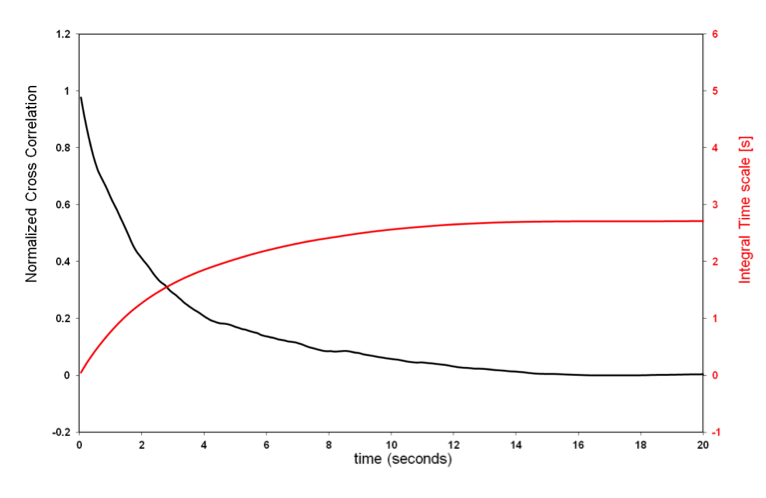
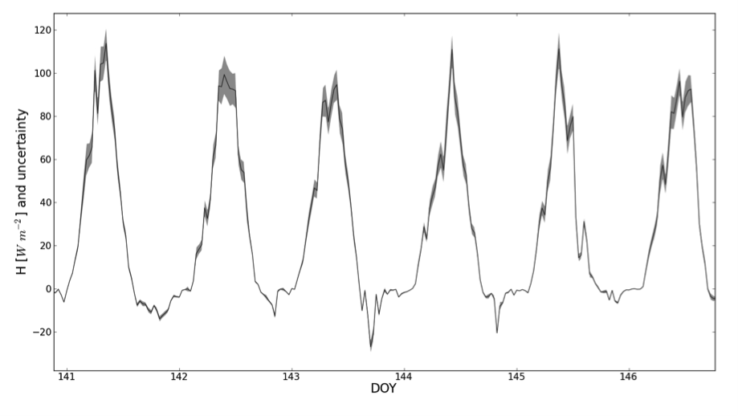
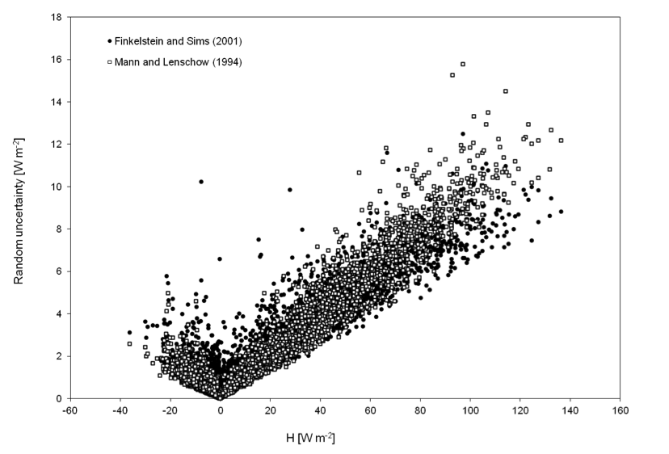

# Random uncertainty estimation

EddyFlow offers four methods for estimating the random uncertainty of a flux, selected with the **Method** dropdown on the Statistical Analysis page (project-file key `ru_meth`):

| Label in the dropdown | `ru_meth` | What it estimates |
| --- | --- | --- |
| Finkelstein and Sims (2001) | 1 | Sampling error (variance of the covariance) |
| Mann and Lenschow (1994) | 2 | Sampling error (error variance of the central moment) |
| Billesbach (2011) | 4 | Noise floor from random shuffling |
| Lenschow et al. (2000) - instrument noise | 5 | The analyser's own white noise |

The value 3 is the Mahrt (1998) estimate, which is not offered in the dropdown. The four methods answer different questions and are not interchangeable. The two sampling errors tell how much the flux would differ for another realisation of the same turbulence. The Billesbach floor tells whether a flux is distinguishable from zero. The instrument-noise estimate tells how much of the signal is the analyser's own noise, and is the smallest of the four. The sampling-error methods are described first; the other two follow.

## Sampling errors: Mann and Lenschow (1994) and Finkelstein and Sims (2001)

The methods of [Mann and Lenschow (1994)](references.md#Mann) and [Finkelstein and Sims (2001)](references.md#Finkelstein) require the preliminary estimation of the Integral Turbulence time-Scale (ITS), which – for our purposes – can be defined as the integral of the cross-correlation function. The cross-correlation function is given by:

6‑2
                                                            

where w is the vertical wind component, c is any scalar of interest (e.g., temperature, gas concentration, etc.), t is time and Ï" is the lag-time between the two time series. For Ï"=0 the cross-correlation function provides the covariance of w and c; as Ï" attains values > 0 the cross-correlation function typically decreases towards values close to zero, representing an increasing non-correlation as Ï" increases (black line in [Figure 6?13](#CrossCorrelation)).

                                                            Figure 6‑13. Normalized cross correlation and integral time scale over time.

The following integral represents the ITS:

6‑3
                                                            

The red line in the figure above represents the integral for any given value of the upper limit, which is theoretically set to infinity. In practical implementations, however, this integral must be stopped at a finite upper limit, which should be defined in such a way that the ITS represents the maximum correlation time of the two time series. EddyFlow provides three possible ways of defining this upper limit:

**Cross-correlation first crossing 1/e:** The integral is stopped as soon as the cross-correlation function (which always starts at 1 for Ï"=0) attains the value of 0.369. This gives the "shortest", least conservative definition of the ITS. However, it provides the fastest execution and, more importantly, assures that a value of the ITS is virtually always found based on this definition. Furthermore, it provides the most consistent assessment of the ITS across different runs, because the shape of the cross-correlation function tends to be pretty consistent and similar to the one shown in the figure, for small values of Ï".

**Cross-correlation first crossing 0:** The integral is stopped as soon as the cross-correlation function (which always starts at 1 for Ï"=0) crosses the x-axis. This definition provides a more conservative definition of ITS than the previous one, and is still "data-derived", i.e. it is not imposed by the user. The shortcoming with this definition is that the cross-correlation function may never cross the x-axis (in which case, EddyFlow switches to the next definition); also when it does, the point in which it occurs may be somewhat random, as the cross-correlation function may vary erratically for large values of Ï".

**Integrate over the whole correlation period:** The integral is stopped when Ï" reaches the value defined in the field **Maximum correlation period**, set by the user. This definition provides a conservative estimation but being imposed *a priori*, it does not assure that the cross-correlation function is actually close to zero at the upper integration limit. Also, the execution time may get longer with this choice, because the upper integration limit may be set arbitrarily high.

Once the ITS is calculated, the random uncertainty can be estimated. The random uncertainty of flux F, indicated with σF, is expressed in EddyFlow as "absolute uncertainty", and takes the same units of the flux it refers to. The approach of [Mann and Lenschow (1994)](references.md#Mann) uses the following simple equation:

6‑4
                                                            

where rwc is correlation coefficient of w and c and T is the flux averaging interval.

The approach of [Finkelstein and Sims (2001)](references.md#Finkelstein), instead, is based on the calculation of the "variance of covariance" (their Eq. 8):

6‑5
                                                            

with ɣw,w(p), ɣc,c(p), ɣw,c, and ɣc,w(p) and given by Eq. 9 and 10 in the referenced paper, n is the number of samples in the flux averaging interval and m the discrete counterpart of the ITS (m = ITS * acquisition frequency).

The following figures exemplify the random uncertainty calculated for sensible heat fluxes:

## Random shuffle: Billesbach (2011)

**Exact UI label:** Billesbach (2011). Project-file key: `ru_meth=4`. Method after [Billesbach (2011)](references.md#Billesbach1).

**Idea.** Reordering a scalar at random destroys every real correlation with the vertical wind. Whatever covariance remains after the shuffle was produced by noise alone, so its magnitude is a floor below which a flux cannot be told from zero.

**Procedure.** For each period and each flux variable (momentum, sensible heat and every configured gas), the scalar series is shuffled at random 20 times; each time the covariance with the unshuffled vertical wind is computed at zero lag. The reported value is the mean of the 20 absolute covariances. The scalar is shuffled separately for each gas and each repetition, so the estimates of different gases are independent draws. The random generator is seeded once at the start of the run with a fixed seed, so a rerun with the same data gives the same numbers. No integral turbulence time-scale is computed for this method, and the ITS settings of the page do not apply to it.

**What it means.** This is a noise floor, not a sampling error. It answers whether a flux is resolvable, not how uncertain it is, and it is systematically smaller than the two sampling errors above. Because it is the mean of absolute values rather than a standard deviation, it is about 0.8 of the scatter of the shuffled covariances. It is most useful for weak-flux species such as carbonyl sulfide or nitrous oxide, where the question is whether a flux has been detected at all. It is related to, but computed differently from, the [flux detection limit](flux-detection-limit.md#top), which measures the scatter of the cross-covariance function away from its peak.

## Instrument noise: Lenschow et al. (2000), as applied by Mauder et al. (2013)

**Exact UI label:** Lenschow et al. (2000) - instrument noise. Project-file key: `ru_meth=5`. Method after [Lenschow et al. (2000)](references.md#Lenschow) and [Mauder et al. (2013)](references.md#Mauder2013).

**Idea.** The two sampling-error methods ask how much the covariance of *w* and *c* would differ if it could be recomputed from a different, statistically equivalent realization of the same turbulent flow. This method asks a different question: how much of the measured variance is white noise contributed by the analyser itself, rather than a sampling limitation of the atmospheric signal. True atmospheric turbulence is correlated over short lags, whereas instrumental noise is not, so the autocovariance function of a noisy variable is smooth for lags of one sample and above but shows a discontinuity at lag zero, where the variance is inflated by the noise.

**Procedure.** For w and for each scalar:

1. The autocovariance is calculated at lags 0 to 5 samples.
2. A straight line is fitted through the values at lags 1 to 5 and extrapolated back to lag 0.
3. The noise variance is the measured lag-0 value minus the extrapolated value.
4. The reported uncertainty of the flux is the square root of (the scalar's noise variance multiplied by the total variance of w, divided by the number of samples). The noise variance of w is used only as a validity check.

The five-lag window is fixed in samples and is not derived from the acquisition frequency, so it spans 0.1 to 0.5 s at 10 Hz and half as long at 20 Hz.

!!! note

    The method declines a period rather than guessing. If the noise variance of either w or the scalar is not positive, which means that the extrapolated line sits at or above the measured lag-0 value, the assumption on which the method rests does not hold in that period and the estimate is reported as missing. On a low-noise analyser this can happen in most periods, which is itself informative.

**What it means.** The result is the analyser's own noise and is the smallest of the four estimates. It says nothing about whether the atmosphere was sampled long enough (the sampling errors) or whether a flux is resolvable (the Billesbach floor). It can also be used as one of the noise floors for borrowing time lags from another gas on the same analyser; see [Raw processing options](raw-processing-options.md#top) and [Detecting and compensating time lags](time-lag-detect-correct.md).
