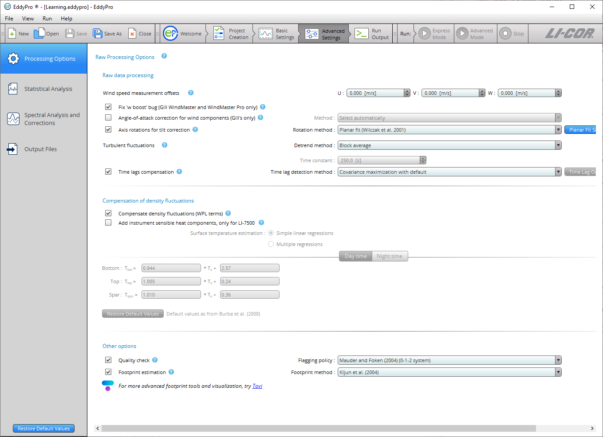
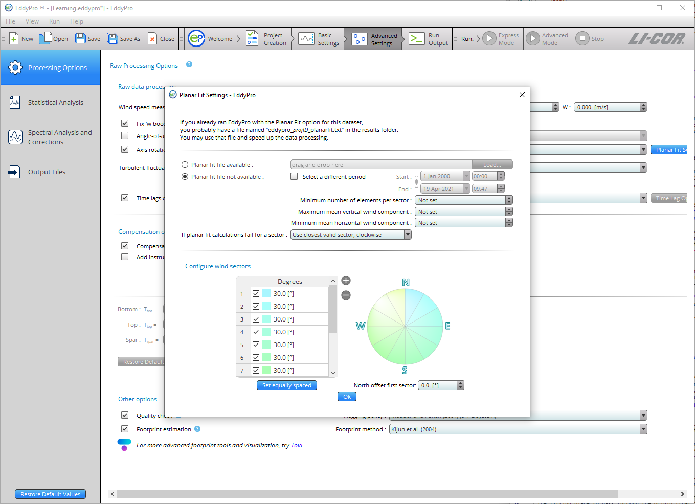
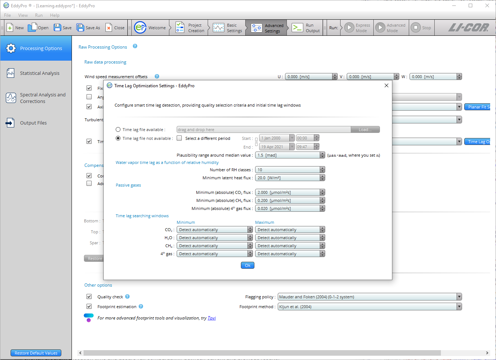
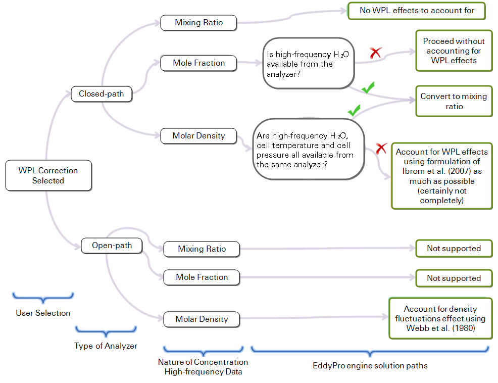

# Advanced settings

Advanced Settings are used to configure EddyFlow for customized data processing. The options available here are generally useful for research applications, custom configuration for sites with complex topography, atypical instrument setups, and for advanced users with high-level knowledge of the eddy covariance technique.

The Advanced Settings page includes four tabs: Processing Options, Statistical Tests, Spectral Corrections, and Output Files.

## Processing options

### Raw processing options

#### Wind speed measurement offsets

Wind measurements by a sonic anemometer may be biased by systematic deviation, which needs to be eliminated (e.g., for a proper assessment of tilt angles). You may get these offsets from the calibration certificate of your units, but you could also assess it easily, by recording the 3 wind components from the anemometer enclosed in a box with still air (zero-wind test). Any systematic deviation from zero of a wind component is a good estimation of this bias.

#### Fix 'w-boost' bug (WindMaster and WindMaster Pro only)

Gill WindMaster™ and WindMaster™ Pro anemometers produced between 2006 and 2015 and identified by a firmware version of the form 2329.x.y with x <700 are affected by a bug such that the vertical wind speed is underestimated. Enable this option to have EddyFlow fix the bug. EddyFlow will apply the fix only if the data are eligible according to the above criteria. For more details, please see [W-boost Bug Correction for WindMaster/Pro](w-boost-correction.md#W-boost).

#### Angle of attack correction for wind components

Applies only to vertical mount Gill sonic anemometers with the same geometry of the R3 (e.g., R2, WindMaster). This correction is intended to compensate for the effects of flow distortion induced by the anemometer frame on the turbulent flow field. See [Angle of attack correction](angle-of-attack-correction.md#top).

- ** Select automatically:** Select this option to allow EddyFlow to choose the most appropriate angle of attack correction method based on the anemometer model and—in the case of the WindMaster™ or WindMaster Pro—its firmware version.
- ** Field calibration ([Nakai and Shimoyama, 2012](references.md#NakaiandShim2012)):** Select this option to apply the Angle of attack correction according to the method described in the referenced paper, which makes use of a field calibration instead of the wind tunnel calibration.
- ** Wind tunnel calibration ([Nakai et al., 2006](references.md#Nakai)):** Select this option to apply the Angle of Attack correction according to the method described in the referenced paper, which makes use of a wind tunnel calibration.

#### Axis rotation for tilt correction

Select the appropriate method for compensating anemometer tilt with respect to local streamlines. Uncheck the box to *not perform* any rotation (not recommended). If your site has a complex or sloping topography, a planar-fit method is advisable. Click on the "** Planar Fit Settings...**" to configure the procedure. See [Axis rotation for tilt correction](anemometer-tilt-correction.md#top).

- ** Double rotation:** Aligns the *x*-axis of the anemometer to the current mean streamlines, nullifying the vertical and crosswind components.
- ** Triple rotation:** Double rotations plus a third rotation that nullifies the cross-stream stress. Not suitable in situations where the cross-stream stress is not expected to vanish, e.g., over water surfaces.
- ** Planar fit:** Aligns the anemometer coordinate system to local streamlines assessed on a long time period (e.g., 2 weeks or more). Can be performed sector-wise, meaning that different rotation angles are calculated for different wind sectors. Click on the ** Planar Fit Settings...** to configure the procedure.
- ** Planar fit with no velocity bias:** Similar to classic planar fit, but assumes that any bias in the measurement of vertical wind is compensated, and forces the fitting plane to pass through the origin (that is, such that if average *u* and *v* are zero, average *w* is also zero). Can be performed sector-wise, meaning that different rotation angles are calculated for different wind sectors. Click on the ** Planar Fit Settings...** to configure the procedure.

### Planar fit settings

- ** Planar fit file available:** If you got a satisfying planar fit assessment in a previous run with EddyFlow, which applies to the current dataset, you can use the same assessment by providing the path to the file eddypro_planar_fit_ID.txt. This file, which contains the results of the assessment, was generated by EddyFlow in the previous run. This will shorten program execution time and assure full comparability between current and previous results.
- ** Planar fit file not available:** Choose this option and provide the following information if you need to calculate (sector-wise) planar fit rotation matrices for your dataset. The planar fit assessment will be completed first, and then the raw data processing and flux computation procedures will automatically be performed.
- ** Start:** Starting date of the time period to be used for planar fit assessment. As a general recommendation, select a time period during which the instrument setup and the canopy height and structure did not undergo major modifications. Results obtained using a given time period (e.g., 2 weeks) can be used for processing a longer time period, in which major modifications did not occur at the site. The higher the *Number of wind sectors* and the *Minimum number of elements per sector*, the longer the period should be.
- ** End:** End date of the time period to be used for planar fit assessment. As a general recommendation, select a time period during which the instrument setup and the canopy height and structure did not undergo major modifications. Results obtained using a given time period (e.g., 2 weeks) can be used for processing a longer time period, in which major modifications did not occur at the site. The higher the *Number of wind sectors* and the *Minimum number of elements per sector*, the longer the period should be.
- ** Minimum number of elements per sector:** Enter the minimum number of mean wind vectors (calculated over each flux averaging interval), required to calculate planar fit rotation matrices. A too-small number may lead to inaccurate regressions and rotation matrices. A too-large number may lead to sectors without planar fit rotation matrices. If for a certain averaging interval wind is blowing from a sector for which the rotation matrix could not be calculated, the policy selected in *If planar fit calculations fail for a sector* applies.
- ** Maximum mean vertical wind component:** Set a maximum vertical wind component to instruct EddyFlow to ignore flux averaging periods with larger mean vertical wind components, when calculating the rotation matrices. Using elements with too-large (unrealistic) vertical wind components would corrupt the assessment of the fitting plane, and of the related rotation matrices.
- ** Minimum mean horizontal wind component:** Set a minimum horizontal wind component to instruct EddyFlow to ignore flux averaging periods with smaller mean horizontal wind components, when calculating the rotation matrices. When the horizontal wind is very small, the attack angle may be affected by large errors, as would the vertical wind component, resulting in poor quality data that would degrade the planar fit assessment.
- ** If planar fit calculations fail for a sector:** Select how EddyFlow should behave when encountering data from a wind sector, for which the planar fit rotation matrix could not be calculated for any reason. Either use the rotation matrix for the closest sector (clockwise or counterclockwise), or switch to double-rotations for that sector.

** Set equally spaced:** Clicking this button will cause EddyFlow to divide the whole 360° circle in *n* equally-wide sectors, where *n* is the number of sectors currently entered.

** Note:** The operation will not modify the north offset.

** North offset first sector:** This parameter is meant to allow you to design a sector that spans through the north. Entering an offset of *α* degrees will cause all sectors to rotate α degrees clockwise.

** Note:** North is intended here as local, magnetic north (the one you assess with the compass at the site).

### Detrending turbulent fluctuations

Choose one from among the following detrending methods:

- ** Block average:** Simply removes the mean value from the time series (no detrending). Obeys Reynolds decomposition rule (the mean value of the fluctuations is zero).
- ** Linear detrending:** Calculates fluctuations as the deviations from a linear trend. The linear trend can be evaluated on a time basis different from the flux averaging interval. Specify this time basis using the *time constant* entry. For classic linear detrending, with the trend evaluated on the whole flux averaging interval, set time constant = 0, which will be automatically converted into the text "Same as Flux averaging interval".
- ** Running mean:** High-pass, finite impulse response filter. The current mean is determined by the previous *N* data points, where *N* depends on the *time constant*. The smaller the time constant, the more low-frequency content is eliminated from the time series.
- ** Exponential running mean:** High-pass, infinite impulse response filter. Similar to the simple running mean, but weighted in such a way that distant samples have an exponentially decreasing weight on the current mean, never reaching zero. The smaller the time constant, the more low-frequency content is eliminated from the time series.
- ** Time constant:** Applies to the linear detrending, running mean, and exponential running mean methods. In general, the higher the time constant, the more low-frequency content is retained in the turbulent fluctuations.

** Note:** For the linear detrending the unit is minutes, while for the running means it is seconds.

** Time lags compensation:** Select the method to compensate for time lags between anemometric measurements and any other high frequency measurements included in the raw files. Time lags arise mainly due to physical distances between sensors, and to the passage of air into/through sampling lines. Uncheck this box to instruct EddyFlow not to compensate time lags (not recommended).

- ** Constant:** EddyFlow will apply constant time lags for all flux averaging intervals, using the ** Nominal time lag ** stored inside the .ghg files or in the ** Alternative metadata file ** (for files other than .ghg). This method is indicated for situations of very low fluxes, when the automatic detection of the time lag is problematic, or for measurements characterized by high signal-to-noise ratios, typical of trace-gas measurements (e.g. N2O, N3, etc.).
- ** Covariance maximization:** Calculates the most likely time lag within a plausible window, based on the covariance maximization procedure. The window is defined by the ** Minimum time lags ** and ** Maximum time lags ** stored inside the .ghg files or entered in the ** Alternative metadata file ** (for files other than .ghg), for each variable. See [Detecting and compensating for time lags](time-lag-detect-correct.md#top).
- ** Covariance maximization with default:** Similar to the ** Covariance maximization **, calculates the most likely time lag based on the covariance maximization procedure. However, if a maximum of the covariance is not found inside the window (but at one of its extremes), the time lag is set to the ** Nominal time lag ** value stored inside the .ghg files or in the alternative metadata file.
- ** Automatic time lag optimization:** Select this option and configure it by clicking on the ** Time lag optimization Settings...** to instruct EddyFlow to perform a statistical optimization of time lags. It will calculate nominal time lags and plausibility windows and apply them in the raw data processing step. For water vapor, the assessment is performed as a function of relative humidity.

### Time lag optimization settings

- ** Time lag file available:** If you have a satisfactory time lag assessment from a previous run and these results apply to the current dataset, you can use the time lag assessment by providing the path to the file named ` eddypro_timelag_opt_ID.txt `, which was generated by EddyFlow in the previous run. It contains the results of the assessment. This will shorten program execution time and assure full comparability between current and previous results.
- ** Time lag file not available:** Choose this option and provide the following information if you need to optimize time lags for your dataset. Time lag optimization will be completed first, and then the raw data processing and flux computation procedures will automatically be performed.
- ** Start:** Starting date of the time period to be used for time lag optimization. This time should not be shorter than about 1-2 months. As a general recommendation, select a time period during which the instrument setup did not undergo major modifications. Results obtained using a given time period (e.g., 2 months) can be used for processing a longer time period, in which major modifications did not occur in the setup. The stricter the threshold setup in this dialogue, the longer the period should be in order to get robust results.
- ** End:** End date of the time period to be used for time lag optimization. This time should not be shorter than about 1-2 months. As a general recommendation, select a time period during which the instrument setup did not undergo major modifications. Results obtained using a given time period (e.g. 2 months) can be used for processing a longer time period, in which major modifications did not occur in the setup. The stricter the threshold setup in this dialogue, the longer the period should be in order to get robust results.
- ** Plausibility range around median value:** The plausibility range is defined as the median time lag, ±*n* times the MAD (median of the absolute deviations from the median time lag). Specify *n* here. The value of 1.5 was heuristically found to be a reasonable default, but a set of trials may be necessary to tailor the calculation to the specifics of the current application.

#### Water vapor time lag as a function of relative humidity

- ** Number of RH classes:** Select the number of relative humidity classes, to assess water vapor time lag as a function of RH. The whole range of RH variation (0-100%) will be evenly divided according to the selected number of classes. For example, selecting 10 classes causes EddyFlow to assess water vapor time lags for the classes 0-10%, 10-20%,…, 90-100%. Selecting 1 class, the label *Do not sort in RH classes* appears and will cause EddyFlow to treat water vapor exactly like other passive gases. This option is only suitable for open path systems or closed path systems with short, heated sampling lines.
- ** Minimum latent heat flux:** H2O time lags corresponding to latent heat fluxes smaller than this value will not be considered in the time lag optimization. Selecting high-enough fluxes assures that well developed turbulent conditions are met and the correlation function is well characterized.

#### Passive gasses

- ** Minimum (absolute) CO2 flux:** CO2 time lags corresponding to fluxes smaller than this value will not be considered in the time lag optimization. Selecting high-enough fluxes assures that well developed turbulent conditions are met and the correlation function is well characterized.
- ** Minimum (absolute) CH** 4 ** flux:** CH4 time lags corresponding to fluxes smaller than this value will not be considered in the time lag optimization. Selecting high-enough fluxes assures that well developed turbulent conditions are met and the correlation function is well characterized.
- ** Minimum (absolute) 4th gas flux:** 4th gas time lags corresponding to fluxes smaller than this value will not be considered in the time lag optimization. Selecting high-enough fluxes assures that well developed turbulent conditions are met and the correlation function is well characterized.

#### Time lag searching windows

- ** Minimum:** Minimum time lag for each gas, for initializing the time lag optimization procedure. The searching window defined by ** Minimum ** and ** Maximum ** should be large enough to accommodate all possible time lags. Leave as ** Detect automatically ** if in doubt, and EddyFlow will initialize it automatically.
- ** Maximum:** Maximum time lag for each gas, for initializing the time lag optimization procedure. The searching window defined by ** Minimum ** and ** Maximum ** should be large enough to accommodate all possible time lags. In particular, maximum time lags of water vapor in closed path systems can be up to ten times higher than its nominal value, or even higher. Leave as ** Detect automatically ** if in doubt, and EddyFlow will initialize it automatically.

### Compensation for density fluctuations (WPL terms)

** Compensate density fluctuations (WPL terms):** Choose whether to apply the compensation of density fluctuations to raw concentration data. This operation is usually referred to as "applying WPL terms" or "WPL correction". The way the correction is actually applied is decided by EddyFlow on the basis of available data and metadata, according to the following decision tree:

With an ** open-path IRGA**, only molar density can be treated, and the way density fluctuations are accounted for in EddyFlow is by following the classic formulation of Webb et al. (1980).

With a ** closed-path IRGA**, the strategy is to convert raw data to mixing ratio any time it is possible to accurately do so. If that's not possible, the *a posteriori* formulation of [Ibrom et al. (2007)](references.md#Ibrom) - revising WPL for closed-path systems – is applied, including all density fluctuation terms that can be included. Note that here, however, EddyFlow also includes the pressure-induced fluctuations terms, which were instead neglected in the original paper.

** Add instrument sensible heat component (LI-7500 only):** Only applies to the LI-7500. It takes into account air density fluctuations due to temperature fluctuations induced by heat exchange processes at the instrument surfaces, as from [Burba et al. (2008)](references.md#Burba). This may be needed for data collected in very cold environments. See [Calculating the off-season uptake correction (LI-7500 only)](calculate-offseason-uptake-correction.md#top).

- ** Simple linear regressions:** Instrument surface temperatures are estimated based on air temperature, using linear regressions as from [Burba et al., 2008](references.md#Burba), eqs. 3-8. Default regression parameters are from Table 3 in the same paper. If you have experimental data for your LI-7500 unit, you may customize those values. Otherwise we suggest using the default values.
- ** Multiple regressions:** Instrument surface temperatures are estimated based on air temperature, global radiation, long-wave radiation and wind speed, as from [Burba et al., 2008](references.md#Burba), Table 2. Default regression parameters are from the same table. If you have experimental data for your LI-7500 unit, you may customize those values. Otherwise we suggest using the default value.

### Other options

#### Quality check - flagging policy

Select the quality flagging policy. Flux quality flags are obtained from the combination of two partial flags that result from the application of the steady-state and the developed turbulence tests. Select the flag combination policy.

- **[Mauder and Foken, 2004](references.md#Mauder):** Policy described in the documentation of the TK2 eddy covariance software that also constituted the standard of the CarboEurope IP project and is now a de facto standard in networks such as ICOS, AmeriFlux and FLUXNET. "0" means high quality fluxes, "1" means fluxes are suitable for budget analysis, "2" means fluxes that should be discarded from the resulting dataset due to bad quality.
- **[Foken, 2003](references.md#Foken):** A system based on 9 quality grades. "0" is best, "9" is worst. The system of Mauder and Foken (2004) and of Göckede et al. (2006) are based on a rearrangement of this system.
- **[Göckede et al., 2006](references.md#Gockede2):** A system based on 5 quality grades. "0" is best, "5" is worst.

#### Footprint estimation

Select whether to calculate flux footprint estimations and which method should be used. Flux crosswind-integrated footprints are provided as distances from the tower contributing 10%, 30%, 50%, 70% and 90% to measured fluxes. Also, the location of the peak contribution is given. See [Estimating the flux footprint](estimating-flux-footprint.md#Footprin).

- **[Kljun et al. (2004)](references.md#Kljun):** A crosswind integrated parameterization of footprint estimations obtained with a 3D Lagrangian model by means of a scaling procedure.
- **[Kormann and Meixner (2001)](references.md#Kormann):** A crosswind integrated model based on the solution of the two dimensional advection-diffusion equation given by van Ulden (1978) and others for power-law profiles in wind velocity and eddy diffusivity.
- **[Hsieh et al. (2000)](references.md#Hsieh):** A crosswind integrated model based on the former model of Gash (1986) and on simulations with a Lagrangian stochastic model.
