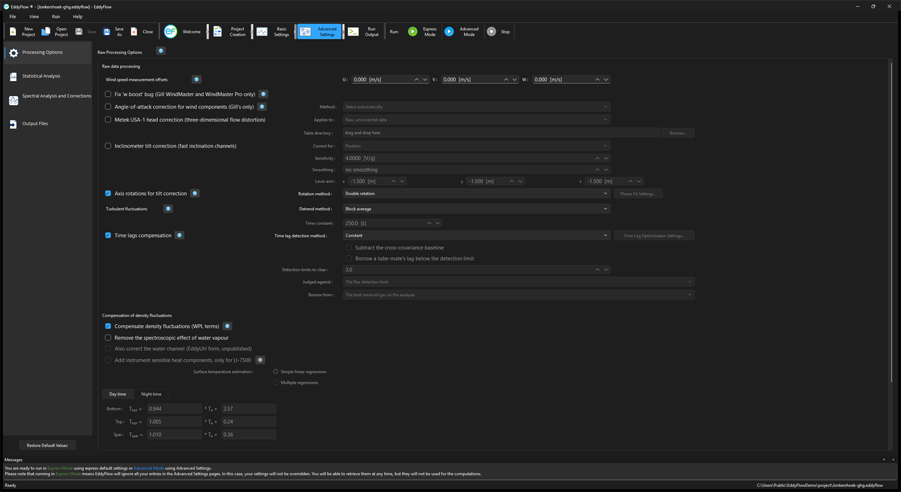
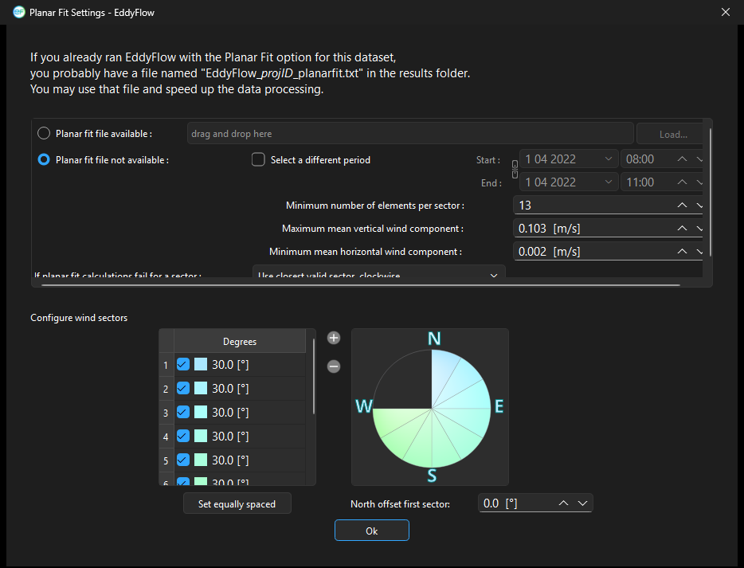
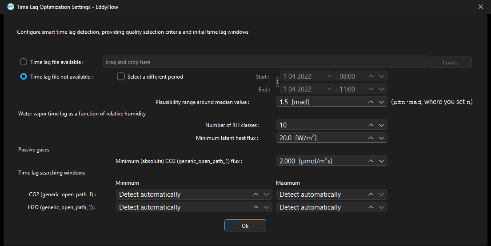
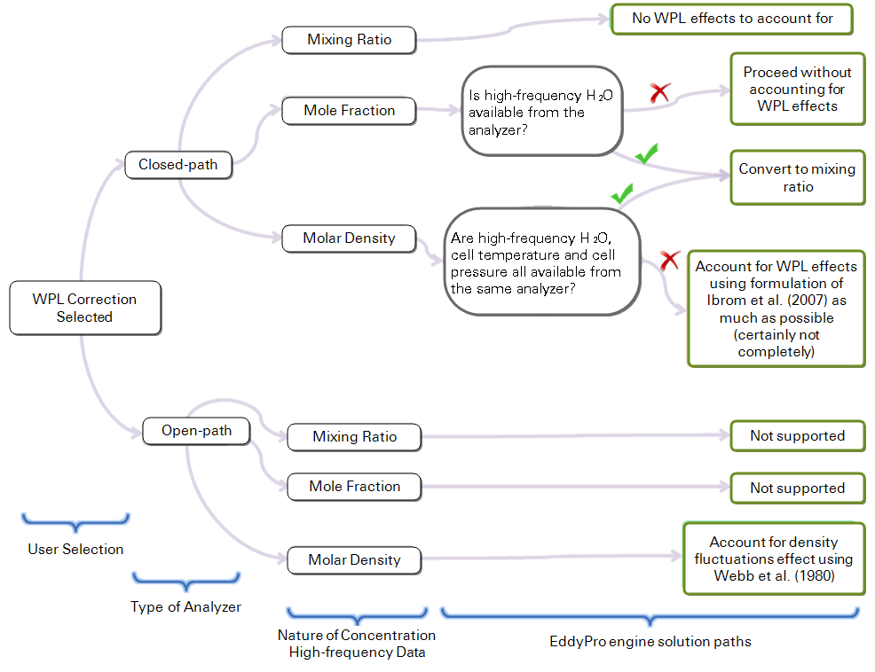

# Advanced settings

Advanced Settings are used to configure EddyFlow for customized data processing. The options available here are generally useful for research applications, custom configuration for sites with complex topography, atypical instrument setups, and for advanced users with high-level knowledge of the eddy covariance technique.

The Advanced Settings page includes four tabs: **Processing Options**, **Statistical Analysis**, **Spectral Analysis and Corrections**, and **Output Files**.

## Processing options

### Raw processing options

#### Wind speed measurement offsets

Wind measurements by a sonic anemometer may be biased by systematic deviation, which needs to be eliminated (e.g., for a proper assessment of tilt angles). You may get these offsets from the calibration certificate of your units, but you could also assess it easily, by recording the 3 wind components from the anemometer enclosed in a box with still air (zero-wind test). Any systematic deviation from zero of a wind component is a good estimation of this bias.

#### Fix 'w-boost' bug (WindMaster and WindMaster Pro only)

Gill WindMaster™ and WindMaster™ Pro anemometers produced between 2006 and 2015 and identified by a firmware version of the form 2329.x.y with x <700 are affected by a bug such that the vertical wind speed is underestimated. Enable this option to have EddyFlow fix the bug. EddyFlow will apply the fix only if the data are eligible according to the above criteria. For more details, please see [W-boost Bug Correction for WindMaster/Pro](w-boost-correction.md#W-boost).

#### Angle of attack correction for wind components

Applies only to vertical mount Gill sonic anemometers with the same geometry of the R3 (e.g., R2, WindMaster). This correction is intended to compensate for the effects of flow distortion induced by the anemometer frame on the turbulent flow field. See [Angle of attack correction](angle-of-attack-correction.md#top).

- **Select automatically:** Select this option to allow EddyFlow to choose the most appropriate angle of attack correction method based on the anemometer model and—in the case of the WindMaster™ or WindMaster Pro—its firmware version.
- **Field calibration ([Nakai and Shimoyama, 2012](references.md#NakaiandShim2012)):** Select this option to apply the Angle of attack correction according to the method described in the referenced paper, which makes use of a field calibration instead of the wind tunnel calibration.
- **Wind tunnel calibration ([Nakai et al., 2006](references.md#Nakai)):** Select this option to apply the Angle of Attack correction according to the method described in the referenced paper, which makes use of a wind tunnel calibration.

#### Metek USA-1 head correction

**Exact UI label:** Metek USA-1 head correction (three-dimensional flow distortion). Project-file keys: `head_corr_meth`, `head_corr_dir`. Off by default.

The transducers and supports of a Metek USA-1 deflect the flow before the sonic measures it, by an amount that depends on where the wind comes from. Metek characterized this in a wind tunnel and published three tables of Fourier coefficients over elevation angle, one each for wind speed, azimuth and elevation, evaluated at three, six and nine times the azimuth. When the box is ticked EddyFlow applies them sample by sample to the raw wind, before the inclinometer correction and before any axis rotation. The method, its assumptions and limitations are described in [Metek USA-1 head correction](anemometer-tilt-correction.md#metek-usa-1-head-correction).

- **Applies to :** (`head_corr_meth`) Tells EddyFlow what state the logged wind is in.
    - **Raw, uncorrected data:** The logger applied nothing, so the three-dimensional correction is applied to the wind as recorded.
    - **Data already carrying Metek's online 2-D correction:** The sonic's own two-dimensional correction is first undone with the closed form Metek publishes for it, and the full three-dimensional correction is applied to what is left. Applying the three-dimensional correction on top of the two-dimensional one without undoing it would count the horizontal part twice. If you do not know which your logger wrote, the sonic's configuration states it; guessing wrongly costs a percent or so of the horizontal wind.
- **Table directory :** (`head_corr_dir`) The folder holding `phicorr.dat`, `ucorr.dat` and `alphacorr.dat`. Each file has twenty comma-separated rows, one per elevation from -50 to +45 degrees in steps of five, carrying the elevation followed by C0, C3, S3, C6, S6, C9 and S9. The folder is read once per run, not once per averaging period. The file browser is titled "Select the Metek Head Correction Table Directory". Next to **Browse...** a **Remote drive...** button lets you pick the folder from a shared Google Drive or Dropbox link, see [Remote folders](remote-folders.md#top).

!!! warning

    The three table files are Metek GmbH's measurements and are **not shipped** with EddyFlow. Without all three files the correction is declined for the **whole run** (it does not correct some periods and not others) and the run log says so; the fluxes then come out exactly as if the option had never been switched on. A directory holding a file with fewer than twenty rows is declined in the same way.

The correction applies to one-inner-bar USA-1 models, which is what the tables were measured on. Nothing in the metadata distinguishes the variants, so this is not checked. It runs in all three raw-data passes of the processing run, including the pre-passes. See also [Head or flow distortion correction](flow-distortion-correction.md#top).

#### Inclinometer tilt correction

**Exact UI label:** Inclinometer tilt correction (fast inclination channels). Project-file keys: `tilt_sensor_meth`, `tilt_sensor_v_g`, `tilt_lpf_s`, `tilt_arm_x`, `tilt_arm_y`, `tilt_arm_z`. Off by default.

A mast that leans or sways tilts the sonic with it. Double rotation, triple rotation and planar fit remove only the *mean* tilt over an averaging period; none can remove a tilt that changes *within* one. An inclinometer logged at the same rate as the wind can, sample by sample, and that is what this option does. Method details and limitations: [Inclinometer tilt correction](anemometer-tilt-correction.md#inclinometer-tilt-correction).

**Where the angles come from.** Ordinary extra raw columns named `theta`, `phi` and `psi`, declared in the **Raw File Description** like any other channel. There is nothing to configure about which column is which, because there is only one sonic and the name is the whole of it. A channel that is absent contributes a zero angle and leaves that axis alone; if none of the three is found, the correction is skipped and the log says so. The columns hold the inclinometer's **output voltage**, not an angle: the angle is -asin(V / sensitivity). The `psi` column is read and then discarded (treated as zero), so this is a two-angle correction even though three channels may be declared.

- **Correct for :** (`tilt_sensor_meth`)
    - **Position:** Rotates the measured wind vector by the inclination of the moment. This is the unambiguous part of the correction and the one to use unless you have a reason not to.
    - **Position and swinging:** Adds a term for the motion of the sonic head as the mast swings, built from the lever arm and the time derivatives of the angles. That term is a **single scalar** added equally to u, v and w, not a velocity vector (the velocity of a point on a rotating body would have three different components). No lever arm turns a scalar into a vector. If you want the physical correction, use **Position** and treat the swinging mode as unavailable.
- **Sensitivity :** (`tilt_sensor_v_g`, volts per g, default 4) Turns the logged voltage into an angle. Check your inclinometer's data sheet before trusting the default. A reading beyond full scale is clamped to plus or minus a right angle, rather than producing an undefined arc sine that would spread through every wind component of that sample.
- **Smoothing :** (`tilt_lpf_s`, seconds, default 0 = "no smoothing") A centred running mean over the angle series, to keep inclinometer noise out of the correction. It smooths what the mast is *believed* to be doing, not what the sonic measured. A window that is too long also removes the genuine sway the correction exists to catch, so keep it short against the swinging period.
- **Lever arm :** (`tilt_arm_x`, `tilt_arm_y`, `tilt_arm_z`, metres, default -1.5 on each axis) The vector from the pivot point of the mast to the sonic head in the sonic's own axes. Used only by **Position and swinging**; **Position** ignores it. The default is a starting point, not a measurement of your mast, and a wrong arm adds a velocity that is not there.

!!! note

    The correction reaches the flux computation only. The planar-fit and time-lag pre-passes run before the angle columns exist, so a planar fit is fitted to winds this correction has not touched. The effect is second order, because the correction targets variation within a period rather than the mean.

#### Axis rotation for tilt correction

Select the appropriate method for compensating anemometer tilt with respect to local streamlines. Uncheck the box to *not perform* any rotation (not recommended). If your site has a complex or sloping topography, a planar-fit method is advisable. Click on the "**Planar Fit Settings...**" to configure the procedure. See [Axis rotation for tilt correction](anemometer-tilt-correction.md#top).

- **Double rotation:** Aligns the *x*-axis of the anemometer to the current mean streamlines, nullifying the vertical and crosswind components.
- **Triple rotation:** Double rotations plus a third rotation that nullifies the cross-stream stress. Not suitable in situations where the cross-stream stress is not expected to vanish, e.g., over water surfaces.
- **Planar fit:** Aligns the anemometer coordinate system to local streamlines assessed on a long time period (e.g., 2 weeks or more). Can be performed sector-wise, meaning that different rotation angles are calculated for different wind sectors. Click on the **Planar Fit Settings...** to configure the procedure.
- **Planar fit with no velocity bias:** Similar to classic planar fit, but assumes that any bias in the measurement of vertical wind is compensated, and forces the fitting plane to pass through the origin (that is, such that if average *u* and *v* are zero, average *w* is also zero). Can be performed sector-wise, meaning that different rotation angles are calculated for different wind sectors. Click on the **Planar Fit Settings...** to configure the procedure.

### Planar fit settings

- **Planar fit file available:** If you got a satisfying planar fit assessment in a previous run with EddyFlow, which applies to the current dataset, you can use the same assessment by providing the path to the file eddyflow_planar_fit_ID.txt. This file, which contains the results of the assessment, was generated by EddyFlow in the previous run. This will shorten program execution time and assure full comparability between current and previous results. Next to **Load...** a **Remote drive...** button lets you select the file from a shared Google Drive or Dropbox link, see [Remote folders](remote-folders.md#top).
- **Planar fit file not available:** Choose this option and provide the following information if you need to calculate (sector-wise) planar fit rotation matrices for your dataset. The planar fit assessment will be completed first, and then the raw data processing and flux computation procedures will automatically be performed.
- **Start:** Starting date of the time period to be used for planar fit assessment. As a general recommendation, select a time period during which the instrument setup and the canopy height and structure did not undergo major modifications. Results obtained using a given time period (e.g., 2 weeks) can be used for processing a longer time period, in which major modifications did not occur at the site. The higher the *Number of wind sectors* and the *Minimum number of elements per sector*, the longer the period should be.
- **End:** End date of the time period to be used for planar fit assessment. As a general recommendation, select a time period during which the instrument setup and the canopy height and structure did not undergo major modifications. Results obtained using a given time period (e.g., 2 weeks) can be used for processing a longer time period, in which major modifications did not occur at the site. The higher the *Number of wind sectors* and the *Minimum number of elements per sector*, the longer the period should be.
- **Minimum number of elements per sector:** Enter the minimum number of mean wind vectors (calculated over each flux averaging interval), required to calculate planar fit rotation matrices. A too-small number may lead to inaccurate regressions and rotation matrices. A too-large number may lead to sectors without planar fit rotation matrices. If for a certain averaging interval wind is blowing from a sector for which the rotation matrix could not be calculated, the policy selected in *If planar fit calculations fail for a sector* applies.
- **Maximum mean vertical wind component:** Set a maximum vertical wind component to instruct EddyFlow to ignore flux averaging periods with larger mean vertical wind components, when calculating the rotation matrices. Using elements with too-large (unrealistic) vertical wind components would corrupt the assessment of the fitting plane, and of the related rotation matrices.
- **Minimum mean horizontal wind component:** Set a minimum horizontal wind component to instruct EddyFlow to ignore flux averaging periods with smaller mean horizontal wind components, when calculating the rotation matrices. When the horizontal wind is very small, the attack angle may be affected by large errors, as would the vertical wind component, resulting in poor quality data that would degrade the planar fit assessment.
- **If planar fit calculations fail for a sector:** Select how EddyFlow should behave when encountering data from a wind sector, for which the planar fit rotation matrix could not be calculated for any reason. Either use the rotation matrix for the closest sector (clockwise or counterclockwise), or switch to double-rotations for that sector.

**Set equally spaced:** Clicking this button will cause EddyFlow to divide the whole 360° circle in *n* equally-wide sectors, where *n* is the number of sectors currently entered.

!!! note

    The operation will not modify the north offset.

**North offset first sector:** This parameter is meant to allow you to design a sector that spans through the north. Entering an offset of *α* degrees will cause all sectors to rotate α degrees clockwise.

!!! note

    North is intended here as local, magnetic north (the one you assess with the compass at the site).

### Detrending turbulent fluctuations

Choose one from among the following detrending methods:

- **Block average:** Simply removes the mean value from the time series (no detrending). Obeys Reynolds decomposition rule (the mean value of the fluctuations is zero).
- **Linear detrending:** Calculates fluctuations as the deviations from a linear trend. The linear trend can be evaluated on a time basis different from the flux averaging interval. Specify this time basis using the *time constant* entry. For classic linear detrending, with the trend evaluated on the whole flux averaging interval, set time constant = 0, which will be automatically converted into the text "Same as Flux averaging interval".
- **Running mean:** High-pass, finite impulse response filter. The current mean is determined by the previous *N* data points, where *N* depends on the *time constant*. The smaller the time constant, the more low-frequency content is eliminated from the time series.
- **Exponential running mean:** High-pass, infinite impulse response filter. Similar to the simple running mean, but weighted in such a way that distant samples have an exponentially decreasing weight on the current mean, never reaching zero. The smaller the time constant, the more low-frequency content is eliminated from the time series.
- **Time constant:** Applies to the linear detrending, running mean, and exponential running mean methods. In general, the higher the time constant, the more low-frequency content is retained in the turbulent fluctuations.

!!! note

    For the linear detrending the unit is minutes, while for the running means it is seconds.

**Time lags compensation:** Select the method to compensate for time lags between anemometric measurements and any other high frequency measurements included in the raw files. Time lags arise mainly due to physical distances between sensors, and to the passage of air into/through sampling lines. Uncheck this box to instruct EddyFlow not to compensate time lags (not recommended).

- **Constant:** EddyFlow will apply constant time lags for all flux averaging intervals, using the **Nominal time lag** stored inside the .ghg files or in the **Alternative metadata file** (for files other than .ghg). This method is indicated for situations of very low fluxes, when the automatic detection of the time lag is problematic, or for measurements characterized by high signal-to-noise ratios, typical of trace-gas measurements (e.g. N2O, N3, etc.).
- **Covariance maximization:** Calculates the most likely time lag within a plausible window, based on the covariance maximization procedure. The window is defined by the **Minimum time lags** and **Maximum time lags** stored inside the .ghg files or entered in the **Alternative metadata file** (for files other than .ghg), for each variable. See [Detecting and compensating for time lags](time-lag-detect-correct.md#top).
- **Covariance maximization with default:** Similar to the **Covariance maximization**, calculates the most likely time lag based on the covariance maximization procedure. However, if a maximum of the covariance is not found inside the window (but at one of its extremes), the time lag is set to the **Nominal time lag** value stored inside the .ghg files or in the alternative metadata file.
- **Automatic time lag optimization:** Select this option and configure it by clicking on the **Time lag optimization Settings...** to instruct EddyFlow to perform a statistical optimization of time lags. It will calculate nominal time lags and plausibility windows and apply them in the raw data processing step. For water vapor, the assessment is performed as a function of relative humidity.
- **Pre-whitening block-bootstrap:** Select this option and configure it by clicking on the **PWB Time Lag Optimization Settings...** to instruct EddyFlow to detect time lags via pre-whitening and block-bootstrap resampling of the cross-covariance function, based on [Vitale et al. (2024)](references.md#Vitale2024). This method is generally more robust than covariance maximization for noisy or short-tube setups, and it has its own borrowing of a tube-mate's lag between co-located gases sharing an intake tube (see [PWB time lag optimization settings dialog](pwb-time-lag-settings.md#top)). See [Detecting and compensating for time lags](time-lag-detect-correct.md#top) and [PWB time lag optimization settings dialog](pwb-time-lag-settings.md#top).

#### Subtract the cross-covariance baseline

**Exact UI label:** Subtract the cross-covariance baseline. Project-file key: `covmax_debaseline`. Off by default.

Chooses the time lag by the largest *departure* of the cross-covariance function from the straight line joining the two ends of the search window, instead of by its largest absolute value. A weak flux often sits on a sloping cross-covariance, caused by a trend or by a neighbouring stronger correlation, and the plain maximum then lands on whichever end of the window the slope is highest at rather than on the peak. Removing the line takes the slope away and leaves the peak.

- It changes **which lag is selected** and nothing about the covariance reported there: the flux at the chosen lag is computed exactly as before.
- It is a modifier of the covariance-maximization methods, not a method of its own, and has no effect with **Constant**.
- With the baseline removed the two ends of the window score zero by construction, so the maximum can never land on an end. **Covariance maximization with default** therefore stops falling back to the nominal time lag. For a weak flux that safety net is worth replacing rather than just losing; conditional lag borrowing (below) is one way to do so.

See [Detecting and compensating for time lags](time-lag-detect-correct.md#baseline-subtracted-covariance-maximization).

#### Conditional lag borrowing

Gases drawn down one tube share a transport delay. A species whose cross-covariance peak cannot be told from noise has nothing of its own to detect, so it can take the lag of a gas on the same analyser that resolved its peak (Nemitz et al., 2018). The controls below sit alongside the **Time lag detection method** selector and apply regardless of which method is chosen. They act in the main raw-data processing pass, after each gas's own lag has been found. Method description: [Detecting and compensating for time lags](time-lag-detect-correct.md#conditional-lag-borrowing).

- **Borrow a tube-mate's lag below the detection limit:** (`tlag_borrow_meth`, off by default) Switches borrowing on. A gas borrows when the covariance at its own lag does not clear the chosen noise floor, and also when its maximum lands on an end of the search window, where a maximization goes when there is no interior peak. With the default noise floor the control stays greyed unless the flux detection limit is switched on under **Statistical Analysis** (`detlim_meth`, see [Flux detection limit](flux-detection-limit.md#top)); without it there is nothing to compare a covariance against, and the engine refuses the combination. The detection limit is not needed when **Lenschow instrument noise (EddyUH)** is chosen under **Judged against**.
- **Detection limits to clear :** (`tlag_borrow_snr`, default 3, range 0.1 to 100) How far above its noise floor a gas's covariance must stand to keep its own lag. Three is the value of Nemitz et al. A lower number means fewer gases borrow, a higher one means more. A gas that clears the threshold keeps its own lag and becomes eligible to donate.
- **Judged against :** (`tlag_borrow_noise`) The noise floor the covariance is compared with.
    - **The flux detection limit:** (`0`, default) The scatter of the cross-covariance far from its peak, where there is no flux. It measures what the covariance itself does with nothing in it. Requires the detection limit to be on.
    - **Lenschow instrument noise (EddyUH):** (`1`) The step in the autocovariance at zero lag, which is the analyser's own white noise ([Lenschow et al., 2000](references.md#Lenschow); [Mauder et al., 2013](references.md#Mauder2013); see [Random uncertainty estimation](random-uncertainty-estimation.md#instrument-noise-lenschow-et-al-2000-as-applied-by-mauder-et-al-2013)). It is measured from the series in hand, so it needs nothing else switched on. It is a smaller floor than the detection limit and therefore lets more gases keep their own lag.
- **Borrow from :** (`tlag_borrow_donor`) Which gas on the same analyser donates the lag.
    - **The best-resolved gas on the analyser:** (`0`, default) Ranks the eligible tube-mates by how far each stands above the noise and takes the strongest.
    - **The analyser's carbon dioxide (EddyUH):** (`1`) Always takes the lag from the carbon dioxide on that analyser. It is usually the best-resolved channel on a trace-gas analyser anyway, and it is the same donor in every period, which makes the lag population easier to defend. Carbon dioxide can then never borrow. If the analyser measures no carbon dioxide, or its carbon dioxide did not clear the threshold either, nothing is borrowed.

Rules that always hold:

- The donor must itself have cleared the threshold, and the set of trusted donors is fixed before any borrowing, so a borrowed lag is never borrowed again.
- Lags are borrowed only between gases on the **same analyser**. A different instrument shares no tube, and a gas whose record names no instrument neither donates nor borrows.
- **Water vapor is never borrowed for or from.** Its lag is the one every other gas's water covariance is taken at, and moving it would move the water term of every density correction with it.
- A borrowed lag is **not a detected lag**. It is flagged in `<gas>_def_timelag` in the same way as a nominal-lag fallback (the flag does not distinguish the two) and the run log names the donor.

### Time lag optimization settings

- **Time lag file available:** If you have a satisfactory time lag assessment from a previous run and these results apply to the current dataset, you can use the time lag assessment by providing the path to the file named ` eddyflow_timelag_opt_ID.txt `, which was generated by EddyFlow in the previous run. It contains the results of the assessment. This will shorten program execution time and assure full comparability between current and previous results. Next to **Load...** a **Remote drive...** button lets you select the file from a shared Google Drive or Dropbox link, see [Remote folders](remote-folders.md#top).
- **Time lag file not available:** Choose this option and provide the following information if you need to optimize time lags for your dataset. Time lag optimization will be completed first, and then the raw data processing and flux computation procedures will automatically be performed.
- **Start:** Starting date of the time period to be used for time lag optimization. This time should not be shorter than about 1-2 months. As a general recommendation, select a time period during which the instrument setup did not undergo major modifications. Results obtained using a given time period (e.g., 2 months) can be used for processing a longer time period, in which major modifications did not occur in the setup. The stricter the threshold setup in this dialogue, the longer the period should be in order to get robust results.
- **End:** End date of the time period to be used for time lag optimization. This time should not be shorter than about 1-2 months. As a general recommendation, select a time period during which the instrument setup did not undergo major modifications. Results obtained using a given time period (e.g. 2 months) can be used for processing a longer time period, in which major modifications did not occur in the setup. The stricter the threshold setup in this dialogue, the longer the period should be in order to get robust results.
- **Plausibility range around median value:** The plausibility range is defined as the median time lag, ±*n* times the MAD (median of the absolute deviations from the median time lag). Specify *n* here. The value of 1.5 was heuristically found to be a reasonable default, but a set of trials may be necessary to tailor the calculation to the specifics of the current application.

#### Water vapor time lag as a function of relative humidity

- **Number of RH classes:** Select the number of relative humidity classes, to assess water vapor time lag as a function of RH. The whole range of RH variation (0-100%) will be evenly divided according to the selected number of classes. For example, selecting 10 classes causes EddyFlow to assess water vapor time lags for the classes 0-10%, 10-20%,…, 90-100%. Selecting 1 class, the label *Do not sort in RH classes* appears and will cause EddyFlow to treat water vapor exactly like other passive gases. This option is only suitable for open path systems or closed path systems with short, heated sampling lines.
- **Minimum latent heat flux:** H2O time lags corresponding to latent heat fluxes smaller than this value will not be considered in the time lag optimization. Selecting high-enough fluxes assures that well developed turbulent conditions are met and the correlation function is well characterized.

#### Passive gasses

One **Minimum (absolute) <gas> flux** row is shown for each gas that has a column in the **Raw File Description** (water vapor uses the latent heat flux above instead). For each, time lags corresponding to fluxes smaller in magnitude than the value are not considered in the time lag optimization. Selecting high-enough fluxes ensures that well developed turbulent conditions are met and the correlation function is well characterized.

- **Minimum (absolute) CO2 flux:**, **Minimum (absolute) CH4 flux:**, **Minimum (absolute) 4th gas flux:** The label carries the gas name used in the project.
- **Unit:** each row is shown in the unit that follows the gas's **own** column in the **Raw File Description**: a column in ppb or nmol/mol gives nmol m-2 s-1, a column in pmol/mol gives pmol m-2 s-1, and anything else gives µmol m-2 s-1. The default offered is scaled to match; with one fixed unit, a trace-gas default such as that for COS or N2O would sit above every flux the gas can produce and no lag would pass. The values are stored in the project, and passed to the engine, in µmol m-2 s-1, so projects saved earlier read back unchanged.

#### Time lag searching windows

- **Minimum:** Minimum time lag for each gas, for initializing the time lag optimization procedure. The searching window defined by **Minimum** and **Maximum** should be large enough to accommodate all possible time lags. Leave as **Detect automatically** if in doubt, and EddyFlow will initialize it automatically.
- **Maximum:** Maximum time lag for each gas, for initializing the time lag optimization procedure. The searching window defined by **Minimum** and **Maximum** should be large enough to accommodate all possible time lags. In particular, maximum time lags of water vapor in closed path systems can be up to ten times higher than its nominal value, or even higher. Leave as **Detect automatically** if in doubt, and EddyFlow will initialize it automatically.

### Compensation for density fluctuations (WPL terms)

**Compensate density fluctuations (WPL terms):** Choose whether to apply the compensation of density fluctuations to raw concentration data. This operation is usually referred to as "applying WPL terms" or "WPL correction". The way the correction is actually applied is decided by EddyFlow on the basis of available data and metadata, according to the following decision tree:

With an **open-path IRGA**, only molar density can be treated, and the way density fluctuations are accounted for in EddyFlow is by following the classic formulation of Webb et al. (1980).

With a **closed-path IRGA**, the strategy is to convert raw data to mixing ratio any time it is possible to accurately do so. If that's not possible, the *a posteriori* formulation of [Ibrom et al. (2007)](references.md#Ibrom) - revising WPL for closed-path systems – is applied, including all density fluctuation terms that can be included. Note that here, however, EddyFlow also includes the pressure-induced fluctuations terms, which were instead neglected in the original paper.

**Remove the spectroscopic effect of water vapour:** (`spectro_meth`, `1` = `chen_10`, `0` = none; off by default) For closed-path laser analysers. Water vapor broadens the absorption lines such an analyser measures, so the mixing ratio it reports depends on humidity beyond simple dilution. Each affected column is divided, sample by sample, by 1 + *a*·χq + *b*·χq², using the water its own analyser read at the same instant ([Peltola et al., 2014](references.md#Peltola2014); applied point by point after Chen et al., 2010).

- Enter *a* and *b* per column in the **Raw File Description** (`col_<N>_spectro_a`, `col_<N>_spectro_b`). A column that leaves them at zero is not touched, and neither is an open-path analyser.
- The correction is independent of the density compensation above: the bias is in what the instrument reported, whether or not WPL is applied.
- **The coefficients are spectroscopic only**, so the identity is *a* = *b* = 0. Some published tables fold the dilution term into the same polynomial, with *a* = -1, *b* = 0 meaning pure dilution and no spectroscopy. EddyFlow corrects the density separately, so to carry such a value across, add one to *a* (for example, a published *a* of -1.39 becomes -0.39). Entering a dilution-inclusive value unchanged would count the dilution twice.

**Also correct the water channel (EddyUH form, unpublished):** (`spectro_water`, `1` = on, off by default) Applies the same division to each hygrometer against its own reading, which is water self-broadening. This is **not part of the published Peltola et al. (2014) result**, which derives the effect of water on *another* gas's absorption lines; the coefficient used for the water channel has no published derivation. The option offers the idea in the same point-by-point form used for every other column. Select it deliberately, and report that you did. It does nothing unless the correction above is on and the hygrometer's own coefficients are non-zero.

**Add instrument sensible heat component (LI-7500 only):** Only applies to the LI-7500. It takes into account air density fluctuations due to temperature fluctuations induced by heat exchange processes at the instrument surfaces, as from [Burba et al. (2008)](references.md#Burba). This may be needed for data collected in very cold environments. See [Calculating the off-season uptake correction (LI-7500 only)](calculate-offseason-uptake-correction.md#top).

- **Simple linear regressions:** Instrument surface temperatures are estimated based on air temperature, using linear regressions as from [Burba et al., 2008](references.md#Burba), eqs. 3-8. Default regression parameters are from Table 3 in the same paper. If you have experimental data for your LI-7500 unit, you may customize those values. Otherwise we suggest using the default values.
- **Multiple regressions:** Instrument surface temperatures are estimated based on air temperature, global radiation, long-wave radiation and wind speed, as from [Burba et al., 2008](references.md#Burba), Table 2. Default regression parameters are from the same table. If you have experimental data for your LI-7500 unit, you may customize those values. Otherwise we suggest using the default value.

!!! note

    As of engine v8.1.0, **Add instrument sensible heat component** is greyed out automatically when the project's metadata has no LI-7500-family analyzer, since the correction does not apply to any other instrument.

### Other options

#### Conditional Eddy Covariance

Activate **Conditional Eddy Covariance** to partition evapotranspiration into transpiration and evaporation and to partition net carbon dioxide flux into photosynthetic uptake and ecosystem respiration. CEC requires simultaneous high-frequency measurements of carbon dioxide and water vapor and is disabled by default.

The option is located under **Advanced Settings > Processing Options > Other options > Conditional Eddy Covariance**. See [Conditional Eddy Covariance](conditional-eddy-covariance.md#top) for the method, requirements, limitations, and output variables.

#### Quality check - flagging policy

Select the quality flagging policy. Flux quality flags are obtained from the combination of two partial flags that result from the application of the steady-state and the developed turbulence tests. Select the flag combination policy.

- **[Mauder and Foken, 2004](references.md#Mauder):** Policy described in the documentation of the TK2 eddy covariance software that also constituted the standard of the CarboEurope IP project and is now a de facto standard in networks such as ICOS, AmeriFlux and FLUXNET. "0" means high quality fluxes, "1" means fluxes are suitable for budget analysis, "2" means fluxes that should be discarded from the resulting dataset due to bad quality.
- **[Foken, 2003](references.md#Foken):** A system based on 9 quality grades. "0" is best, "9" is worst. The system of Mauder and Foken (2004) and of Göckede et al. (2006) are based on a rearrangement of this system.
- **[Göckede et al., 2006](references.md#Gockede2):** A system based on 5 quality grades. "0" is best, "5" is worst.
- **Vitale et al. (2020) (0-1-2 severity system):** (`qc_meth` = 4) A fourth policy that grades each flux 0 (ok), 1 (moderate) or 2 (severe) from a wider set of tests than the three systems above. On the common project that hands spectral corrections off to the flux-correction stage, this grade is computed from the ITC deviation alone. See [Flux quality flags](flux-quality-flags.md#top) for the tests and the conditions under which the wider set applies.

#### Footprint estimation

Select whether to calculate flux footprint estimations and which method should be used. Flux crosswind-integrated footprints are provided as distances from the tower contributing 10%, 30%, 50%, 70% and 90% to measured fluxes. Also, the location of the peak contribution is given. See [Estimating the flux footprint](estimating-flux-footprint.md#Footprin).

- **[Kljun et al. (2004)](references.md#Kljun):** A crosswind integrated parameterization of footprint estimations obtained with a 3D Lagrangian model by means of a scaling procedure.
- **[Kormann and Meixner (2001)](references.md#Kormann):** A crosswind integrated model based on the solution of the two dimensional advection-diffusion equation given by van Ulden (1978) and others for power-law profiles in wind velocity and eddy diffusivity.
- **[Hsieh et al. (2000)](references.md#Hsieh):** A crosswind integrated model based on the former model of Gash (1986) and on simulations with a Lagrangian stochastic model.

#### Parallelise the planar fit and time lag pre-passes

**Exact UI label:** Parallelise the planar fit and time lag pre-passes. Off by default. Last control in the **Other options** group.

Before computing any flux, EddyFlow may walk every averaging period once, to fit the planar-fit planes or to optimise the time lags (and, with the pre-whitening method, to build its time-lag cache). On a long dataset this walk dominates the run. Each period is independent of the others, so with this box ticked the range is split across the processor cores and the pieces are joined back in order.

- **Results do not change:** the planar-fit coefficients and the optimised time lags come out identical to a serial run. It has no effect on a project that runs no pre-pass, nor on the flux computation itself, which is not split.
- **A setting of this computer, not of the project:** it is remembered between sessions but is not saved in the project file, so a colleague opening the same project decides for themselves.
- **Unticked** means one worker (serial); ticked lets the engine use every core. It corresponds to the `-j` / `--jobs` option of the command line, see [Command line](command-line.md#top).
