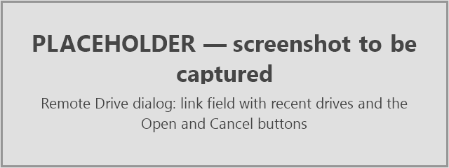
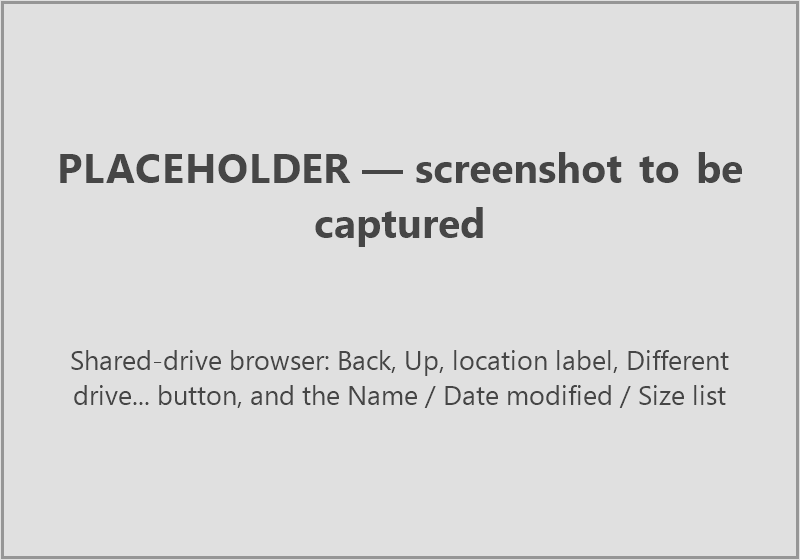

# Remote folders and shared links

EddyFlow can read its input files from a Google Drive or Dropbox folder that has been shared with **Anyone with the link**. Raw data, metadata files, biomet files and the assessment files of earlier runs can all be given as a link instead of a local path, so a dataset that lives on a shared drive can be processed without first copying it to the computer. Nothing needs a login or an API key: only public shares are supported.

The interface offers a **Remote drive...** button next to the usual **Browse...** or **Load...** button of twelve input fields. The processing engine accepts a link in any input path setting of the project file, so a run started from the command line, with no interface involved, can also read from a drive. The **Output directory** cannot be remote: results are always written to a local folder.

## Supported providers and link forms

**Google Drive.** A link to a folder (`https://drive.google.com/drive/folders/<id>`), to a file (`https://drive.google.com/file/d/<id>/view`), or a link that carries the item as `?id=<id>`. EddyFlow keeps the item identifier and drops everything else from the link (for example `usp=sharing`).

**Dropbox.** A shared folder link of the form `https://www.dropbox.com/scl/fo/...`, and a shared file link of the form `https://www.dropbox.com/scl/fi/...`. The `rlkey` parameter that Dropbox adds to the link is kept; the tracking parameters `st` and `dl` are dropped.

Any other address is rejected. A link to a file is rejected where a folder is needed, and a link to a folder is rejected where a file is needed.

### How to share a folder

1. In Google Drive or Dropbox, open the sharing dialog of the folder that holds the data.
2. Set general access to **Anyone with the link**, with the Viewer role (read only is sufficient).
3. Copy the link and paste it into EddyFlow as described below.

Share the folder that contains the files EddyFlow needs. Subfolders are shared with it. If you share a single file (for example a metadata file) the link points at that file only.

!!! note

    A folder shared only with named people, or one that requires signing in, cannot be read. EddyFlow does not log in to either provider.

## The Remote drive... button

**Exact UI label:** **Remote drive...** (tooltip: "Dropbox or Google Drive link").

The button sits to the right of **Browse...** or **Load...** and is shown only on fields that can take a remote value. It is not shown on any other field. The twelve fields that have it are:

| Where | Field | Project-file key |
| --- | --- | --- |
| Basic Settings page | **Raw data directory** | `data_path` |
| Project Creation page | **Metadata file** > **Use alternative file** | `proj_file` |
| Project Creation page | **Use dynamic metadata file** | `dyn_metadata_file` |
| Project Creation page | **Biomet data** > **Use external file** | `biom_file` |
| Project Creation page | **Biomet data** > **Use external directory** | `biom_dir` |
| Advanced Settings > Spectral Analysis and Corrections | **Spectral assessment file available for this dataset** (the file) | `sa_file` |
| Advanced Settings > Spectral Analysis and Corrections | **Binned (co)spectra files available for this dataset** (the folder) | `sa_bin_spectra` |
| Advanced Settings > Spectral Analysis and Corrections | **Full w/Ts cospectra files available for this dataset** (the folder) | `sa_full_spectra` |
| Advanced Settings > Processing Options | Metek head correction **Table directory** | `head_corr_dir` |
| Planar Fit Settings dialog | Planar fit file (**Load**) | `pf_file` |
| Time Lag Optimization Settings dialog | Time lag optimization file (**Load**) | `to_file` |
| PWB Time Lag Optimization Settings dialog | **Time-lag file available** (**Load**) | `to_file` |

The **Output directory** field deliberately has no **Remote drive...** button.

### The Remote Drive dialog

The first time you click **Remote drive...** in a project, EddyFlow opens a dialog titled **Remote Drive**. It asks: "Paste the link to a Google Drive or Dropbox folder shared with **Anyone with the link**:". Below it is an editable drop-down list. Paste the link into it, or pick one of the ten most recently used drives from the list. The field shows the hint `https://drive.google.com/drive/folders/...` while it is empty.

The confirm button is called **Open**. Clicking it checks that the link is a Google Drive or Dropbox link and then tries to list the folder. If either step fails, the dialog stays open and a warning explains why (see [Failures and hints](#failures-and-hints)); a link that does not work never becomes the current drive.

### The drive browser

Once the link is accepted, EddyFlow opens a browser that works like the ordinary file dialog but shows the shared drive:

- **Window title.** The browser carries the same title as the local dialog of that field, for example **Select the Metadata File** or **Select the Raw Data Directory**.
- **Back** (tooltip "Back") returns to the folder you were in before. **Up** (tooltip "Parent folder") goes to the parent folder.
- The location label shows the provider and the current path, for example **Google Drive** / `site/2019-03`.
- **Different drive...** lets you paste another link (see below).
- The list has the columns **Name**, **Date modified** and **Size**. Folders are listed first, then files, each group sorted by name without regard to case. While a folder is being listed a **Loading...** row is shown. Google Drive does not report file sizes, so the **Size** column can be empty for a Google drive.
- For fields that pick a file, a filter list offers the same file types as the local dialog of that field.
- Double-click, or **Enter**, opens a folder or accepts a file.
- The confirm button reads **Select Folder** for a folder field and **Open** for a file field. For a folder field it selects the folder that is open, or the folder highlighted in it.

Later clicks on any **Remote drive...** button reopen the same drive, at the place the field already points to if it has a remote value. **Different drive...** switches to another link. When you open a project, the current drive is taken from the first remote value the project holds; starting a new project or opening another one forgets it. EddyFlow remembers the last ten drives you used (the setting `remote_drives`) and offers them in the Remote Drive dialog.

## How a remote field is shown and stored

After a selection the field shows a short readable name, for example `Google Drive: site/2019-03` or `Dropbox: site/2019-03`. The full link is shown in the tooltip of the field. If you edit the text of the field, the link is dropped and the field becomes an ordinary path again.

In the project file the value is the link of the item followed by the drive it was picked from and the position in that drive:

    <link to the item>#root=<link to the drive>&path=<path in the drive>

This is what lets **Remote drive...** reopen the browser at the right place. The engine ignores everything after the `#`, so the same value works unchanged when the project is run from the command line.

You can also paste or type a link straight into a remote-capable field. It is accepted as it is. Pasting a link into the **Output directory** field is refused with a warning titled **Remote Drive**: "Output locations must be local folders; EddyFlow cannot write to a shared drive."

## What the interface copies to the computer

The interface needs some of the files itself, before any run, to fill in pages and check settings. It handles them in two different ways.

**The alternative metadata file is copied next to the project.** As soon as you choose a metadata file from a drive, EddyFlow saves a copy beside the project file and points the project at the copy, because EddyFlow edits that file (for example in the **Metadata File Editor**). A new project is saved first so that it has a folder. If a file with that name already exists next to the project, a question titled **Metadata File** asks "`<name>` already exists next to the project." with the buttons **Overwrite**, **Keep Both** (the default; the copy is named `<name>_1.metadata`, then `_2`, and so on) and **Cancel**. When the copy is made, an information box says "The metadata file was copied from the shared drive next to the project, where EddyFlow can update it:" and gives the path. If it cannot be saved, a warning says "Could not save the metadata file next to the project."

**Everything else goes to a temporary cache.** Other files the interface itself reads go into a per-session temporary folder named `eddyflow_remote_XXXXXX` in the system temporary folder, and the folder is deleted when you close EddyFlow. This covers the metadata embedded in a raw GHG file, biomet file headers, the files that are tested when you load an assessment file, the planar fit, time lag and PWB files, and the inputs that **Create Package** collects in SmartFlux configuration mode. A file that is reached twice is downloaded once.

The raw file name dialog lists the files of the drive. Raw files are not downloaded in bulk: only the ones the interface has to open are fetched.

## Failures and hints

A failure opens a modal warning titled **Remote Drive**. The first line says what failed, for example:

- "This is not a Google Drive or Dropbox link."
- "Could not open the shared folder."
- "Could not open the folder on the shared drive."
- "Could not list the shared folder."
- "Could not download `<file>` from the shared drive."

A second paragraph gives the detail, for example "The server answered HTTP ..." or "This link is to a file, not a folder." or "The provider sent a web page instead of the file - a sign-in, permission or download quota page." The last paragraph is always the hint: **Is the folder shared with "Anyone with the link", and can this computer reach the internet?**

Typical causes are a folder that is not shared publicly, a link that has been revoked, no internet connection, and a provider that answers with a sign-in or quota page instead of the file. A Dropbox folder with too many entries cannot be listed. A request that takes longer than 120 seconds is abandoned.

## How the engine reads a link

Any input path setting of the project may hold a link instead of a path. A value counts as a link when it starts with `http://` or `https://` (the match is not case sensitive). No new project-file keys exist; the keys below simply accept a link.

| Section | Keys that accept a link |
| --- | --- |
| `[RawProcess_General]` | `data_path` (raw data folder) |
| `[Project]` | `proj_file`, `dyn_metadata_file`, `biom_file`, `biom_dir` |
| `[RawProcess_TiltCorrection_Settings]` | `pf_file` |
| `[RawProcess_TimelagOptimization_Settings]` | `to_file` |
| `[RawProcess_Settings]` | `head_corr_dir` |
| `[FluxCorrection_SpectralAnalysis_General]` | `sa_file`, `sa_bin_spectra`, `sa_full_spectra`, `ex_file` |

The output folder `out_path` cannot be a link. If it is, the run stops with **Fatal error(122)** before anything is downloaded.

### Requirements

Downloads are made with the `curl` program. `curl.exe` ships with Windows 10 and later, and macOS and most Linux distributions include `curl`. If it cannot be found the run stops with **Fatal error(120)** ("Reading from a shared link needs curl, which was not found."). The computer must also be able to reach the provider while the run is going: the internet is needed at run time, not only in the interface.

### Raw data

A season of raw files may not fit on the disk, so the raw data folder is not downloaded as a whole.

1. At start-up the shared folder is **listed** once (including subfolders when **Search in subfolders** is on). Each file is given the local path it will have, and file name matching, time stamps and ordering behave exactly as for a local folder. The log shows "Raw files are read from a shared link:" followed by the link, and then "Listing the shared folder.. N files."
2. A file is **downloaded when a reader asks for it**. While it is processed, the next two files are fetched in the background.
3. The start-up survey of acquisition frequencies and the planar fit, time lag and drift pre-passes read files that the main pass reads again. Until the main pass starts nothing is deleted, so the files these passes download are kept. When the main pass begins, the log reports "N raw file(s) downloaded for the preparatory passes are used again, not downloaded again."
4. The **main pass** reads in time order and **deletes each file once it is two files behind** (a period can start in the file before).
5. Pre-pass workers started with `-j` (see [Command line](command-line.md#top)) share one download folder and take a lock per file, so two of them never fetch the same file.

Every URL fetched during a run is recorded, so a file that two settings name, or that a setting and the raw listing both name, crosses the network once and is copied locally the second time.

A raw file is retried three times. If it still cannot be downloaded (a web page returned in place of the file counts as a failure), the file is treated as missing: **Warning(121)** is written, the file is skipped, and a summary Warning(121) at the end of the run counts the files that were lost. Their periods are skipped or processed from the files that remain.

### Other inputs

Single files (`proj_file`, `dyn_metadata_file`, `biom_file`, `pf_file`, `to_file`, `ex_file`, `sa_file`) and folders that are read whole (`biom_dir`, `head_corr_dir`, `sa_bin_spectra`, `sa_full_spectra`) are downloaded once, at start-up. The log shows `Downloading "<setting>" from the shared link.. Done.` for each. A setting that must be a file but links to a folder stops the run with Fatal error(120). Biomet folders are filtered by the biomet file extension, and the two cospectra folders by `.csv`.

### Staging folders and cleanup

Raw files are staged in `<temporary folder>/remote/` and small inputs in `<temporary folder>/remote_aux/<setting>/<file>`. Nothing is kept after the run. The staging folders are removed at the end, after any background downloads have finished. A download that is held by a stuck lock is waited for at most 600 seconds before it is fetched again. Pre-pass workers remove their own temporary folder when they finish.

The run produces no output links: results always go to the local output folder.

### Messages

| Code | Meaning |
| --- | --- |
| Warning(121) | A raw file could not be downloaded after three attempts and is treated as missing. |
| Fatal error(120) | A shared-link input could not be read: `curl` is missing, the link is not a Google Drive or Dropbox folder link EddyFlow can read, the listing failed, a file download failed, a setting that needs a file links to a folder, or Dropbox changed its listing format. |
| Fatal error(122) | The output location is a link. |

See [Run errors](error-codes.md#top) for the full text and what to do.

## Using a link from the command line

No interface is needed. Edit the project file (`*.eddyflow`) in a text editor, or set the field in the interface and save, and put the link as the value of the key:

    [RawProcess_General]
    data_path=https://drive.google.com/drive/folders/<id>

    [Project]
    out_path=C:/results/site
    proj_file=https://drive.google.com/file/d/<id>/view

Then run the engine as usual (see [Command line](command-line.md#top)). A link written by the interface carries the `#root=...&path=...` suffix; the engine drops it, so you can leave it in or remove it. The `curl` program must be on the path of the computer that runs the engine.

## Limits

- Only public shares work: no sign-in, no private folders.
- Listing relies on the public share pages of the providers. They are not a published programming interface, so a provider can change them. When that happens a listing fails with Fatal error(120) rather than processing a partial folder.
- Google Drive does not report file sizes.
- A Dropbox folder with too many entries cannot be listed in the interface.
- The output must be a local folder.
- The internet connection is needed in the interface and at run time. Large raw datasets are downloaded file by file for every run, so a run reads the data over the network each time.

## Troubleshooting

| Symptom | Likely cause | What to do |
| --- | --- | --- |
| "This is not a Google Drive or Dropbox link." | The address is not a share link of either provider. | Copy the link from the **Share** dialog of the folder. |
| "Could not open the shared folder." or "Could not list the shared folder." | Not shared with **Anyone with the link**, link revoked, no internet. | Check the sharing setting and the connection, then try again. |
| "This link is to a file, not a folder." | A file link was given for a folder field. | Share the folder that contains the file, or use a field that takes a file. |
| "The provider sent a web page instead of the file" | Sign-in, permission or download quota page. | Open the link in a browser while signed out. Wait if a quota applies. |
| Output folder refused | A link was pasted into **Output directory**. | Choose a local folder. |
| Run stops with Fatal error(120) | `curl` missing, link not readable, or a listing or download failed. | Read the lines above the message in the run log. |
| Run stops with Fatal error(122) | `out_path` is a link. | Set a local output folder. |
| Warning(121) | A raw file could not be downloaded. | The periods that need it are skipped. Rerun later or check the sharing. |
| **Remote drive...** button is missing | The field does not take a remote value. | Only the twelve fields listed above do. |
