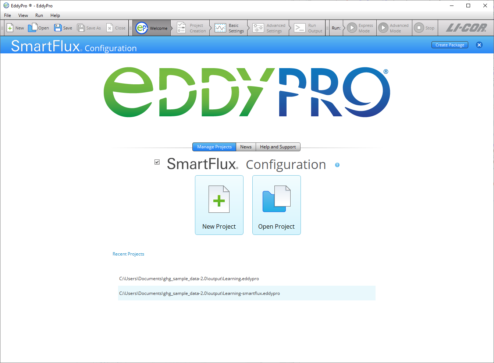
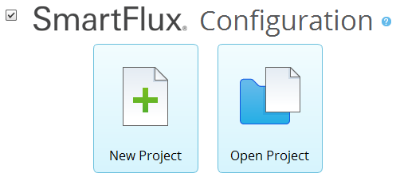
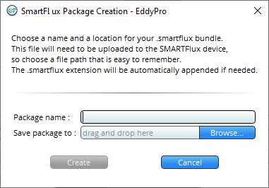

# Running EddyFlow in the SmartFlux System

The SmartFlux® System is an essential component for the original publisher eddy covariance systems that are based upon the LI-7500A/RS/DS and LI-7200/RS gas analyzers. The original SmartFlux System reads the analog signals from the sonic anemometer . It installs in the LI-7550 Analyzer Interface Unit. The SmartFlux 2 and 3 Systems read the digital signal from the sonic anemometer. They install in a the original publisher Biomet enclosure, the original publisher Systems Enclosure, or another suitable enclosure.

Both the original SmartFlux System and the SmartFlux 2 or 3 Systems run EddyFlow to process .ghg files. They provide:

- Fully corrected eddy covariance results processed by EddyFlow in Express or Advanced mode in real-time with a 30-minute averaging interval.
- GPS location and time keeping for populating metadata location information and synchronizing system clocks with GPS satellite clocks.
- Compatibility with FluxSuite for online monitoring.

The SmartFlux 2 and 3 Systems also provides:

- Digital data and diagnostics acquisition from the sonic anemometer.
- A USB drive that is easy to access when mounted at the bottom of a tower.
- Pass-through power to the sonic anemometer.

EddyFlow provides SmartFlux configuration mode, which is used to create a custom configuration file for the SmartFlux System. To use this mode, check the ** SmartFlux Configuration ** box on the welcome page, and proceed through EddyFlow as you normally would. The steps are summarized below:

1. Check the ** SmartFlux Configuration ** box on the welcome page.
2. 
3. Select ** New Project ** or ** Open Project **..
4. 
5. Click ** Create Package ** in the upper right of EddyFlow.
6. 
7. When prompted, name the package, select a directory and click ** Create **.
8. 
9. The configuration file has a .smartflux extension.
10. Upload the file to the SmartFlux System.
11. This is done in the gas analyzer configuration software.
