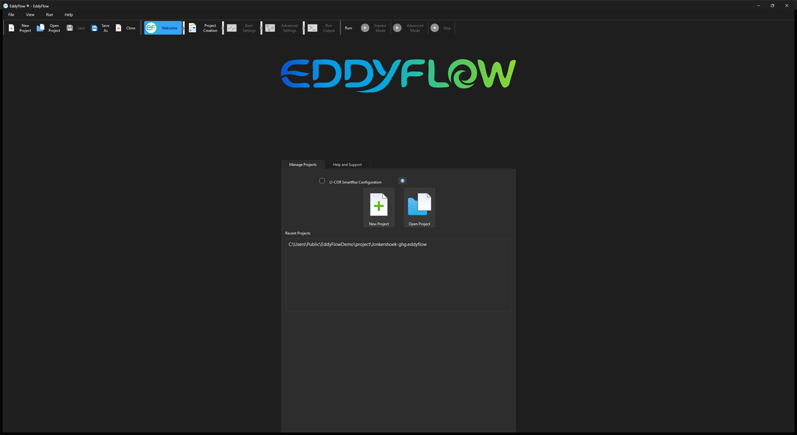
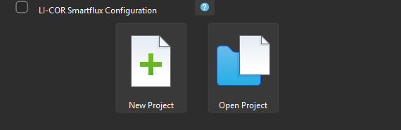
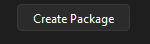
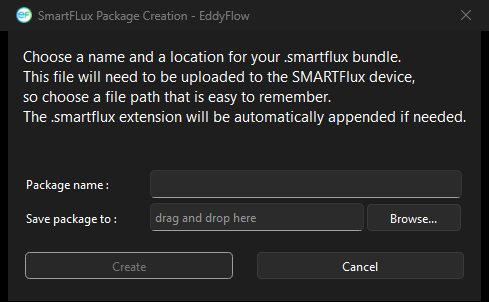

# Running EddyFlow in the SmartFlux System

The SmartFlux® System is an essential component for LI-COR eddy covariance systems that are based upon the LI-7500A/RS/DS and LI-7200/RS gas analyzers. The original SmartFlux System reads the analog signals from the sonic anemometer . It installs in the LI-7550 Analyzer Interface Unit. The SmartFlux 2 and 3 Systems read the digital signal from the sonic anemometer. They install in a LI-COR Biomet enclosure, a LI-COR Systems Enclosure, or another suitable enclosure.

Both the original SmartFlux System and the SmartFlux 2 or 3 Systems run EddyFlow to process .ghg files. They provide:

- Fully corrected eddy covariance results processed by EddyFlow in Express or Advanced mode in real-time with a 30-minute averaging interval.
- GPS location and time keeping for populating metadata location information and synchronizing system clocks with GPS satellite clocks.
- Compatibility with FluxSuite for online monitoring.

The SmartFlux 2 and 3 Systems also provides:

- Digital data and diagnostics acquisition from the sonic anemometer.
- A USB drive that is easy to access when mounted at the bottom of a tower.
- Pass-through power to the sonic anemometer.

EddyFlow provides SmartFlux configuration mode, which is used to create a custom configuration file for the SmartFlux System. To use this mode, check the **SmartFlux Configuration** box on the welcome page, and proceed through EddyFlow as you normally would. The steps are summarized below:

1. Check the **SmartFlux Configuration** box on the welcome page.
2. 
3. Select **New Project** or **Open Project**..
4. 
5. Click **Create Package** in the upper right of EddyFlow.
6. 
7. When prompted, name the package, select a directory and click **Create**.
8. 
9. The configuration file has a .smartflux extension.
10. Upload the file to the SmartFlux System.
11. This is done in the gas analyzer configuration software.

## Entering and leaving SmartFlux configuration mode

**Exact UI label:** **SmartFlux Configuration** (File menu, shortcut **Ctrl+F**; **Cmd+F** on macOS).

The mode can be switched on and off with the menu item, with its shortcut, or with the close button of the SmartFlux bar. Pressing **Ctrl+F** on the **Project Creation** page used to close EddyFlow without any message; this is fixed. The widgets that the mode disables are also restored correctly each time you leave it, however often you enter and leave it in one session.

### The SmartFlux copy of your project

SmartFlux configuration mode does not work on your project file itself. It saves and opens a copy named after the file, `<name>-smartflux.eddyflow`, in the same folder, and the original stays as it was. The name is built from the file name only. A project in a folder whose name ends in `.eddyflow`, or a project file with no extension at all (for example an imported legacy file), now gets a proper `<name>-smartflux.eddyflow` copy next to it; the copy used to be named wrongly or to be identical to the original.

If the copy cannot be opened (for example if it is damaged), the load error is reported, the mode is **not** engaged, the SmartFlux bar does not appear, no pages are greyed out and **Create Package** is not offered. The original project stays open.

### Create Package and shared drives

**Create Package** collects the spectral assessment file, the planar fit file and the time lag file of the project and places them in the package. If any of them is given as a link to a shared Google Drive or Dropbox folder (see [Remote folders and shared links](remote-folders.md#top)), EddyFlow first downloads it, so the package contains the files themselves and not the links.
