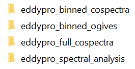
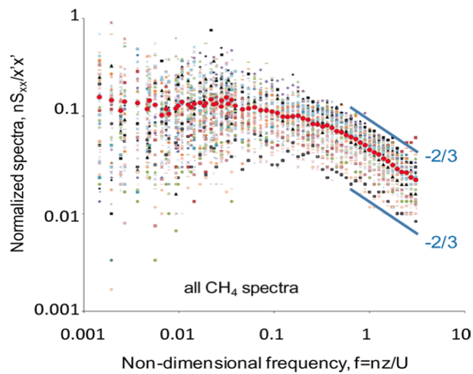
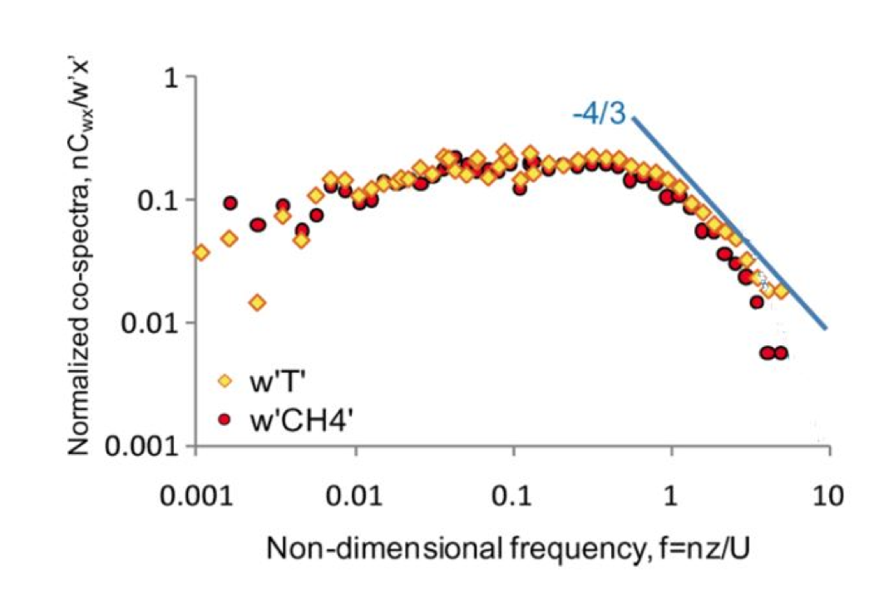
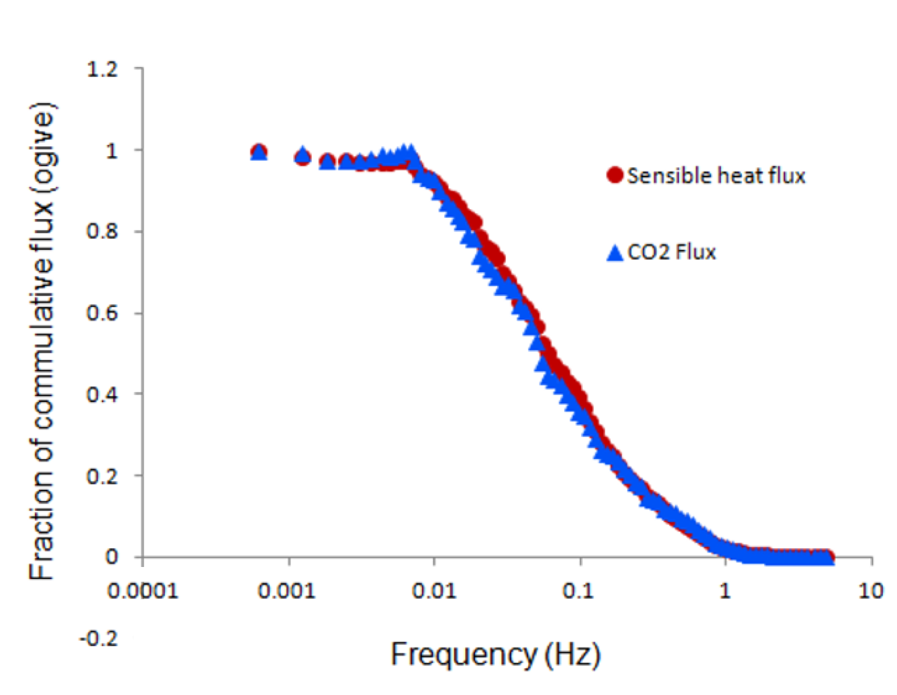

# Analyzing Spectra and Cospectra in EddyFlow

Spectral analysis determines how variance or covariance distributes over frequency for a finite time series data set. Eddy covariance (EC) spectral analysis can reveal insights that would otherwise not be obvious by looking at data in the time-domain only. Spectral analysis allows you to assess whether the instruments have enough resolution, if a sampling rate is fast enough, and if a flux averaging period is adequate, among other things. Here are the basic steps for doing spectral analysis using EddyFlow:

1. Choose EddyFlow Advanced Mode to process your raw data.
2. There are two data processing modes in EddyFlow: Express and Advanced. Only the Advanced Mode outputs spectral analysis results.
3. Use the default settings of EddyFlow Advanced Mode or set up your own.
4. EddyFlow outputs full spectra and cospectra, binned spectra and cospectra, and binned ogives for every flux averaging period (usually 30 minutes). Based on these results, EddyFlow also outputs ensemble (i.e., averaged) binned spectra and binned cospectra for the entire period of a raw data set. The ensemble spectral analyses are further grouped by atmospheric stability (stable: -650 m < L < 0 m and unstable: 0 m < L < 1000 m, where L is Monin-obukhov length) and time of day (every three hours). The ensemble spectral results are quality controlled using the filters displayed on the interface of ** Spectral Analysis and Corrections ** in the Advance Mode. These quality criteria can be changed by yourself if needed.
5. Get spectral analysis results.
6. In EddyFlow Advance Mode output files, the following folders contain spectral and cospectral results:
7. 
8. The binned and full spectra and cospectra from every averaging period (usually 30 minutes) are in the ` eddypro_binned_cospectra ` and ` eddypro_full_cospectra ` folders respectively. The ` eddypro_binned_ogives ` folder contains binned ogives files. The ensemble spectra and cospectra averaged based on atmospheric stability, period of time, or relative humidity are in the ` eddypro_spectral_analysis ` folder. All the files are in a comma-separated values file format with a `.csv ` extension. When plotting these data, use a logarithmic scale for both x and y axes. A spectra or cospectra collected for one single 30 minute period may be noisy and may not give you a clear picture of the frequency response of the instrument, as ideal conditions may not exist during that period. The binned cospectral files should be averaged, omitting periods with bad quality or low fluxes and then classified based on stability to get a clear picture of the instrument frequency response. The ` eddypro_spectral_analysis ` folder has ensemble average outputs which are quality controlled and sorted based on stability. They can be used for determining instrument frequency response.
9. Determining if the spectra and cospetra are normal.
10. A time series such as CO2 densities at different time can be decomposed into a sum of simple sines and cosine functions of different frequencies and amplitudes through Fourier Transform. At a certain frequency, the mean of the square of amplitude for each sine and cosine functions is called power spectral density. If a frequency is important, its power spectral density should be large and vice versa. Power spectral density over all the frequencies is called a spectrum. A spectrum refers to one variable, and a cospectrum is for the combined result of two variables. The integral of a spectrum over all the frequencies (i.e., the sum of power density of a spectrum) is equal to the variance of the time series and the integral of a cospectra over all the frequencies gives you the covariance. Therefore, the spectrum breaks the sample variance of time series up into pieces across different frequencies, and cospectra breaks the sample covariance across different frequencies.
11. When spectra are normalized by the area under the curve (i.e., the total variance), all spectra are brought to approximately the same level on the intensity scale. At the same time, when the frequency is multiplied by measurement height and then normalized by wind speed, the spectra at the inertial subrange come into coincidence. These are also true for cospectra. With these normalizations, all spectra and cospectra collapse into universal curves. On the high frequency end, a spectrum exhibits a slope of -2/3 and a cospectrum -4/3. Below are two graphs showing some spectra and cospectra from an LI-7700 Open Path CH4 Gas Analyzer, where the slopes match the theoretic values of -2/3 and -4/3 well. If a spectrum or cospectrum has a quite different shape or slope from what is predicted in theory, it may indicate a problem in instrument, measurement setup, or data processing.
12. 
13. 
14. Check ogive to determine if a flux averaging period is adequate.
15. Ogive is the integral of a cospectrum from the current frequency to the Nyquist frequency (half of the sampling rate). When it has an asymptotic shape toward the highest and lowest frequencies and its plateau at the low frequency end is close to 1 as shown in the graph below, the flux averaging period is adequate. Otherwise, the flux averaging period is not adequate. This is an additional way to check if your spectral results are normal or not.

In flux measurement, some cospectra such as those from an eddy covariance system with a closed-path gas analyzer may be attenuated by tubing and their shapes and slopes could be different from what are predicted in theory. In addition, frequency for spectra or cospectra can be expressed in different ways such as natural frequency vs normalized frequency. Spectra or cospectra and normalized spectra or cospectra are different as explained above. Proper data formats are important in spectral analysis and they deserve attention.
