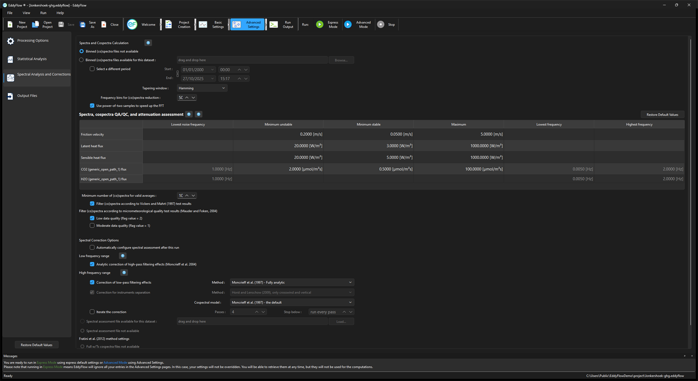

# Spectral corrections

Spectral corrections are needed to correct flux estimates for low and high frequency losses due to the instrument setup, intrinsic sampling limits of the instruments, and some data processing choices. For a detailed description, see [Spectral corrections](advanced-settings-spectral-corrections.md#top).

## Low frequency range

**Analytic correction of high-pass filtering effects:** Check this option to apply a correction for flux spectral losses in the low frequency range, due to the finite averaging time and dependent on the detrending method selected. The correction is implemented after [Moncrieff et al. (2004)](references.md#Moncrieff2). See [High-pass filtering correction](high-pass-filtering.md#top).

## High frequency range

### Correction of low-pass filtering effects

**Method:** Check this option to apply a correction for flux spectral losses in the high frequency range, and select a method. For open path systems and for closed-path systems with very short and heated sampling lines, all methods are similarly valid. The methods by Ibrom et al. (2007) and Fratini et al. (2012) are the most appropriate for non-heated and/or long sampling lines. See [Low-pass filtering correction](low-pass-filtering.md#top).

- **Moncrieff et al. (1997)**: This method models all major sources of flux attenuation by means of a mathematical formulation. The use of this method is suggested for open path EC systems or for closed path systems if the sampling line is very short and heated. This method may seriously underestimate the attenuation (and hence the correction) - notably for water vapor - when the sampling line of a closed-path system is long and/or not heated, because of the dependency of attenuation of H2O on relative humidity.
- **Massman (2000, 2001):** This method provides a simple analytical expression for the spectral correction factors. The use of this method is suggested for open path EC systems or for closed path systems if the sampling line is short and heated. This method may seriously underestimate the attenuation (and hence the correction) for water vapor, when the sampling line is long and/or not heated, because of the dependency of attenuation of H2O on relative humidity. For closed-path systems, this method is only applicable to CO2, H2O, CH4, N2O and O3 fluxes.
- **Horst (1997):** Correction method based on an analytical formulation of the spectral correction factor that requires an in-situ assessment of the system's cut-off frequency. Provide the settings in the *Assessment of high-frequency attenuation* to specify how to perform the assessment.
- **Ibrom et al. (2007):** Correction method based on an analytical formulation of the spectral correction factors, that requires an in-situ assessment of the system's cut-off frequencies, separately for each instrument and gas, and as a function of relative humidity for water vapor. Provide the settings in the *Assessment of high-frequency attenuation* to specify how to perform the assessment. This method is recommended in most cases, notably for closed-path systems placed high over rough canopies.
- **Fratini et al. (2012):** Correction method based on the combination of a direct approach (similar to Hollinger et al., 2009) and the analytical formulation of Ibrom et al., 2007. It requires an in-situ assessment of the system's cut-off frequencies, separately for each instrument and gas, and as a function of relative humidity for water vapor. It also requires full length co-spectra of measured sensible heat. This method is recommended in most cases, notably for closed-path systems placed low over smooth surfaces.

If a gas's fitted cut-off frequency lies above that gas's own Nyquist frequency (half its acquisition rate), the in situ result is rejected and that gas is corrected with the analytic method instead; this also applies in projects with a single rate. If the acquisition rate of a gas changes during the run, the assessment is done separately at each rate. See [Mixed acquisition rates](mixed-acquisition-rates.md#top).

**Correction for instruments separation:** Applies an additional correction for the physical separation between the anemometer and the gas analyzer, on top of whichever low-pass method is selected above. See [Correction for spectral losses due to physical instrument separation](low-pass-filtering.md#correction-for-spectral-losses-due-to-physical-instrument-separation).

**Cospectral model:** (project key `cosp_model`) Selects the analytic cospectrum against which the correction is integrated. The combo offers six curves; the stored value runs from 0 to 5 in the order listed:

- **Moncrieff et al. (1997) - the default** (0): the curve EddyFlow has always used, with separate stable and unstable branches. This is the choice that reproduces results from earlier versions.
- **Kaimal et al. (1972)** (1): the Kansas cospectrum, with stable and unstable branches of its own. It is a genuinely different curve from Moncrieff's, but the two agree closely, because Moncrieff's is a fit to the same data.
- **Sakai et al. (2001) - rough surfaces** (2): fitted over rough surfaces, where more of the flux sits at low frequency than Kaimal's curve allows.
- **Su et al. (2003) - forest, non-flat terrain** (3): fitted over two mixed hardwood forests in non-flat terrain.
- **Moraes et al. (2008)** (4): fitted across differing surface boundary conditions.
- **Kristensen et al. (1997)** (5): a broader curve with a long low-frequency tail; on the test data set it gave the largest correction of the six.

The model is a modifier of the method chosen above, not a method of its own: it decides how much of the flux is assumed to sit at the frequencies the system attenuates, and therefore how large the correction is. On the test data set the six models spread the gas correction factors over about four percent of the correction, a few tenths of a percent of the flux. Only the shape of the curve matters, since the correction is a ratio of two integrals of the same curve. The choice has no effect where the correction is taken directly from measured cospectra. The Reynolds stress keeps the Moncrieff et al. (1997) momentum cospectrum whichever model is chosen, because the Sakai, Su, Moraes and Kristensen curves are scalar cospectra without a momentum counterpart.

!!! note

    Sakai, Su, Moraes and Kristensen are single-form models with **no stability dependence**: the same shape is used at any z/L. Under stable stratification the cospectral peak moves to higher frequency, so these models put too little flux there and will understate the high-frequency loss. Prefer Moncrieff or Kaimal for stable conditions. See [Cospectral model](low-pass-filtering.md#cospectral-model-for-the-analytic-correction).

**Iterate the correction:** (project key `corr_iter_meth`, off by default) When checked, the spectral correction and the flux computation are repeated until the atmospheric stability the correction assumes and the stability the corrected flux produces agree. Without it, the correction is computed once, at the stability of the uncorrected flux, as in versions before 8.1.0.

- **Passes:** (`corr_iter_max`, integer 1 to 20, default 4) The maximum number of passes. One pass is the same as switching the option off.
- **Stop below:** (`corr_iter_tol`, percent from 0 to 100, default 0, displayed as *run every pass*) Stop early once every gas flux changes by less than this value between two passes. At 0 the loop always runs all passes. A tolerance saves passes but changes the answer slightly, since stopping at pass two is not the same as stopping at pass four.

When the loop runs, the full output and FLUXNET files get an extra column, `corr_iter_dev`, giving the change in percent of the gas fluxes between the last two passes (the worst gas of the period). Effects are largest in strongly non-neutral conditions, where the correction factor is most sensitive to stability; in a near-neutral forest test the fluxes moved by hundredths of a percent, and a 1 % tolerance stopped at the second pass and came within 0.02 % of four full passes. Nothing compounds: every pass corrects the same raw covariances again, so only the z/L at which the cospectrum is evaluated changes. See [Iterating the correction](low-pass-filtering.md#iterating-the-correction).

## Assessment of high-frequency attenuation

**Binned spectra files not available:** Select this option if you have not computed "Binned spectra and cospectra files" for the current dataset in a previous run of EddyFlow. Note that the binned (co)spectra files do not need to correspond exactly to the current dataset, rather they need to be representative of it. Binned spectra are used to quantify spectral attenuations, thus they must have been collected in conditions comparable to those of the current dataset (e.g., same EC system and similar canopy heights, measurement height, instruments spatial separations, etc.). At least one month worth of spectra files is needed for a robust spectral attenuation assessment. If you select this option, the option "All binned spectra and cospectra" in the Output Files page will be automatically selected and the check box will be deactivated.

**Binned spectra files available:** Select this option if you already obtained "Binned spectra and cospectra files" for the current dataset (in a previous run of EddyFlow). Note that such binned (co)spectra files do not need to correspond exactly to the current dataset, rather they need to be representative of it. Binned spectra are used here for quantification of spectral attenuations, thus they must have been collected in conditions comparable to those of the current dataset (e.g., same EC system and similar canopy heights, measurement height, instruments spatial separations, etc.). At least one month worth of spectra files is needed for a robust spectral attenuation assessment. If you select this option, the option "All binned spectra and cospectra" in the Output Files page will be automatically deselected.

- **Start:** Starting date of the time period to be used for assessment of the cut-off frequencies and/or calculation of ensemble-averaged (co)spectra. The longer the time span, the more accurate the assessment and the ensemble averages will be.
- **End:** Ending date of the time period to be used for assessment of the cut-off frequencies and/or calculation of ensemble-averaged (co)spectra. The longer the time span, the more accurate the assessment will be.

**Spectral assessment file available for this dataset:** (project key `sa_file`, with `sa_mode=0`) Use the results of an earlier assessment, from the file named `EddyFlow_spectral_assessment_ID.txt`, instead of computing them. This shortens the run and guarantees full comparability with the earlier results. When the file is chosen it is checked by the interface; see [Assessment tests](assessment-tests.md#spectral-assessment-file). A file written for a project with several acquisition rates carries one value set per rate, and each rate's set is applied to the periods at that rate ([Mixed acquisition rates](mixed-acquisition-rates.md#the-rates-token-in-the-spectral-assessment-file)).

**Spectral assessment file not available:** The assessment is performed as an intermediate step, after all binned (co)spectra of the current dataset have been calculated and before the fluxes are calculated and corrected.

**Automatically configure spectral assessment after this run:** When an on-the-fly assessment finds eligible spectra that were excluded by the flux limits, saves data-driven flux-limit recommendations to the output processing project. The current run is not changed; rerun using the generated processing project.

**Minimum number of (co)spectra for valid averages:** (`sa_min_smpl`) The minimum number of spectra that must be found in each class for the corresponding ensemble average to be valid. Classes are currently defined only for H2O with respect to ambient relative humidity: 9 classes between RH = 5 % and RH = 95 %. A number that is too high may leave some classes without an average; one that is too small gives a poor characterisation of the average spectra. The higher the number, the longer the period needed. With several acquisition rates the count applies to each rate separately.

!!! note "Remote drive"

    The **Spectral assessment file**, the **binned cospectra folder** and the **full cospectra folder** fields have a **Remote drive...** button beside **Browse...** / **Load...**. It lets you pick the file or folder from a Google Drive or Dropbox folder shared with "Anyone with the link"; see [Remote folders](remote-folders.md#top).

### Spectra, cospectra QA/QC, and attenuation assessment

This table sets, for every quantity and gas of the project, which spectra and cospectra enter the ensemble averages and over which frequency range the transfer function is fitted. **Restore Default Values** on the title row resets the whole table; each gas returns to the default for its own species. Rows: **Friction velocity**, **Latent heat flux** (only if the project measures water vapour), **Sensible heat flux**, and one row `<gas> flux` for every gas record that has a column in the raw data (two analysers measuring CO2 get two rows, labelled with the analyser). Columns:

- **Lowest noise frequency** (gas rows): Frequency above which high-frequency (blue) noise is expected to matter. The high-frequency part of the spectrum is interpolated linearly in log-log space and subtracted before the transfer function is calculated. Set 0 Hz (shown as *Do not remove noise*) to skip the noise removal.
- **Minimum unstable** and **Minimum stable**: Cospectra whose flux is below these absolute values are excluded from the ensemble cospectra for unstable or stable stratification; spectra are excluded from the ensemble spectra by the unstable thresholds. Details in [QA/QC of spectra and cospectra](ensemble-averages.md#top).
- **Maximum**: (Co)spectra whose flux exceeds this value are excluded from every ensemble average, to keep flux spikes and abnormal periods out.
- **Lowest frequency** and **Highest frequency** (gas rows): The range in which the ratio of gas to temperature spectra is taken to fit the transfer function. At lower frequencies slow atmospheric and source/sink dynamics may break the similarity assumption, so adapt the lower value mainly to the averaging interval; at higher frequencies noise and aliasing may corrupt the fit, so adapt the upper value to the acquisition rate and the instrument. These two columns are only editable when the assessment is computed in this run.

**Units of the flux thresholds.** The minimum and maximum of a gas row follow the unit of that gas's own column in the Raw File Description, so that a threshold is read in the unit the flux is reported in:

| Unit of the gas column | Threshold unit |
| --- | --- |
| ppb or nmol/mol | nmol m-2 s-1 |
| pmol/mol | pmol m-2 s-1 |
| anything else (mole fractions on other bases, molar density, mass density) | umol m-2 s-1 |

The default offered is scaled to match. (Previously the defaults of COS and N2O sat above any flux those gases produce, which discarded every spectrum.) The values stored in the project file, and read by the engine, stay in umol m-2 s-1 in all cases, so existing projects read back unchanged; the table follows an edit of the unit in the metadata editor. Friction velocity, latent heat flux and sensible heat flux keep m s-1 (u*), W m-2 and W m-2 units.

## Assessment run mode

The three radio buttons of the Output Files page configure the whole run around producing or consuming a spectral assessment file. Selecting one applies all its settings together as a single change.

- **Pre-processing run (Create Spectral Assessment File if possible):** Prepares a run that creates a new spectral assessment file if enough data are available. It selects an in situ low-pass method if none is selected (Fratini et al. 2012 by default), sets **Binned spectra files not available**, turns on the binned (co)spectra and the full w/Ts cospectra outputs, sets **Full w/Ts cospectra files not available**, and turns off the Vickers and Mahrt filter and the Foken filter for moderate quality, so that the assessment sees all spectra that pass the flux limits. It locks settings that must stay fixed during the run. It is refused with a warning titled "Create Spectral Assessment File" if there are no raw data, the assessment period is invalid, the period holds fewer averaging periods than **Minimum number of (co)spectra for valid averages**, or a chosen binned or full cospectra folder is not valid.
- **Production run:** Prepares a normal run that uses existing assessment inputs and production QA/QC defaults: an in situ low-pass method is selected (Fratini by default if none), **Binned spectra files available** and **Full w/Ts cospectra files available** are set, the assessment file option is set to use an existing file, and the (co)spectra filters of Vickers and Mahrt and of Foken (low and moderate quality) are turned on. Ensemble spectra and cospectra and full-spectra outputs are turned off. Normal output choices remain available.
- **Default, all options available:** Applies no preset; everything is controlled manually from the Output Files page and this page.

Choosing **Create timelag file only** or **Create planar fit file only** clears the run mode. See [Output files](output-files.md#top).

## Fratini et al. (2012) method settings

**Full w/T cospectra files not available:** Select this option if you do not have **Full cospectra of w/T** for the current dataset (from a previous run of EddyFlow). Note that existing cospectra files need to correspond exactly to the current dataset. Full cospectra of w/T (sensible heat) are used for the definition of the spectral correction factor for each flux with the method of [Fratini et al. (2012)](references.md#Fratini2012). If you select this option, the option **Full length cospectra w/Ts** in the Output Files page will be automatically selected and deactivated. Each period's full cospectrum is sized from its own file, which matters in projects with gaps or several rates ([Mixed acquisition rates](mixed-acquisition-rates.md#fratini-et-al-2012-period-sizing)).
