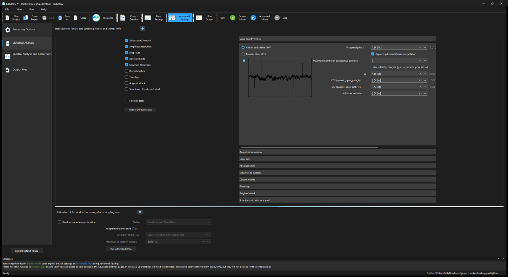

# Statistical analysis

## Statistical tests for raw data screening

Select (on the left side) and configure (on the right side) up to 9 tests for assessing statistical quality of raw time series. Use the results of these tests to filter out results, for which flags are turned on. All tests are implemented after [Vickers and Mahrt (1997)](references.md#Vickers). See the original publication for more details and how to interpret results. See [Despiking and raw data statistical screening](despiking-raw-statistical-screening.md#top).

### Spike count/removal

The checkbox **Spike count/removal** determines whether the spike detection test is performed or not. If it is not, then spikes remain unchanged. Three spike detection methods are available: Vickers and Mahrt (1997), Mauder et al. (2013), and Consecutive difference (EddyUH). The method of Mauder et al. (2013) does not require any settings. For the Vickers and Mahrt (1997) method, configure the definition of spikes; for Consecutive difference, configure the per-variable step limits. See [Despiking](despiking-raw-statistical-screening.md#despiking) for how the three differ. For all methods, define the flagging policy by specifying the maximum percentage of accepted spikes and whether spikes shall be replaced by linear interpolation or simply eliminated from the dataset (in which case EddyFlow will replace spikes with an error code of -9999).

- If both **Spike count/removal** and **Replace spikes with linear interpolation** are checked, detected spikes are removed and replaced with linear interpolation.
- If the box **Replace spikes with linear interpolation** is NOT checked, then spikes are retained in the data (the test therefore functions as a quality test but not as a data filter).

See also [Despiking](despiking-raw-statistical-screening.md#Spike).

### Amplitude resolution

Detects situations in which the signal variance is too low with respect to instrument resolution. Configure the assessment procedure and the flagging policy in the corresponding section of the right-side panel. See [Amplitude resolution](despiking-raw-statistical-screening.md#Amplitude).

## Drop-outs

Detects relatively short periods in which time series stick to some value which is statistically different from the average value calculated over the whole period. Configure the assessment procedure and the flagging policy in the corresponding section of the right-side panel. See [Drop-outs](despiking-raw-statistical-screening.md#Drop).

### Absolute limits

Assesses whether each variable attains, at least once in the current time series, a value that is outside a user-defined plausible range. In this case, the variable is flagged. The test is performed after the despiking procedure. Thus, each outranged value found here is not a spike. It will remain in the time series and affect calculated statistics, including fluxes. Check the "Filter outranged values" to eliminate such outliers. See [Absolute limits](despiking-raw-statistical-screening.md#Absolute).

### Skewness and kurtosis

Third and fourth order moments are calculated on the whole time series and variables are flagged if their values exceed certain thresholds that you can customize in the corresponding section of the right-side panel. See [Skewness and kurtosis](despiking-raw-statistical-screening.md#Skewness).

### Discontinuities

Detect discontinuities that lead to semi-permanent changes, as opposed to sharp changes associated with smaller-scale fluctuations. Configure the assessment of discontinuities in the corresponding section of the right-side panel. See [Discontinuities](despiking-raw-statistical-screening.md#Discontinuities).

### Time lags

This test flags scalar time series if the maximal *w*-covariances, determined via the covariance maximization procedure and evaluated over a predefined time-lag window, are too different from those calculated for the user-suggested time lags. Configure the expected time lags and the accepted discrepancies in the corresponding section of the right-side panel. See [Time lags](despiking-raw-statistical-screening.md#Time).

### Angle of attack

Calculates sample-wise angle of attacks throughout the current flux averaging period, and flags it if the percentage of angles of attack exceeding a user-defined range is beyond a threshold that you can set on the right-side panel. See [Angle of attack](despiking-raw-statistical-screening.md#Angle).

### Steadiness of horizontal wind

Assesses whether the along-wind and crosswind components of the wind vector undergo a systematic reduction/increase throughout the file. If the quadratic combination of such systematic variations is beyond the user-selected limit, the flux-averaging period is hard-flagged for instationary horizontal wind. See [Steadiness of horizontal wind](despiking-raw-statistical-screening.md#Steadiness).

## Estimation of flux random uncertainty due to sampling errors

EddyFlow can calculate flux random uncertainty according to several methods, selected from the **Method** dropdown: [Mann and Lenschow (1994)](references.md#Mann), [Finkelstein and Sims (2001)](references.md#Finkelstein), Mahrt (1998), Billesbach (2011), and instrumental noise after [Lenschow et al. (2000)](references.md#Lenschow) as applied by [Mauder et al. (2013)](references.md#Mauder2013). See [Random uncertainty estimation](random-uncertainty-estimation.md#top) for how each method differs.

The **Flux Detection Limit...** button below opens a separate dialog for a related but distinct diagnostic: not the uncertainty on a computed flux, but the smallest flux that could be resolved at all given the instrument's own noise. See [Flux detection limit](flux-detection-limit.md#top) and the [Flux Detection Limit Settings dialog](flux-detection-limit-settings.md#top).
