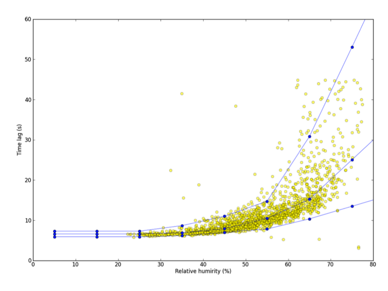

# Detecting and compensating for time lags

See [Selecting advanced processing options](selecting-advanced-options.md#top) for more information.

The last step of raw data processing in EddyFlow, prior to flux calculation and correction, regards the compensation of possible time lags between anemometric variables and variables measured by any other sensor, notably the gas analyzer(s). A time lag arises for different reasons in closed path and in open path systems.

The presence of the intake tube in closed path systems (with the inlet normally placed very close to the anemometer measuring volume) implies that gas concentrations are always measured with a certain delay with respect to the moment air is sampled. In addition, the residence time of sticky gases, such as H2O, in the sampling line is a strong function of air relative humidity and temperature. Conversely, sonic anemometers measure wind speed and sonic temperature without detectable delays. In open path systems the delay is due to the physical distance between the two instruments (gas analyzer and anemometer), which are usually placed several decimeters or less apart to avoid mutual disturbances. The wind field takes some time to travel from one to the other, resulting in a certain delay between the moments the same air parcel is sampled by the two instruments.

It is a common practice to compensate for time lags before calculating covariances between anemometric variables and gas analyzer measurements. EddyFlow provides four different methods for detecting and compensating time lags, besides the option of not compensating at all, which speeds up program execution but will almost certainly lead to systematic flux underestimations.

## Constant

In the Raw File Description table, you can enter ** Nominal time lags ** for variables not measured by the master anemometer. In closed path systems, a nominal time lag can be estimated from the volume of the intake tube and the average flow rate in the tube. In open path systems, a nominal lag can be computed by considering the transit time in the space between the instruments, with site-specific typical wind speeds and directions. Selecting *Constant* will instruct EddyFlow to use such nominal values as fixed time lags. Using this option makes the program execution faster, because the automatic time lag detection procedure is avoided. However, this option is only suitable for closed path systems featuring an active control of the sampling line flow rate, such that the travel time of air in the tube does not change as a result of pump fluctuations, filter clogging, or any other reason. Also, this option is not recommended when measuring "sticky" gases such as H2O, whose residence time varies according to climatic (RH, T) conditions, on account of sorption processes occurring at the tube walls (e.g., [Runkle et al., 2012](references.md#Runkle)).

** Note:** If you leave the Nominal time lag set to *zero*, EddyFlow will [automatically calculate](nominal-time-lag.md) the most plausible value for you.

## Covariance maximization

A certain degree of uncertainty in the control over the flow rate (closed path) and the variability of wind regimes (open path) suggests an automatic time lag detection procedure, normally performed for each flux averaging period. Typically the detection is accomplished via the "covariance maximization" procedure, consisting of the determination of the time lag that maximizes the covariance of two variables, within a window of plausible time lags (e.g., [Fan et al., 1990](references.md#Fan)):

6‑23
                                                            

In this equation, N is the total number of samples in the current flux averaging interval; m and M are the discrete counterparts of the minimum and maximum plausible time lags, respectively; τ is the best time lag estimate, and jτ is its discrete counterpart. You can toggle between discrete indices and actual times in seconds by dividing the formers by the acquisition frequency (fa, Hz), e.g., τ = jτ • fa-1.

The minimum and maximum plausible time lags are either taken from the ** Minimum time lag ** and ** Maximum time lag ** entered in the ** Raw File Description ** table or, if those are left at zero, [automatically calculated](nominal-time-lag.md) by EddyFlow.

## Covariance maximization with default

Selecting this option, if—during the covariance maximization procedure depicted above—a maximum is not attained within the plausibility window, a default is used, either taken as the ** Nominal time lag ** in the ** Raw File Description ** table or automatically calculated by EddyFlow.

Using the covariance maximization procedure (either with or without default), a plausible time lag window has to be defined with the ** Minimum ** and ** Maximum time lags **, which constitute the end points of the plausibility window. A too narrow plausible window might lead to frequent use of the default (** Covariance maximization with default **) or either endpoint (*Covariance maximization*) time lag, because the actual time lag is often found outside defined plausibility range. This situation leads to systematic flux underestimations. Conversely, imposing a too broad plausibility window increases the possibility that unrealistic time lags are detected, especially when covariances are small and vary erratically with the lag time. These cases often result in flux overestimations. A trade-off must be reached between the two contrasting needs.

## Automatic time lag optimization

EddyFlow also provides the possibility of analyzing the actual time lags found in the available dataset and determining the most suitable ** Nominal time lag ** and plausibility window (Minimum and Maximum time lags). This procedure implies a pre-processing step, before actually processing raw files, to statistically evaluate the most likely time lags and their ranges of variations. In this step, raw files are actually handled in a very similar manner as done later in the raw data processing step (e.g., despiking, Angle of Attack correction, detrending, etc.), but the processing stops at the calculation of the time lag. Here, the *Covariance Maximization* procedure is applied, adopting very broad (and user-customizable) time lag windows. Then, optimal time lags are calculated, in different ways for passive gases (e.g., CO2, CH4) and for H2O.

### Time lag optimization for passive gases

For passive gases, whose time lag is not expected to depend on climatic conditions or other drivers, the nominal time lag is calculated as the median of all calculated time lags:

6‑24
                                                            

where, for convenience, τi represents all time lags calculated from the available dataset.

The plausibility window is defined as:

6‑25
                                                            
                                                              

                                                            

where z is a user-selectable parameter, whose optimal value was heuristically determined to be around 1.5.

** Note:** This assessment must be performed on a dataset long enough for calculating robust statistics. At least 1 month of data is recommended.

** Note:** The dataset used to optimize time lags must refer to a period, in which the sampling line did not undergo major modifications, such as replacement of tubing or filters, change of the flow rate, etc. In the whole period, time lags are expected to be stationary.

### Time lag optimization for water vapor

The time lag of water vapor is a strong function of relative humidity (and secondarily, a function of temperature). Thus, for water vapor, nominal time lags and plausibility windows are assessed for relative humidity classes in the range 0 to 100%. In each class, the same definitions used for passive gases are also used:

6‑26
                                                            
                                                              

                                                            
                                                              

                                                            

where now the subscript class indicates that a different value is calculated for each class. Here also z is a user-selectable parameter, with an optimal value around 1.5.

For each class, a minimum of 30 time lags need be present, for the statistics to be considered valid. Depending on the length of the dataset, such numerosity may not be reached for all class. In such cases, EddyFlow behaves as follows:

- If the first n classes do not have enough numerosity, their time lags (nominal, minimum, and maximum) are set equal to those of class (n + 1);
- If the last n classes do not have enough numerosity, their time lags are set to a linear extrapolation of classes (nt – n) and (nt - n - 1), where nt represents the total number of classes;
- If any intermediate class i does not have enough numerosity, its time lags are set to the average of classes i – 1 and (i + 1).

** Note:** Due to class sorting, a much longer dataset is needed for water vapor. A minimum 2 months of raw data are deemed necessary, possibly spanning a broad range of climatic conditions. A longer dataset (> 6 months) will allow a more robust optimization.

The figure below shows the results of a time lag optimization procedure using 6 months of data. Yellow circles are actual time lags calculated using a very large time lag window while blue lines are nominal, minimum, and maximum time lags calculated by EddyFlow as a function of RH, by means of the time lag optimization procedure.

** Note:** During the following phase of raw data processing, the actual nominal, minimum, and maximum time lags are determined as a function of the current value of relative humidity.
