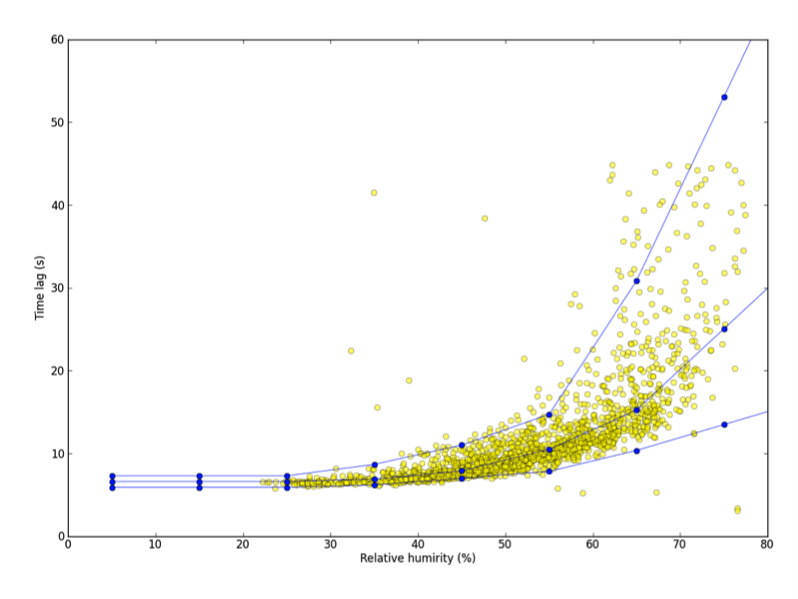

# Detecting and compensating for time lags

See [Selecting advanced processing options](selecting-advanced-options.md#top) for more information.

The last step of raw data processing in EddyFlow, prior to flux calculation and correction, regards the compensation of possible time lags between anemometric variables and variables measured by any other sensor, notably the gas analyzer(s). A time lag arises for different reasons in closed path and in open path systems.

The presence of the intake tube in closed path systems (with the inlet normally placed very close to the anemometer measuring volume) implies that gas concentrations are always measured with a certain delay with respect to the moment air is sampled. In addition, the residence time of sticky gases, such as H2O, in the sampling line is a strong function of air relative humidity and temperature. Conversely, sonic anemometers measure wind speed and sonic temperature without detectable delays. In open path systems the delay is due to the physical distance between the two instruments (gas analyzer and anemometer), which are usually placed several decimeters or less apart to avoid mutual disturbances. The wind field takes some time to travel from one to the other, resulting in a certain delay between the moments the same air parcel is sampled by the two instruments.

It is a common practice to compensate for time lags before calculating covariances between anemometric variables and gas analyzer measurements. EddyFlow provides five different methods for detecting and compensating time lags, besides the option of not compensating at all, which speeds up program execution but will almost certainly lead to systematic flux underestimations.

## Constant

In the Raw File Description table, you can enter **Nominal time lags** for variables not measured by the master anemometer. In closed path systems, a nominal time lag can be estimated from the volume of the intake tube and the average flow rate in the tube. In open path systems, a nominal lag can be computed by considering the transit time in the space between the instruments, with site-specific typical wind speeds and directions. Selecting *Constant* will instruct EddyFlow to use such nominal values as fixed time lags. Using this option makes the program execution faster, because the automatic time lag detection procedure is avoided. However, this option is only suitable for closed path systems featuring an active control of the sampling line flow rate, such that the travel time of air in the tube does not change as a result of pump fluctuations, filter clogging, or any other reason. Also, this option is not recommended when measuring "sticky" gases such as H2O, whose residence time varies according to climatic (RH, T) conditions, on account of sorption processes occurring at the tube walls (e.g., [Runkle et al., 2012](references.md#Runkle)).

!!! note

    If you leave the Nominal time lag set to *zero*, EddyFlow will [automatically calculate](nominal-time-lag.md) the most plausible value for you.

## Covariance maximization

A certain degree of uncertainty in the control over the flow rate (closed path) and the variability of wind regimes (open path) suggests an automatic time lag detection procedure, normally performed for each flux averaging period. Typically the detection is accomplished via the "covariance maximization" procedure, consisting of the determination of the time lag that maximizes the covariance of two variables, within a window of plausible time lags (e.g., [Fan et al., 1990](references.md#Fan)):

6‑23
                                                            

In this equation, N is the total number of samples in the current flux averaging interval; m and M are the discrete counterparts of the minimum and maximum plausible time lags, respectively; τ is the best time lag estimate, and jτ is its discrete counterpart. You can toggle between discrete indices and actual times in seconds by dividing the formers by the acquisition frequency (fa, Hz), e.g., τ = jτ • fa-1.

The minimum and maximum plausible time lags are either taken from the **Minimum time lag** and **Maximum time lag** entered in the **Raw File Description** table or, if those are left at zero, [automatically calculated](nominal-time-lag.md) by EddyFlow.

## Covariance maximization with default

Selecting this option, if—during the covariance maximization procedure depicted above—a maximum is not attained within the plausibility window, a default is used, either taken as the **Nominal time lag** in the **Raw File Description** table or automatically calculated by EddyFlow.

Using the covariance maximization procedure (either with or without default), a plausible time lag window has to be defined with the **Minimum** and **Maximum time lags**, which constitute the end points of the plausibility window. A too narrow plausible window might lead to frequent use of the default (**Covariance maximization with default**) or either endpoint (*Covariance maximization*) time lag, because the actual time lag is often found outside defined plausibility range. This situation leads to systematic flux underestimations. Conversely, imposing a too broad plausibility window increases the possibility that unrealistic time lags are detected, especially when covariances are small and vary erratically with the lag time. These cases often result in flux overestimations. A trade-off must be reached between the two contrasting needs.

## Automatic time lag optimization

EddyFlow also provides the possibility of analyzing the actual time lags found in the available dataset and determining the most suitable **Nominal time lag** and plausibility window (Minimum and Maximum time lags). This procedure implies a pre-processing step, before actually processing raw files, to statistically evaluate the most likely time lags and their ranges of variations. In this step, raw files are actually handled in a very similar manner as done later in the raw data processing step (e.g., despiking, Angle of Attack correction, detrending, etc.), but the processing stops at the calculation of the time lag. Here, the *Covariance Maximization* procedure is applied, adopting very broad (and user-customizable) time lag windows. Then, optimal time lags are calculated, in different ways for passive gases (e.g., CO2, CH4) and for H2O.

### Time lag optimization for passive gases

For passive gases, whose time lag is not expected to depend on climatic conditions or other drivers, the nominal time lag is calculated as the median of all calculated time lags:

6‑24
                                                            

where, for convenience, τi represents all time lags calculated from the available dataset.

The plausibility window is defined as:

6‑25
                                                            
                                                              

                                                            

where z is a user-selectable parameter, whose optimal value was heuristically determined to be around 1.5.

!!! note

    This assessment must be performed on a dataset long enough for calculating robust statistics. At least 1 month of data is recommended.

!!! note

    The dataset used to optimize time lags must refer to a period, in which the sampling line did not undergo major modifications, such as replacement of tubing or filters, change of the flow rate, etc. In the whole period, time lags are expected to be stationary.

### Time lag optimization for water vapor

The time lag of water vapor is a strong function of relative humidity (and secondarily, a function of temperature). Thus, for water vapor, nominal time lags and plausibility windows are assessed for relative humidity classes in the range 0 to 100%. In each class, the same definitions used for passive gases are also used:

6‑26
                                                            
                                                              

                                                            
                                                              

                                                            

where now the subscript class indicates that a different value is calculated for each class. Here also z is a user-selectable parameter, with an optimal value around 1.5.

For each class, a minimum of 30 time lags need be present, for the statistics to be considered valid. Depending on the length of the dataset, such numerosity may not be reached for all class. In such cases, EddyFlow behaves as follows:

- If the first n classes do not have enough numerosity, their time lags (nominal, minimum, and maximum) are set equal to those of class (n + 1);
- If the last n classes do not have enough numerosity, their time lags are set to a linear extrapolation of classes (nt – n) and (nt - n - 1), where nt represents the total number of classes;
- If any intermediate class i does not have enough numerosity, its time lags are set to the average of classes i – 1 and (i + 1).

!!! note

    Due to class sorting, a much longer dataset is needed for water vapor. A minimum 2 months of raw data are deemed necessary, possibly spanning a broad range of climatic conditions. A longer dataset (> 6 months) will allow a more robust optimization.

The figure below shows the results of a time lag optimization procedure using 6 months of data. Yellow circles are actual time lags calculated using a very large time lag window while blue lines are nominal, minimum, and maximum time lags calculated by EddyFlow as a function of RH, by means of the time lag optimization procedure.

!!! note

    During the following phase of raw data processing, the actual nominal, minimum, and maximum time lags are determined as a function of the current value of relative humidity.

## Baseline-subtracted covariance maximization

Project-file key `covmax_debaseline`, interface label **Subtract the cross-covariance baseline** (off by default). It is a modifier of the two covariance maximization methods above, not a sixth method.

**Idea.** A weak flux often sits on a sloping cross-covariance function, for instance because of a trend in one of the series or a neighbouring stronger correlation. The plain maximum of the absolute covariance then falls on whichever end of the search window the slope is highest at, instead of on the peak.

**Procedure.**

1. Compute the cross-covariance function inside the search window, as for the ordinary method.
2. Draw the straight line (the chord) between its values at the two ends of the window and subtract it.
3. Choose the lag with the largest departure from the chord.

The lag selected can differ from the plain maximum; the covariance reported at that lag is the ordinary covariance, computed exactly as before.

**Consequences and limitations.**

- After the subtraction both window ends score zero, so the selected lag can never land on an end of the window. **Covariance maximization with default** falls back to the nominal lag precisely when the maximum lands on an end, so with this modifier on that fallback stops firing. For a weak flux this safety net is worth replacing rather than losing; [conditional lag borrowing](#conditional-lag-borrowing) is intended for that.
- It does nothing with **Constant**, which does not search.
- A window that is too wide for the lag structure still gives a poor chord; keep the **Minimum** and **Maximum time lags** plausible.

## Conditional lag borrowing

Project-file keys `tlag_borrow_meth`, `tlag_borrow_snr`, `tlag_borrow_noise`, `tlag_borrow_donor`; interface controls **Borrow a tube-mate's lag below the detection limit**, **Detection limits to clear**, **Judged against**, **Borrow from** (see [Advanced settings: processing options](raw-processing-options.md#conditional-lag-borrowing)). Off by default.

**Idea.** Gases drawn through the same intake tube share the same transport delay. A trace gas whose cross-covariance with *w* cannot be distinguished from noise has no peak of its own to detect, and the lag a maximization returns for it is close to a random draw over the search window. A gas on the same analyser that resolves its peak is measuring that same delay, so its lag is the best estimate available for the weak gas (Nemitz et al., 2018).

**Procedure**, applied in each averaging period after the lag of every gas has been found by the chosen method and before the series are shifted:

1. For each gas compute the signal-to-noise ratio: the absolute covariance at its own lag divided by the noise floor chosen under **Judged against**. The floor is either the flux detection limit ([Wienhold et al., 1994](references.md#Wienhold1994); see [Flux detection limit](flux-detection-limit.md#top)), which is the scatter of the cross-covariance far from the peak, or the instrumental noise ([Lenschow et al., 2000](references.md#Lenschow); [Mauder et al., 2013](references.md#Mauder2013)), which is the step in the autocovariance at zero lag.
2. A gas is *trusted* if its ratio is at least **Detection limits to clear** (default 3). The trusted set is fixed before any borrowing happens, so a borrowed lag can never become a donor and the result does not depend on column order.
3. A gas that is not trusted, or whose lag landed on an end of its search window, takes the lag of a donor. The donor is the trusted gas on the same analyser with the highest ratio, or, if **The analyser's carbon dioxide (EddyUH)** is chosen, the carbon dioxide of that analyser provided it is trusted.
4. The borrowed lag is applied in place of the gas's own. The lag that the gas's own maximization found remains in the output of actual lags, so the two differing is the record that a lag was taken from elsewhere.

**Rules and limitations.**

- The detection-limit floor requires the flux detection limit to be on (`detlim_meth`); the engine refuses the combination otherwise. The instrumental-noise floor is measured from the series itself and needs nothing else.
- Water vapor is never borrowed for or from.
- A lag is never taken from a different instrument, and a gas whose record names no instrument neither donates nor borrows.
- With the carbon dioxide donor, nothing is borrowed if the analyser measures no carbon dioxide, and carbon dioxide itself never borrows.
- Borrowing trades a noisy number for a biased one: two gases down one tube can differ systematically by a few tenths of a second. It is intended for gases whose own detection is unreliable, not as a general replacement for detection.
- A borrowed lag is flagged in `<gas>_def_timelag` like a nominal-lag fallback, and the run log names the donor.
- Borrowing is separate from the borrowing inside the pre-whitening block-bootstrap method (below). The first asks whether a peak stands above the noise in this period; the second asks whether a bootstrap could not settle on a lag across periods.

## Pre-whitening block-bootstrap (PWB)

The pre-whitening block-bootstrap method, based on [Vitale et al. (2024)](references.md#Vitale2024), is a statistical alternative to the covariance maximization procedures above. Rather than reading a single time lag off the raw cross-covariance function, PWB first pre-whitens the anemometric and scalar time series to remove their autocorrelation structure, then repeatedly resamples the pre-whitened series in contiguous blocks (a block-bootstrap) to build a distribution of plausible time lags for the current flux averaging interval. The final lag estimate, together with a highest-density interval (HDI) describing its uncertainty, is derived from this distribution, rather than from a single peak-picking operation on the raw covariance function.

Because it relies on a distribution of resampled estimates instead of a single covariance maximum, PWB tends to be more robust than covariance maximization in situations where the cross-covariance function is noisy or shows multiple local maxima of similar magnitude, for example with short or turbulent intake tubes, low signal-to-noise trace-gas measurements, or short flux averaging intervals. In these conditions, a classic covariance-maximization search can lock onto a spurious peak, whereas PWB's bootstrap distribution makes it possible to judge how well-determined the lag actually is, and to fall back gracefully (via the **Maximum carry-over** setting) on a recent, well-determined estimate when the current period does not support one.

PWB settles every averaging period's lag with the whole run in view. When a pre-pass has read the run, each period is settled in this order: the HDI pre-filter, then the reliability classes S1 and S2, then the gas's *own* lag in three forms (interpolated between the reliable lags either side, carried forward, or filled backward, never further than **Max carry**), and only then a lag borrowed from another gas on the same analyser, then that gas's median, and finally a terminal fallback. The gas's own lag comes first on purpose: two gases down one tube have measurably different delays, so borrowing trades a stale number for a biased one. Live detection without a pre-pass keeps a causal classifier that can only look backwards. A column in the output names which step settled each period.

Select *Pre-whitening block-bootstrap* to enable the method, and click on the **PWB Time Lag Optimization Settings...** button to configure the bootstrap, detection-timing, and lag-borrowing parameters. See [PWB time lag optimization settings dialog](pwb-time-lag-settings.md#top) for a description of each field.

### PWB behaviour in detail

- **Terminal fallback:** a period that no earlier step could settle uses the lag of its own covariance maximum (the lag found by covariance maximization in that period), not a generic default. This changes lags compared with earlier versions; on one test dataset 10 of 21 settled lags changed.
- **Borrowed lags are labelled `S4_borrowed`:** the log column formerly named `S4_instrument_filled` is now `S4_borrowed`, and the summary line reads for example `S1/S2=0, S4_borrowed=7`. A class that cannot be classified prints a NOTE. Donors are counted from the settled table, and the detection summary no longer counts borrowed lags as detections.
- **Stale donors cleared:** the columns `donor_gas`, `carry_hours`, `fallback_source` and `fallback_used` are blanked before the post-pass, so the half-hourly table no longer reports a stale donor (for example water vapor borrowing from water vapor).
- **Pre-pass parallelism:** the PWB cache pre-pass (`tlag_meth` = 5 with `to_mode` = 1) is split across the worker processes of the `-j` / `--jobs` option, like the planar-fit and time-lag pre-passes, and the settled table is post-processed once, in the parent process. See [Command line](command-line.md#top).
- **Gases slower than the file (8.1.2):** a gas whose instrument samples slower than the file rate, for example a 1 Hz laser written on a 20 Hz row grid with the other rows empty, used to fail PWB's validity test in every period, because its completeness was counted against the row grid (about 5 %), and ended in the terminal fallback. Completeness is now counted against what the gas's own instrument owes. Stage 1 runs the unchanged pre-whitening chain on the gas's real samples (found by walking the column, so an instrument that drifts through every row position within a half hour is handled), with w and the sonic temperature taken at the same rows and the windows, block length and smoothing converted to the measured spacing. Stage 2 evaluates every row lag within one gas interval of the coarse peak, so the lag and its interval come out at the file's resolution; if the stage 1 replicates spread over more than one and a half intervals, the interval covers both stages, so the narrow stage 2 range cannot make an uncertain period look certain. Gases at the file rate take the earlier path unchanged.

!!! note

    PWB is available starting with EddyFlow engine v7.2.1 (GUI v7.2.1 and later, 2026-06).
