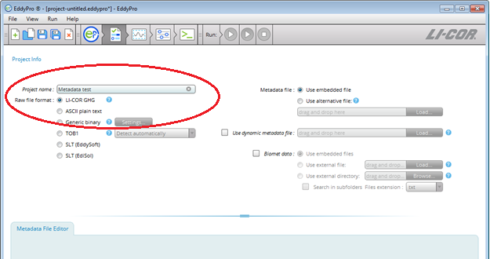
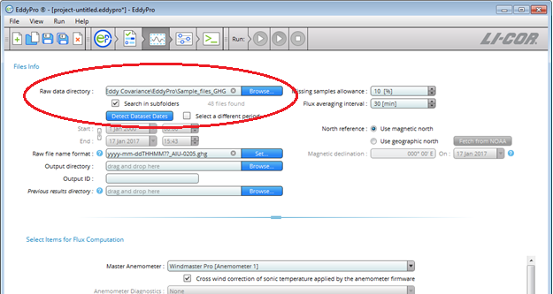
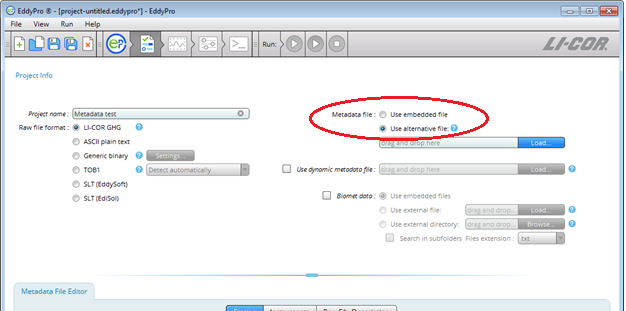
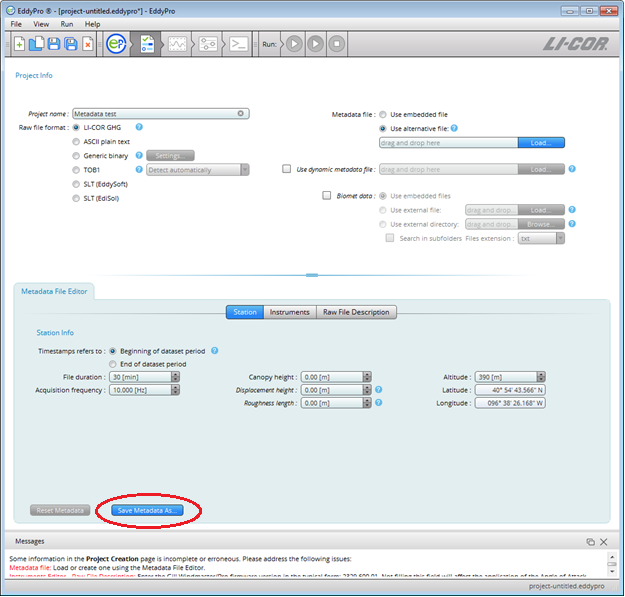
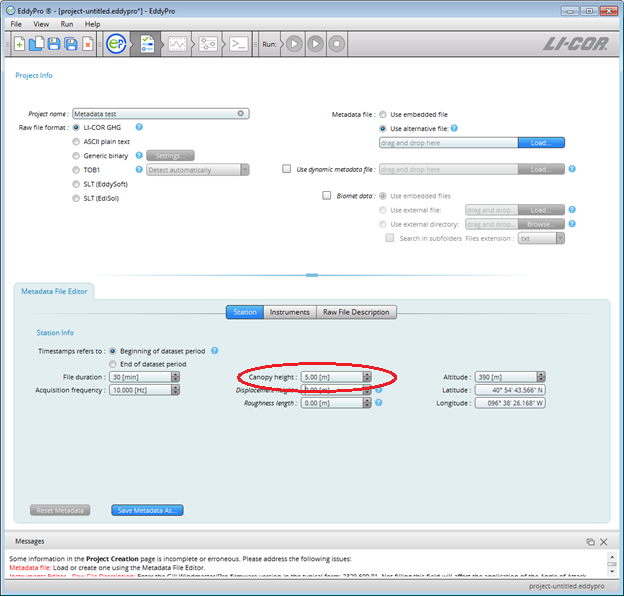
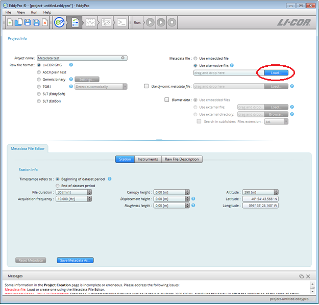

[Download](https://licor.app.boxenterprise.net/s/om2q8k9z9uiuubnz7l8t9hvhp7ogbw2w)

# Changing metadata after it has been collected

** Authors:** the original publisher, Inc.

** Correspondence:**[envsupport@the original publisher.com](mailto:envsupport@licor.com)

** Instruments:** EddyFlow, LI-7200/RS, LI-7500A/RS, LI-7500DS, LI-7700

** Keywords:**

Mistakes happen. During the busy hustle of an eddy covariance installation, you might accidentally enter some metadata values incorrectly in the LI-7500A/RS/DS and LI-7200/RS Windows Interface Software. For example, you could set the canopy height to 2.6 m instead of 6.2 m, or you could incorrectly hear the sensor separation numbers as they're being shouted down from the tower. You might not notice the discrepancy for a while, either. Fortunately EddyFlow Software makes it easy to edit the metadata file and reprocess all of your flux data.

1. Open EddyFlow and click ** New Project ** (or ** Open Project ** if you have started one already).
2. Enter the ** Project Name ** and select ** the original publisher GHG**.
3. 
4. Click on the next tab at the top to go to the ** Basic Settings ** page.
5. Select the ** Raw Data Directory ** where your GHG files are held.
6. 
7. Now click on the previous tab at the top and you will return to the ** Project Creation ** page. Instead of ** Use embedded file ** for the metadata designation, click on ** Use alternative file **.
8. 
9. Now the ** Metadata File Editor ** will automatically pull data from the GHG files. Before you make any changes, click the ** Save Metadata As ** button. Save the file as a .metadata file in the same folder.
10. 
11. You can change any of the metadata values for the site, instruments, or file description. In this example we changed the ** Canopy Height ** under the Station setting. These edits are saved automatically.
12. 
13. Under the metadata designation, click ** Load ** (if the file you have created is not already selected). Find the file you have just created. Follow the rest of the steps in EddyFlow, and it will use this edited metadata file to process all the GHG files you have selected.
14. 
