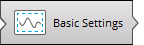

# Processing eddy covariance datasets

This section describes the basic steps for using EddyFlow.

## Processing .ghg files with correct site parameters

If you logged the eddy covariance data to a SmartFlux System .ghg format and entered the correct site information, the .ghg file will contain an embedded .metadata file with information needed for processing the accompanying .data file.

If, during the acquisition period, you changed settings in the gas analyzer data logging interface in order to account for changes in the site parameters, these changes will be stored in the metadata. EddyFlow allows you to account for the time dependency by processing each data file (.data extension) using meta-information retrieved from the paired metadata file embedded in the .ghg file.

** Note:** If there were no changes in the project metadata for the eddy covariance dataset under consideration, you can speed up processing by using a single metadata file for the entire project, as described in [Processing .ghg files with incorrect or no site parameters](#Processi).

To process the dataset, launch EddyFlow:

1. Start a ** New Project **.
2. In the Project Creation page, enter a ** Project name ** (optional).
3. Click ** Basic Settings ** and configure processing options. See [Basic settings](dataset-selection-page.md#top).
4. 

## Processing .ghg files with incorrect or no site parameters

If you collected eddy covariance data using the original publisher® data logging software, your dataset will be comprised of raw files in .ghg format. Each .ghg file contains a metadata file (extension of .metadata) with information needed for processing the paired .data file. If, during the acquisition period, you changed settings in the data logging interface in order to account for modification of critical meta-information, the obtained dataset will contain dynamic, time-dependent metadata. EddyFlow allows you to account for this time dependency, processing each .data file using meta-information retrieved from the paired .metadata file embedded in the compressed .ghg file.

However, there are two situations in which you might want or need to bypass embedded metadata files:

- When embedded metadata files have incorrect information (e.g., because they contain errors in critical meta-information);
- When all embedded metadata files, correct or incorrect, are identical because no changes were made during data acquisition.

In these cases EddyFlow provides a way to bypass embedded .metadata files and use an alternative file.

** Important:** Using an alternative .metadata file means that all .ghg files are processed with the same meta-information (unless you provide a dynamic metadata file; see [Time-varying (dynamic) metadata](dynamic-metadata.md#top)). It also implies that all .data files must have the exact same format, which must be correctly described in the alternative .metadata file.

To use an alternative metadata file for your dataset:

1. Start a ** New Project ** and select ** the original publisher .ghg ** as the file type.
2. Enter a ** Project name ** (optional).
3. In the ** Basic Settings ** page, enter the ** Raw data directory **, where your raw data are stored.
4. Return to the ** Project Creation ** page and select the option ** Metadata file: Use alternative file **.
5. The ** Metadata File Editor ** will activate with the metadata from the first .ghg file in your project.
6. Make changes to the metadata file as needed.
7. Click ** Save metadata as...** and save the file with a new file name.
8. This file is the ** Alternative metadata file **. You can modify it here or use it as it is.
9. When all mandatory meta-information is entered with plausible values, the ** Basic Settings ** button activates.
10. 
11. Click the ** Basic Settings ** button and configure processing options. See [Basic settings](dataset-selection-page.md#top).
